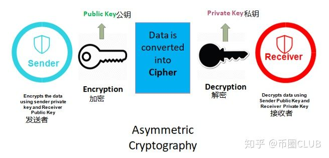
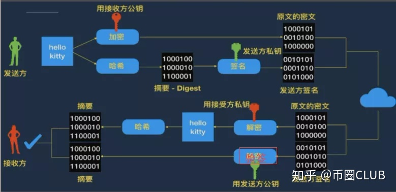
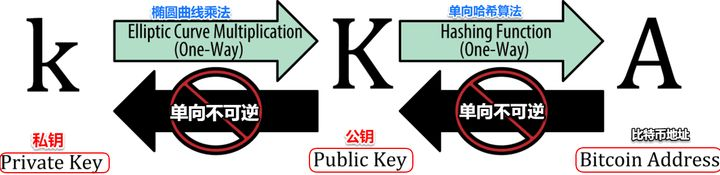

# Cryptography

[toc]

> From:  https://zhuanlan.zhihu.com/p/136669571
>
> From: https://zhuanlan.zhihu.com/p/32780232

# 1. 加密技术的类型

## 1.1. 对称加密

对称加密算法是应用较早的加密算法，**在对称加密算法中，数据发送者和接收者使用同一套规则来对数据进行加密和解密。**

* 简单理解就是加密密钥和解密密钥是同样的

**<u>优点</u>**

运算速度快

**<u>缺点</u>**

* 密钥传输问题： 怎么把这个“密钥”安全的传输给接受者
* 密钥管理问题

**<u>常用算法</u>**

DES、3DES、Blowfish、IDEA、RC4、RC5、RC6和AES

## 1.2. 非对称加密

对称加密使用共享密钥来解密数据，而非对称加密使用“密钥对”来解密数据。**密钥对包含两部分：一个公钥，一个私钥。**

* 发送数据时，我们需要使用**私钥（即密码）**和**接收者公钥**（即用户名）
* 接受数据时，接收者则使用他的**私钥（密码）**和**发送者的公钥（用户名）**来解密数据

**<u>优点</u>**

解决了密钥传输中的安全问题

**<u>缺点</u>**

无法验证发送方是否正确，发送方可能存在被伪造

**<u>常用算法</u>**

RSA、ECC（椭圆曲线加密算法）

#  2. 非对称加密技术在区块链的应用场景：

## 2.1. 信息加密场景

主要是由信息发送者(记为A)使用接受者(记为B)的公钥对信息加密后再发送给B，B利用自己的私钥对信息解密。比特币交易的加密即属于此场景。

信息加密是**公钥加密，私钥解密**，确保信息的**安全性**

## 2.2. 数字签名场景

由发送者A采用自己的私钥加密信息后发送给B，B使用A的公钥对信息解密、从而可确保信息是由A发送的。
数字签名，可以保证收到的文件没有被篡改，也可以保证发送者的身份。因为私钥生产了数字签名，私钥是不公开的。

数字签名是**私钥加密公钥解密**，确保数字签名的**归属性**

## 2.3. 登陆认证场景

是由客户端使用私钥加密登录信息后发送给服务器，后者接收后采用该客户端的公钥解密并认证登录信息.

# 3. 比特币系统中的私钥和公钥

## 3.1. 私钥

* 私钥是一个数字，通常是随机选出来的
* 比特币私钥只是一个数字，一个**256位的二进制数字**组成
* **比特币软件**使用操作系统底层的随机数生成器来产生256位的熵（随机性）。 **从编程的角度来看**，一般是通过在一个密码学安全的随机源中取出一长串随机字节，对其使用SHA256哈希算法进行运算，这样就可以方便地产生一个256位的数字。

## 3.2. 公钥

公钥从私钥通过 椭圆曲线乘法计算得到。 公钥的几何意义，是在曲线上的一个点，由一对坐标组成。即公钥被定义为一个点 **K = (x, y)**。公钥通常表示为前缀**04紧接着两个256比特的数字**

## 3.3. 地址

地址就类似于银行账号。

## 3.4. 公钥，私钥和地址

* 有了私钥，我们就可以使用椭圆曲线乘法这个**单向加密函数**产生一个公钥（K）。

* 有了公钥（K），我们就可以使 用一个**单向加密哈希函数**生成比特币地址（A）。

# 4. 以RSA为例： 为什么被公钥加密的可以被私钥解密

> From: https://blog.csdn.net/doujinlong1/article/details/82051986