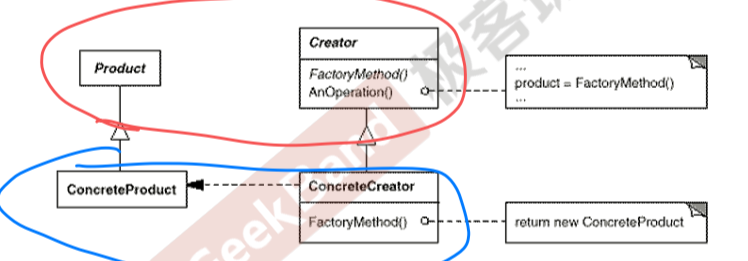
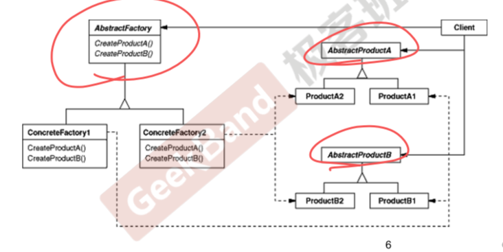
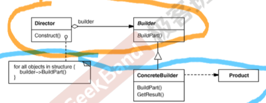

# Object Generation

[toc]

## Introduction

**对象创建模式**试图绕开 `new`， 来避免使用 `new` 进行对象创建的过程中所导致的紧耦合，从而支持对象创建的稳定，它是接口抽象之后的第一步工作。

## 1. Factory Method

### 1.1. Motivation

在软件系统中，经常面临着创建对象的工作，由于需求的变化，**需要创建的对象的具体类型经常变化。**

### 1.2. Definition

定义一个**用于创建对象的接口，\**让\**子类决定**实例化哪一个类，Factory Method使得一个类的**实例化延迟（目的：解耦，手段：虚函数）到子类**

### 1.3. Structure

### 1.4. Summary

- Factory Method 模式用于隔离对象的使用者和具体类型之间的耦合关系，面对一个经常变化的具体类型，紧耦合关系(new) 会导致软件的脆弱
- Factory Method模式通过面向对象的手法，将所要创建的具体对象工作延迟到子类，从而实现一种**扩展而非更改（通过添加factory）**的策略，较好的解决了这种紧耦合关系
- Factory Method模式解决“单个对象”的需求变化，缺点在于要求**创建方法/参数相同**

## 2. Abstract Factory

### 2.1. Motivation

在软件系统中，经常面临着“一**系列相互依赖的对象**”的创建工作；同时由于需求的变化，往往存在更多系列对象的创建工作

### 2.2. Definition

提供一个接口，让该接口负责创建**一系列“相关或者相互依赖的对象”**，无需指定它们具体的类

### 2.3. Structure

### 2.4. Summary

- 如果没有应对“**多系列对象创建**”的需求变化，则没有必要使用Abstract Factory模式，这时候使用简单工厂完全可以
- **系列对象**指的是在**某一特定系列下的对象之间有相互依赖或者作用的关系**，不同系列的对象之间不能相互依赖
- Abstract Factory模式主要在于应对“新系列”的需求变动，其缺点在于难以应对“新对象”的需求变动

## 3. Builder

### 3.1. Motivation

在软件系统中，有时候面临着“**一个复杂对象**”的创建工作，其通常由各个部分的子对象用一定的算法构成，由于需求的变化，这个复杂对象的**各个部分经常面临着剧烈的变化**，但是将它们**组合在一起的算法却相对稳定**

### 3.2. Definition

将一个复杂对象的**构建与其表示相分离**，使得同样的构架过程（稳定）可以创建不同的表示（变化）

### 3.3. Structure

### 3.4. Summary

- Builder模式主要用于“分步骤构建一个复杂的对象”。在这其中“分步骤”是一个稳定的算法，而复杂对象的各个部分则经常变化
- 变化点在哪里，封装哪里，Builder模式主要在于应对“**复杂对象的各个部分**”的频繁需求变动，其缺点在于难以应付“**分步骤构建算算法**”的需求变动