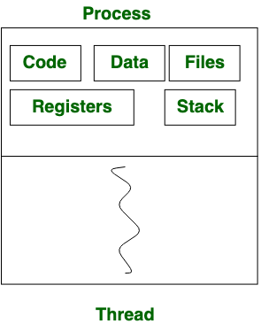
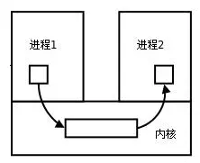
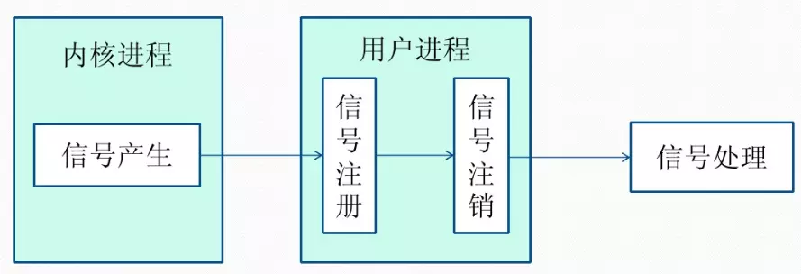
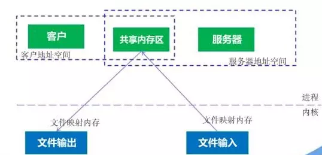
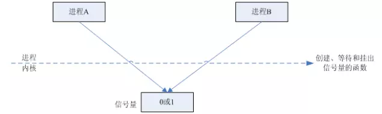
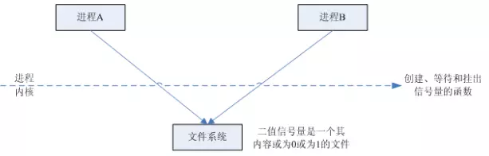
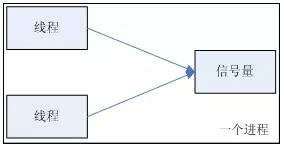

# Process and Thread

[toc]

# 1. Process

Process means any program is in execution (like **jobs** ). **Process control block** controls the operation of any process. Process control block contains **information** about processes for example Process priority, process id, process state, CPU, register, etc. A process can creates other processes which are known as **Child Processes** . Process takes more time to terminate and it is isolated means it does not share memory with any other process.

The process can have the following states like new, ready, running, waiting, terminated, suspended.

# 2. Thread

Thread is the segment of a process means a process can have multiple threads and these multiple threads are **contained within a process** . A thread have 3 states: **running, ready, and blocked** .

Thread takes less time to terminate as compared to process and like process threads do not isolate.

Different thread in a process can share some resources.



# 3. Thread Pool

# 4. Mutex

# 5. InterProcess Communication (IPC)

> From: [https://www.jianshu.com/p/c1015f5ffa74](https://www.jianshu.com/p/c1015f5ffa74)
>

## 5.1. Background

每个进程各自有**不同的用户地址空间** ，任何一个进程的全局变量在另一个进程中都**看不到** ，所以进程之间要交换数据**必须通过内核** ，在内核中开辟一块**缓冲区** ，进程1把数据从用户空间拷到内核缓冲区，进程2再从内核缓冲区把数据读走，内核提供的这种机制称为**进程间通信（IPC，InterProcess Communication）**



## 5.2. Pipe

* 管道是**半双工的** ，数据**只能向一个方向流动** ；需要双方通信时，需要建立起两个管道。
* **只能用于父子进程或者兄弟进程之间(具有亲缘关系的进程)** ;
* 单独构成一种独立的文件系统：管道对于管道两端的进程而言，就是**一个文件** ，但它不是普通的文件，它不属于某种文件系统，而是自立门户，单独构成一种文件系统，并且只存在与内存中。
* 数据的读出和写入：一个进程向管道中写的内容被管道另一端的进程读出。写入的内容每次都添加在管道缓冲区的末尾，并且每次都是**从缓冲区的头部读出数据。**


* 管道的实质是一个**内核缓冲区** ，**进程以先进先出的方式从缓冲区存取数据** ，管道一端的进程顺序的将数据写入缓冲区，另一端的进程则顺序的读出数据。
* 该缓冲区**可以看做是一个循环队列，读和写的位置都是自动增长的** ，不能随意改变，一个数据只能被读一次，读出来以后在缓冲区就不复存在了。
* 当缓冲区**读空或者写满时** ，有一定的规则控制相应的读进程或者写进程**进入等待队列** ，当空的缓冲区有新数据写入或者满的缓冲区有数据读出来时，就唤醒等待队列中的进程继续读写。

**Limitation**

* 只支持单向数据流；
* 只能用于具有亲缘关系的进程之间；
* 没有名字；
* 管道的缓冲区是有限的（管道制存在于内存中，在管道创建时，为缓冲区分配一个页面大小）；
* 管道所传送的是**无格式字节流** ，这就要求管道的读出方和写入方必须事先约定好数据的格式，比如多少字节算作一个消息（或命令、或记录）等等

## 5.3. FIFO

* 有名管道不同于匿名管道之处在于它提供了一个路径名与之关联，**以有名管道的文件形式存在于文件系统中** ，这样，**即使与有名管道的创建进程不存在亲缘关系的进程，只要可以访问该路径，就能够彼此通过有名管道相互通信** ，因此，通过有名管道不相关的进程也能交换数据。
* 值的注意的是，有名管道严格遵循**先进先出(first in first out)** ,对匿名管道及有名管道的读总是从开始处返回数据，对它们的写则把数据添加到末尾。它们不支持诸如lseek()等文件定位操作。**有名管道的名字存在于文件系统中，内容存放在内存中。**

**Overview of Pipe and FIFO**

（1）管道是特殊类型的文件，在满足先入先出的原则条件下可以进行读写，但不能进行定位读写。
（2）匿名管道是单向的，只能在有亲缘关系的进程间通信；有名管道以磁盘文件的方式存在，可以实现本机任意两个进程通信。
（3）**无名管道阻塞问题：**无名管道无需显示打开，创建时直接返回文件描述符，在读写时需要确定对方的存在，否则将退出。如果当前进程向无名管道的一端写数据，必须确定另一端有某一进程。如果写入无名管道的数据超过其最大值，写操作将阻塞，如果管道中没有数据，读操作将阻塞，如果管道发现另一端断开，将自动退出。
（4）**有名管道阻塞问题：**有名管道在打开时需要确实对方的存在，否则将阻塞。即以读方式打开某管道，在此之前必须一个进程以写方式打开管道，否则阻塞。此外，可以以读写（O_RDWR）模式打开有名管道，即当前进程读，当前进程写，不会阻塞。

## 5.4. Signal

* 信号是Linux系统中用于进程间互相通信或者操作的一种机制，**信号可以在任何时候发给某一进程，而无需知道该进程的状态** 。
* 如果该进程当前并未处于执行状态，则该信号就有内核保存起来，知道该进程回复执行并传递给它为止。
* 如果一个信号被进程设置为阻塞，则该信号的传递被延迟，直到其阻塞被取消是才被传递给进程。

### Linux 系统中常用信号

（1）**SIGHUP**用户从终端注销，所有已启动进程都将收到该进程。系统缺省状态下对该信号的处理是终止进程。
（2）**SIGINT:**程序终止信号。程序运行过程中，按`Ctrl+C`键将产生该信号。
（3）**SIGQUIT:**程序退出信号。程序运行过程中，按`Ctrl+\\\\`键将产生该信号。
（4）**SIGBUS和SIGSEGV:**进程访问非法地址。
（5）**SIGFPE：运算中出现致命错误，如除零操作、数据溢出等。
（6）**SIGKILL：**用户终止进程执行信号。shell下执行`kill -9`发送该信号。
（7）**SIGTERM：**结束进程信号。shell下执行`kill 进程pid`发送该信号。
（8）**SIGALRM：**定时器信号。
（9）**SIGCLD：**子进程退出信号。如果其父进程没有忽略该信号也没有处理该信号，则子进程退出后将形成僵尸进程。

### Resources of

信号是**软件层次上** 对中断机制的一种模拟，是一种异步通信方式，信号**可以在用户空间进程和内核之间直接交互** ，内核可以利用信号来通知用户空间的进程发生了哪些系统事件，信号事件主要有两个来源：

* 硬件来源：用户按键输入`Ctrl+C`退出、硬件异常如无效的存储访问等。
* 软件终止：终止进程信号、其他进程调用kill函数、软件异常产生信号

### Life Circle and Processing process of Signal



（1）信号被某个进程产生，并设置此信号**传递的对象** （一般为对应进程的pid），然后传递给操作系统；
（2）操作系统根据接收进程的设置（是否阻塞）而**选择性的发送** 给接收者，如果接收者阻塞该信号（且该信号是可以阻塞的），操作系统将暂时保留该信号，而不传递，直到该进程解除了对此信号的阻塞（如果对应进程已经退出，则丢弃此信号），如果对应进程没有阻塞，操作系统将传递此信号。
（3）目的进程接收到此信号后，**将根据当前进程对此信号设置的预处理方式** ，暂时终止当前代码的执行，保护上下文（主要包括临时寄存器数据，当前程序位置以及当前CPU的状态）、转而执行中断服务程序，执行完成后在回复到中断的位置。**当然，对于抢占式内核，在中断返回时还将引发新的调度。**

## 5.5.  Message Queue

* 消息队列是存放在内核中的**消息链表** ，每个消息队列由消息队列标识符表示。
* 与管道（无名管道：只存在于内存中的文件；命名管道：存在于实际的磁盘介质或者文件系统）不同的是消息队列**存放在内核中** ，**只有在内核重启(即，操作系统重启)或者显示地删除一个消息队列时，该消息队列才会被真正的删除** 。
* 另外与管道不同的是，**消息队列在某个进程往一个队列写入消息之前，并不需要另外某个进程在该队列上等待消息的到达**

### Property

（1）消息队列是消息的链表,具有特定的格式,存放在内存中并由消息队列标识符标识.
（2）消息队列**允许一个或多个进程** 向它写入与读取消息.
（3）管道和消息队列的通信数据都是**先进先出** 的原则。
（4）消息队列可以实现消息的**随机查询** ,消息**不一定要以先进先出的次序读取** ,也可以按消息的类型读取.比FIFO更有优势。
（5）消息队列克服了信号承载信息量少，管道只能承载无格式字节流以及缓冲区大小受限等缺。
（6）目前主要有两种类型的消息队列：**POSIX消息队列** 以及**System V消息队列** ，系统V消息队列目前被大量使用。系统V消息队列是随内核持续的，只有在内核重起或者人工删除时，该消息队列才会被删除。

## 5.6. Shared Memory

* 使得多个进程可以可以**直接读写同一块内存空间** ，是最快的可用IPC形式。
* 是针对其他通信机制运行效率较低而设计的。为了在多个进程间交换信息，内核专门留出了一块内存区，可以由需要访问的进程将其映射到自己的私有地址空间。进程就可以直接读写这一块内存而不需要进行数据的拷贝，从而大大提高效率。
* 由于多个进程共享一段内存，因此**需要依靠某种同步机制（如信号量）来达到进程间的同步及互斥。**



## 5.7. Semaphore

信号量是一个**计数器** ，用于多进程对共享数据的访问，信号量的意图在于进程间同步。
为了获得共享资源，进程需要执行下列操作：
（1）**创建一个信号量** ：这要求调用者指定初始值，对于二值信号量来说，它通常是1，也可是0。
（2）**等待一个信号量** ：该操作会测试这个信号量的值，如果小于0，就阻塞。也称为P操作。
（3）**挂出一个信号量** ：该操作将信号量的值加1，也称为V操作。

为了正确地实现信号量，信号量值的测试及减1操作应当是原子操作。为此，信号量通常是在内核中实现的。Linux环境中，有三种类型：**Posix（[可移植性操作系统接口](https://link.jianshu.com/?t=http://baike.baidu.com/link?url=hYEo6ngm9MlqsQHT3h28baIDxEooeSPX6wr_FdGF-F8mf7wDp2xJWIDtQWGEDxthtPNiJtlsw460g1_N0txJYa)）有名信号量（使用Posix IPC名字标识）** 、**Posix基于内存的信号量（存放在共享内存区中）** 、**System V信号量（在内核中维护）** 。这三种信号量都可用于进程间或线程间的同步。







### 信号量与普通整型变量的区别：

1. 信号量是**非负整型变量** ，除了初始化之外，它只能通过**两个标准原子操作** ：wait(semap) , signal(semap) ; 来进行访问；
2. 操作也被成为PV原语（P来源于荷兰语proberen"测试"，V来源于荷兰语verhogen"增加"，P表示通过的意思，V表示释放的意思），而普通整型变量则可以在任何语句块中被访问；

### 信号量与互斥量的区别

* Strictly speaking, a mutex is locking mechanism used to synchronize access to a resource. Only one task (can be a thread or process based on OS abstraction) can acquire the mutex. It means there is ownership associated with mutex, and only the owner can release the lock (mutex).
* **Semaphore is signaling mechanism** (“I am done, you can carry on” kind of signal). For example, if you are listening songs (assume it as one task) on your mobile and at the same time your friend calls you, an interrupt is triggered upon which an interrupt service routine (ISR) signals the call processing task to wakeup.**That means, the "signal" can be entered/visited by several different processes, which is different from mutex**
* Mutex is just an object while Semaphore is an integer
* Mutex has no subtype whereas Semaphore has two types, which are counting semaphore and binary semaphore.
* Semaphore supports wait and signal operations modification, whereas Mutex is only modified by the process that may request or release a resource.
* Semaphore value is modified using wait () and signal () operations, on the other hand, Mutex operations are locked or unlocked.

### Example

> From: [https://stackoverflow.com/questions/62814/difference-between-binary-semaphore-and-mutex](https://stackoverflow.com/questions/62814/difference-between-binary-semaphore-and-mutex)
>

Binary Semaphore address a totally different question:

* Task B is pended waiting for something to happen (a sensor being tripped for example).
* Sensor Trips and an Interrupt Service Routine runs. It needs to notify a task of the trip.
* Task B should run and take appropriate actions for the sensor trip. Then go back to waiting.

```cpp
Task A                      Task B
...                         Take BinSemaphore   <== wait for something
Do Something Noteworthy
Give BinSemaphore           do something    <== unblocks

```

Note that with a binary semaphore, it is OK for B to take the semaphore and A to give it.
Again, a binary semaphore is NOT protecting a resource from access. The act of Giving and Taking a semaphore are fundamentally decoupled.
It typically makes little sense for the same task to so a give and a take on the same binary semaphore.

# 6. Priority

## 6.1. Priority Inversion

> From: [https://en.wikipedia.org/wiki/Priority_inversion#Solutions](https://en.wikipedia.org/wiki/Priority_inversion#Solutions)
>

In computer science, ***priority inversion*** is a scenario in scheduling in which **a high priority task is indirectly preempted by a lower priority task** effectively inverting the relative priorities of the two tasks.

* Priority is a kind of sequence**that is known by CPU** , not directly by other resources/hardware
* Consider two tasks**H and L** , of high and low priority respectively, either of which can acquire exclusive use of a**shared resource R** .
* If H attempts to acquire R after L has acquired it, then H becomes blocked until L relinquishes the resource. Sharing an exclusive-use resource (R in this case) in a well-designed system typically involves L relinquishing R promptly so that H (a higher priority task) does not stay blocked for excessive periods of time.
* Despite good design, however, it is possible that a third**task M** of medium priority (p(L) < p(M) < p(H), where p(x) represents the priority for task (x)) becomes runnable during L's use of R. At this point, M being higher in priority than L, preempts L (since**M does not depend on R** ), causing**L to not be able to relinquish R promptly** , in turn causing
* the highest priority process—to be unable to run (that is,**H suffers unexpected blockage indirectly caused by lower priority tasks like M** ).

### Priority ceiling protocol

优先级天花板是当任务申请某资源时， 把**该任务的优先级提升到可访问这个资源的所有任务中的最高优先级** ， 这个优先级称为该资源的优先级天花板。

### Priority inheritance

当任务A 申请共享资源S 时， 如果S正在被任务C 使用，通过**比较任务C 与自身的优先级** ，如发现任务C 的优先级小于自身的优先级， 则**将任务C的优先级提升到自身的优先级** ， 任务C 释放资源S 后，再恢复任务C 的原优先级。这种方法只在占有资源的低优先级任务阻塞了高优先级任务时才动态的改变任务的优先级，如果过程较复杂， 则需要进行判断。