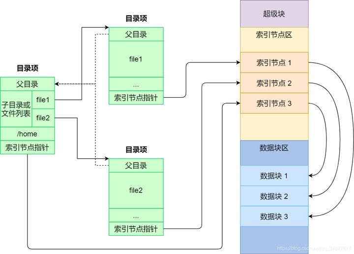
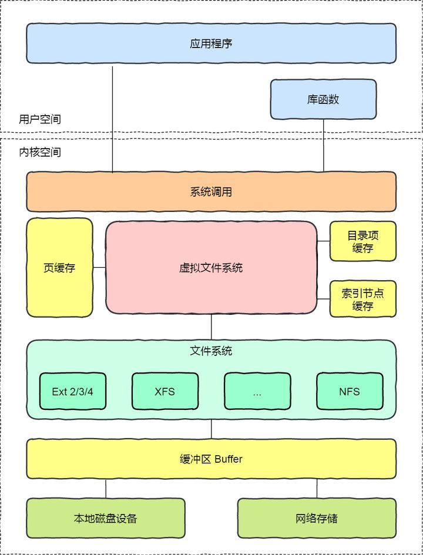

# 文件系统

[toc]

> From: https://zhuanlan.zhihu.com/p/183238194

# 1. 文件系统的组成

文件系统是操作系统中**负责管理持久数据的子系统**，

文件系统的**基本数据单位是文件**，

## 1.1. Linux 文件系统

Linux 最经典的一句话是：「**一切皆文件**」，不仅普通的文件和目录，就连块设备、管道、socket 等，也都是统一交给文件系统管理的。

Linux 文件系统会为每个文件分配两个数据结构：**索引节点（index node）和目录项（directory entry）**，它们主要用来记录文件的元信息和目录层次结构。

- 索引节点，也就是 *inode*，用来记录文件的元信息，比如 inode 编号、文件大小、访问权限、创建时间、修改时间、**数据在磁盘的位置**等等。索引节点是文件的**唯一**标识，它们之间一一对应，也同样都会被存储在硬盘中，所以**索引节点同样占用磁盘空间**。
- 目录项，也就是 *dentry*，用来记录文件的名字、**索引节点指针**以及与其他目录项的层级关联关系。多个目录项关联起来，就会形成目录结构，但它与索引节点不同的是，**目录项是由内核维护的一个数据结构，不存放于磁盘，而是缓存在内存**。

由于索引节点唯一标识一个文件，而目录项记录着文件的名，所以**目录项和索引节点的关系是多对一**。

注意，**目录也是文件**，也是用索引节点唯一标识，和普通文件不同的是，普通文件在磁盘里面保存的是文件数据，而**目录文件在磁盘里面保存子目录或文件。**

### 目录项vs目录

**目录是个文件，持久化存储在磁盘，而目录项是内核一个数据结构，缓存在内存。**

如果查询目录频繁从磁盘读，效率会很低，所以**内核会把已经读过的目录用目录项这个数据结构缓存在内存**，下次再次读到相同的目录时，只需从内存读就可以，大大提高了文件系统的效率

### 文件数据的存储

磁盘读写的最小单位是**扇区**，扇区的大小只有 `512B` 大小，很明显，如果每次读写都以这么小为单位，那这读写的效率会非常低。

所以，文件系统把多个扇区组成了一个**逻辑块**，每次读写的最小单位就是逻辑块（数据块），Linux 中的逻辑块大小为 `4KB`，也就是一次性读写 8 个扇区，这将大大提高了磁盘的读写的效率。

### 磁盘的存储区域划分

磁盘进行格式化的时候，会被分成三个存储区域，分别是**超级块、索引节点区和数据块区**。 

* *超级块*，用来存储文件系统的详细信息，比如块个数、块大小、空闲块等等, 当文件系统挂载时进入内存
*  *索引节点区*，用来存储索引节点； 当文件被访问时进入内存
* *数据块区*，用来存储文件或目录数据

# 2. 虚拟文件系统

文件系统的种类众多，而操作系统希望**对用户提供一个统一的接口**，于是在用户层与文件系统层引入了中间层，这个中间层就称为**虚拟文件系统（Virtual File System，VFS）。**VFS 定义了一组**所有文件系统都支持的数据结构和标准接口**，这样程序员不需要了解文件系统的工作原理，只需要了解 VFS 提供的统一接口即可。

## 2.1. Linux 虚拟文件系统

在 Linux 文件系统中，用户空间、系统调用、虚拟机文件系统、缓存、文件系统以及存储之间的关系如下图：

Linux 中可以把文件系统分为三类：

- *磁盘的文件系统*，它是直接把数据存储在磁盘中，比如 Ext 2/3/4、XFS 等都是这类文件系统。
- *内存的文件系统*，这类文件系统的数据不是存储在硬盘的，而是占用内存空间，我们经常用到的 `/proc` 和 `/sys` 文件系统都属于这一类，读写这类文件，实际上是读写内核中相关的数据数据。
- *网络的文件系统*，用来访问其他计算机主机数据的文件系统，比如 NFS、SMB 等等。

文件系统首先要先挂载到某个目录才可以正常使用，比如 Linux 系统在启动时，会把文件系统挂载到根目录。