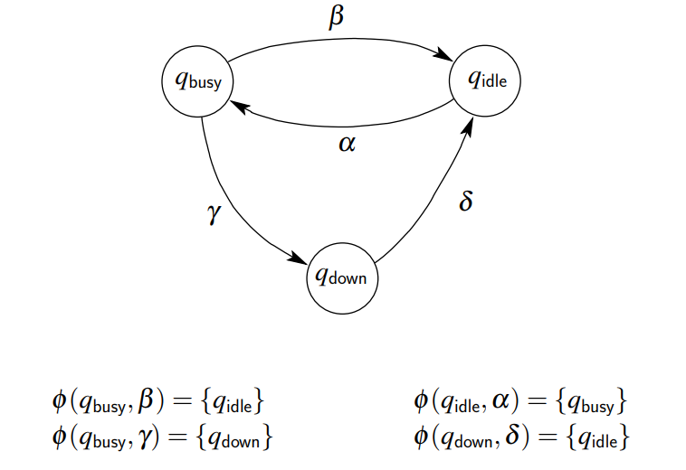
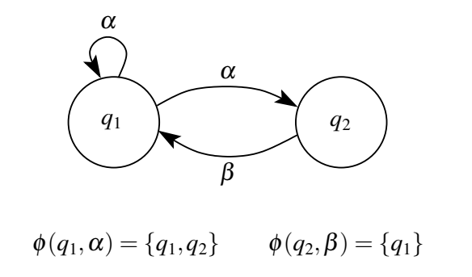
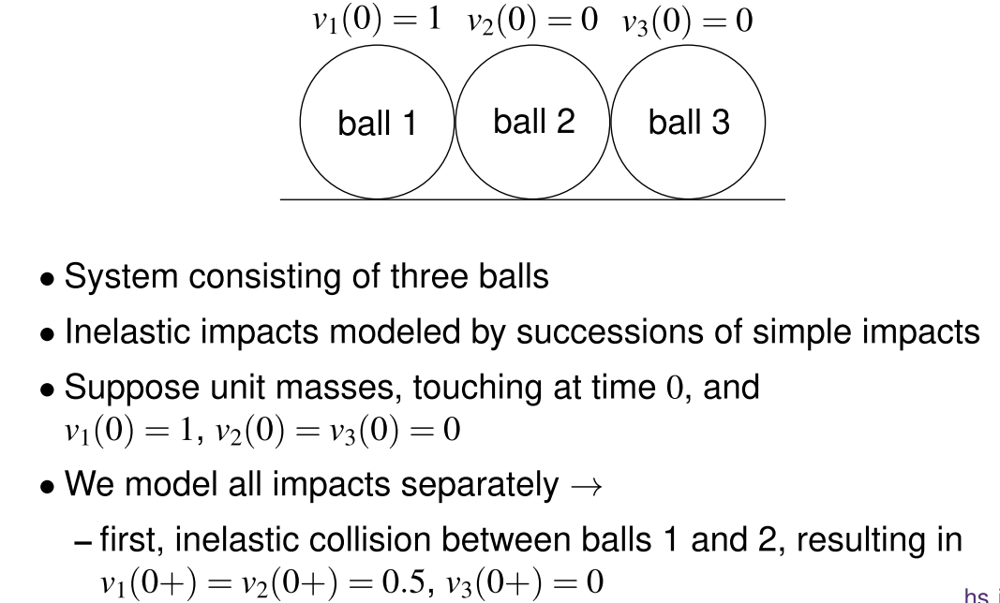

# Introduction of Hybrid Systems

[toc]

# 1. System and Basic Automata

## 1.1. Definition of System

$$
x(\sigma)=\phi(\tau, \sigma, x(\tau), u)
$$
$\tau$ : initial time
$\sigma:$ current time
$u:$ input function (over $[\tau, \sigma])$
$\phi:$ transition map

### Classification

* Continuous-state (speed, position)/Discrete-state (#customers in the queue)
* Continuous-time/Discrete-time
* Time-driven/Event-Driven

Combination of them we call "hybrid"

## 1.2. Models for Time-Driven Systems

Continuous-time time-driven systems:
$$
\begin{aligned}
\dot{x}(t) &=f(x(t), u(t)) \\
y(t) &=g(x(t), u(t))
\end{aligned}
$$
Discrete-time (or sampled) time-driven systems:
$$
\begin{aligned}
x(k+1) &=f(x(k), u(k)) \\
y(k) &=g(x(k), u(k))
\end{aligned}
$$

## 1.3. Models For Event-driven Systems

Automaton is defined by triple $\Sigma=(\mathscr{Q}, \mathscr{U}, \phi)$ with
$\mathscr{Q}$ : **finite or countable** set of discrete states

$\mathscr{U}:$ **finite or countable set** of discrete inputs ("input alphabet")

$\phi: \mathscr{Q} \times \mathscr{U} \rightarrow P(\mathscr{Q}):$ partial transition function.

where $P(\mathscr{Q})$ is power set of $\mathscr{Q}$ (set of all subsets)

Finite automaton: $\mathscr{Q}$ and $\mathscr{U}$ finite

### Countable

Countable means we can assign **order** on the elements

## 1.4. Evolution of Automaton

### Deterministic Automaton

If each set of next states has 0 or 1 element

### Non-Deterministic Automaton

If some set of next states has more than 1 element  

## 1.5. Hybrid System

System can be in **one of several modes**  

* In each mode: behavior described by system of difference or differential equations  

* Mode switches due to occurrence of “events”  
  * external control signal  
  * internal control signal  
  * dynamics of system itself  

# 2. Computation Complexity

# 3. Hybrid Automaton

## 3.1. Definition

Hybrid automaton $H$ is collection $H=(Q, X, f$, Init $, \operatorname{lnv}, E, G, R)$ where
- $Q=\left\{q_{1}, \ldots, q_{N}\right\}$ is finite set of **discrete states or modes**
- $X=\mathbb{R}^{n}$ is set of **continuous states**
- $f: Q \times X \rightarrow X$ is **vector field**
- Init $\subseteq Q \times X$ is set of **initial states**
- Inv: $Q \rightarrow P(X)$ describes **invariants**
- $E \subseteq Q \times Q$ is set of **edges or transitions**
- $G: E \rightarrow P(X)$ is guard condition
- $R: E \rightarrow P(X \times X)$ is **reset map**

## 3.2. illustration

* Hybrid state: $(q, x)$
* **Evolution** of continuous state in mode $q: \dot{x}=f(q, x)$
* Invariant Inv: describes conditions that **continuous state has to satisfy in given mode**
* Guard $G:$ specifies subset of state space where certain **transition is enabled**
* Reset map $R$ : specifies how **new continuous states are related to previous continuous states**

## 3.3. Evolution of Hybrid Automaton

* **Initial** hybrid state $\left(q_{0}, x_{0}\right) \in$ Init

* **Continuous state** $x$ evolves according to
  $$
  \dot{x}=f\left(q_{0}, x\right) \quad$ with $x(0)=x_{0}
  $$
  
* **discrete state** $q$ remains constant: $q(t)=q_{0}$

* Continuous evolution c**an go on as long as** $x \in \operatorname{lnv}\left(q_{0}\right)$

* If at some point state $x$ **reaches guard** $G\left(q_{0}, q_{1}\right)$, then

  * transition $q_{0} \rightarrow q_{1}$ is **enabled**
  * discrete state **may change** to $q_{1}$, continuous state then **jumps** from current value $x^{-}$ to new value $x^{+}$ with $\left(x^{-}, x^{+}\right) \in R\left(q_{0}, q_{1}\right)$

* Next, continuous evolution resumes and whole process is repeated

# 4. Zeno Behavior

## 4.1. Introduction

**infinitely** many mode **switches** in **finite** time interval

* Live-lock is a case of Zeno Behavior

## 4.2. Bouncing Ball Example

