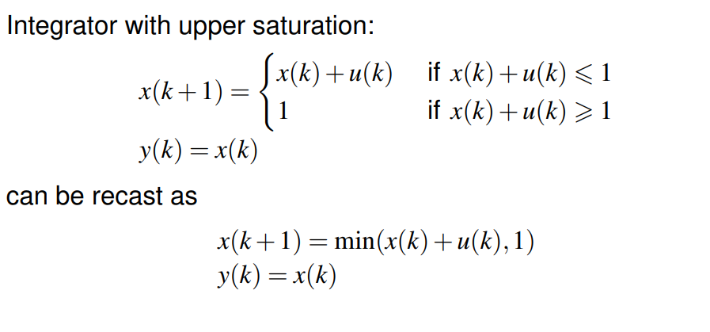
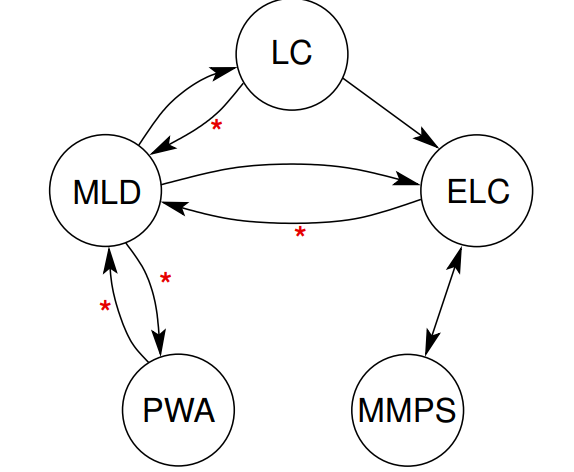

# Modelling Framework of Hybrid Systems

[toc]

# 1. Frameworks

## 1.1. Piecewise Affine Systems (PWA)

> region partition and piece-wise affine constraint

$$
\begin{aligned}
x(k+1) &=A_{i} x(k)+B_{i} u(k)+f_{i} \\
y(k) &=C_{i} x(k)+D_{i} u(k)+g_{i}
\end{aligned} \text { for }\left[\begin{array}{l}
x(k) \\
u(k)
\end{array}\right] \in \Omega_{i}, i=1, \ldots, N
$$

with

$\Omega_1,\cdots ,\Omega_N$: convex polyhedra (i.e., given by finite number of linear inequalities) in input/state space, non-overlapping interiors  

* PWA can be used as **approximation of nonlinear model**  

## 1.2. Mixed Logical Dynamical (MLD) Systems

> boolean variable + linear equality constraint

$$
\begin{aligned}
x(k+1) &=A x(k)+B_{1} u(k)+B_{2} \delta(k)+B_{3} z(k) \\
y(k) &=C x(k)+D_{1} u(k)+D_{2} \delta(k)+D_{3} z(k) \\
E_{1} x(k) &+E_{2} u(k)+E_{3} \delta(k)+E_{4} z(k) \leqslant g_{5}, \\
\end{aligned}
$$
$x(k)=\left[x_{\mathrm{r}}^{\top}(k) x_{\mathrm{b}}^{\top}(k)\right]^{\top}$with $x_{\mathrm{r}}(k)$  real-valued,  $x_{\mathrm{b}}(k)$ boolean

$z(k):$ real-valued auxiliary variables

 $\delta(k):$ boolean auxiliary variables

### Transformation of Logical part

* Associate with literal $X_{i}$ logical variable$\delta_{i} \in\{0,1\}:$

  $\delta_{i}=1$ iff $X_{i}=\mathrm{T}, \delta_{i}=0$ iff $X_{i}=\mathrm{F}$

* Other Logical Operations

$$
\begin{array}{l}
X_{1} \wedge X_{2} \text { equivalent to } \delta_{1}=\delta_{2}=1\\
X_{1} \vee X_{2} \text { equivalent to } \delta_{1}+\delta_{2} \geqslant 1\\
\sim X_{1} \text { equivalent to } \delta_{1}=0\\
X_{1} \Rightarrow X_{2} \text { equivalent to } \delta_{1}-\delta_{2} \leqslant 0\\
X_{1} \Leftrightarrow X_{2} \text { equivalent to } \delta_{1}-\delta_{2}=0\\
X_{1} \oplus X_{2} \text { equivalent to } \delta_{1}+\delta_{2}=1
\end{array}
$$

### Transformation of Real-Value Function

* For $f: \mathbb{R}^{n} \rightarrow \mathbb{R}$ and $x \in \mathscr{X}$ with $\mathscr{X}$ bounded, define

$$
M \stackrel{\text { def }}{=} \max _{x \in \mathscr{X}} f(x) \quad m \stackrel{\text { def }}{=} \min _{x \in \mathscr{X}} f(x)
$$

* Mixture Logic of real-value function and boolean variables
  $$
  \begin{array}{l}
  [f(x) \leqslant 0] \wedge[\delta=1] \text { true iff } f(x)-\delta \leqslant-1+m(1-\delta)\\
  [f(x) \leqslant 0] \vee[\delta=1] \text { true iff } f(x) \leqslant M \delta\\
  \sim[f(x) \leqslant 0] \text { true iff } f(x) \geqslant \varepsilon \quad \text { (with } \varepsilon \text { machine precision) }\\
  [f(x) \leqslant 0] \Rightarrow[\delta=1] \text { true iff } f(x) \geqslant \varepsilon+(m-\varepsilon) \delta\\
  [f(x) \leqslant 0] \Leftrightarrow[\delta=1] \text { true iff }\left\{\begin{array}{l}
  f(x) \leqslant M(1-\delta) \\
  f(x) \geqslant \varepsilon+(m-\varepsilon) \delta
  \end{array}\right.
  \end{array}
  $$

### Transformation of Product of Logic Variable

Product $\delta_1\delta_2$ can be replaced by auxiliary variable $\delta_3 = \delta_1\delta_2$  
$$
\delta_{3}=\delta_{1} \delta_{2} \quad \text { is equivalent to }\left\{\begin{array}{l}
-\delta_{1}+\delta_{3} \leqslant 0 \\
-\delta_{2}+\delta_{3} \leqslant 0 \\
\delta_{1}+\delta_{2}-\delta_{3} \leqslant 1
\end{array}\right.
$$

### Transformation of Product of Logic Variable and Real-value Function

$\delta f (x)$ can be replaced by auxiliary real variable $y = \delta f (x)$  
$$
y=\delta f(x) \quad \text { is equivalent to }\left\{\begin{array}{l}
y \leqslant M \delta \\
y \geqslant m \delta \\
y \leqslant f(x)-m(1-\delta) \\
y \geqslant f(x)-M(1-\delta)
\end{array}\right.
$$

### One example of transformation from PWA to MLD

## 1.3. Linear Complementarity (LC) systems

> complementarity condition + linear equality constraint

$$
\begin{aligned}
x(k+1) &=A x(k)+B_{1} u(k)+B_{2} w(k) \\
y(k) &=C x(k)+D_{1} u(k)+D_{2} w(k) \\
v(k) &=E_{1} x(k)+E_{2} u(k)+E_{3} w(k)+e_{4} \\
0 \leqslant v(k) & \perp w(k) \geqslant 0
\end{aligned}
$$

$v(k), w(k)$: “complementarity variables” (real-valued)  

* LC  systems do not have $\delta$ and inequality constraints
* LC systems only have equation and complementary conditions

## 1.4. Extended Linear Complementarity (ELC) systems

> group complementarity condition + linear equality constraint

$$
\begin{array}{l}
x(k+1)=A x(k)+B_{1} u(k)+B_{2} d(k) \\
y(k)=C x(k)+D_{1} u(k)+D_{2} d(k) \\
E_{1} x(k)+E_{2} u(k)+E_{3} d(k) \leqslant e_{4} \\
\sum_{i=1}^{p} \prod_{j \in \phi_{i}}\left(e_{4}-E_{1} x(k)-E_{2} u(k)-E_{3} d(k)\right)_{j}=0
\end{array}
$$

$d(k)$: real-valued auxiliary variable  

* The 4th condition is equal to  $\prod_{j \in \phi_{i}}\left(e_{4}-E_{1} x(k)-E_{2} u(k)-E_{3} d(k)\right)_{j}=0 \quad \text { for each } i \in\{1, \ldots, p\}$
  * system of linear inequalities with p groups, in each group **at least one inequality should hold with equality**  

## 1.5. Max-Min-Plus-Scaling (MMPS) systems

Max-min-plus-scaling expression : 
$$
f:=x_{i}|\alpha| \max \left(f_{k}, f_{l}\right)\left|\min \left(f_{k}, f_{l}\right)\right| f_{k}+f_{l} \mid \beta f_{k}
$$
with $\alpha, \beta \in \mathbb{R}$ and $f_{k}, f_{l}$ again **MMPS expressions.**

**<u>MMPS Systems</u>**
$$
\begin{array}{l}
x(k+1)=\mathscr{M}_{x}(x(k), u(k), d(k)) \\
y(k)=\mathscr{M}_{y}(x(k), u(k), d(k)) \\
\mathscr{M}_{c}(x(k), u(k), d(k)) \leqslant c \\
\text { with } \mathscr{M}_{x}, \mathscr{M}_{y}, \mathscr{M}_{\mathrm{c}} \text { MMPS expressions }
\end{array}
$$
$d(k)$: real-valued auxiliary variables  

* It is good for systems with soft & hard synchronization constraints  

**<u>Example</u>**

# 2. Equivalence of MLD, LC, ELC, PWA, and MMPS systems  

## 2.1. Definition of Equivalence

Equivalence between model classes $\mathscr{A}$ and $\mathscr{B}$ :
for each model $\in \mathscr{A}$ there exists model $\in \mathscr{B}$ with same input/output behavior $(+$ vice versa $)$

## 2.2. Equivalence Relations

red star means this transformation need some constraints

## 2.3. Different Advantages

Each subclass has own advantages:

* stability criteria for PWA
* control and verification techniques for MLD
* control techniques for MMPS
* conditions of existence and uniqueness of solutions for LC
* transfer techniques from one class to other

# 3. Transformation Among Different Systems

## 3.1. MLD and LC systems

*<u>Every MLD system can be written as LC system</u>*
$$
\begin{array}{l}
x(k+1)=A x(k)+B_{1} u(k)+\left[\begin{array}{llll}
B_{2} & 0 & B_{3} & -B_{3}
\end{array}\right] w(k)\\
y(k)=C x(k)+D_{1} u(k)+\left[\begin{array}{llll}
D_{2} & 0 & D_{3} & -D_{3}
\end{array}\right] w(k)\\
\underbrace{\left(\begin{array}{c}
p(k) \\
q(k) \\
s(k) \\
t(k)
\end{array}\right)}_{=: v(k)}=\left(\begin{array}{c}
e \\
g_{5}-E_{1} x(k)-E_{2} u(k) \\
0 \\
0
\end{array}\right)+\left(\begin{array}{cccc}
-I & 0 & 0 & 0 \\
-E_{3} & 0 & -E_{4} & E_{4} \\
0 & 0 & 0 & I \\
0 & 0 & I & 0
\end{array}\right) \underbrace{\left(\begin{array}{c}
\delta(k) \\
r(k) \\
z^{+}(k) \\
z^{-}(k)
\end{array}\right)}_{=: w(k)}\\
0 \leqslant v(k) \perp w(k) \geqslant 0
\end{array}
$$

* $\delta_{i}(k) \in\{0,1\}$ is equivalent to $0 \leqslant \delta_{i}(k) \perp 1-\delta_{i}(k) \geqslant 0$ $\rightarrow$ introduce **auxiliary variable** $p(k)=\left[\begin{array}{llll}1 & 1 & \ldots & 1\end{array}\right]^{\top}-\delta(k)$ with
  $$
  \begin{array}{c}
  0 \leqslant \delta(k) \perp p(k) \geqslant 0 \\
  \end{array}
  $$
* For **constraint** $E_{1} x(k)+E_{2} u(k)+E_{3} \delta(k)+E_{4} z(k) \leqslant g_{5}$, introduce auxiliary variables $q(k)=g_{5}-E_{1} x(k)-E_{2} u(k)-E_{3} \delta(k)-E_{4} z(k) \geqslant 0$ and $r(k)=0$ with
  $$
  0 \leqslant q(k) \perp r(k) \geqslant 0
  $$

* For LC: all variables $\geqslant 0$ $\rightarrow$ **split real-valued variable** $z(k)$ in "positive" and "negative part":
  $z(k)=z^{+}(k)-z^{-}(k)$ with $z^{+}(k)=\max (0, z(k)), z^{-}(k)=\max (0,-z(k))$
  or $0 \leqslant z^{+}(k) \perp z^{-}(k) \geqslant 0$

*<u>Every LC system can be written as MLD provided that $w(k)$ and $v(k)$ are bounded</u>*

* Transform $v(k)$ and $w(k)$

  * LC complementarity condition $0 \leqslant v(k) \perp w(k) \geqslant 0$ implies that for each $i$ we have $v_{i}(k)=0, w_{i}(k) \geqslant 0$ or $v_{i}(k) \geqslant 0, w_{i}(k)=0$

  * **Introduce boolean vector** $\delta(k)$ such that
    $$
    \begin{array}{l}
    v_{i}(k)=0, w_{i}(k) \geqslant 0 \leftrightarrow \delta_{i}(k)=1 \\
    v_{i}(k) \geqslant 0, w_{i}(k)=0 \leftrightarrow \delta_{i}(k)=0
    \end{array}
    $$

  * Can be achieved by **introducing constraints**
    $$
    \begin{array}{l}
    w(k) \leqslant M_{w} \delta(k) \\
    v(k) \leqslant M_{v}\left([11 \ldots 1]^{\top}-\delta(k)\right) \\
    w(k), v(k) \geqslant 0
    \end{array}
    $$
    with $M_{w}, M_{v}$ diagonal matrices containing **upper bounds** on $w(k), v(k)$

    (in practice, the upper bounds usually known due to physical reasons/insight)

  * replacing linear equality constraints: Replacing $v(k)$ by $E_{1} x(k)+E_{2} u(k)+E_{3} w(k)+e_{4}$ in inequalities finally results in MLD model
    $$
    x(k+1)=A x(k)+B_{1} u(k)+B_{2} z(k) \\
    y(k)=C x(k)+D_{1} u(k)+D_{2} z(k) \\
    \left[\begin{array}{c}0 \\ E_{1} \\ 0 \\ -E_{1}\end{array}\right] x(k)+\left[\begin{array}{c}0 \\ E_{2} \\ 0 \\ -E_{2}\end{array}\right] u(k)+\left[\begin{array}{c}-M_{w} \\ M_{v} \\ 0 \\ 0\end{array}\right] \delta(k)+\left[\begin{array}{c}I \\ E_{3} \\ -I \\ -E_{3}\end{array}\right] z(k) \leqslant\left[\begin{array}{c}0 \\ M_{v} e-e_{4} \\ 0 \\ e_{4}\end{array}\right]
    $$

    with $e=\left[\begin{array}{llll}1 & 1 & \ldots & 1\end{array}\right]^{\top}$

## 3.2. LC and ELC systems

<u>*Every LC system can be written as ELC system*</u>
$$
v(k) \perp w(k) \text { is equivalent to } \sum v_{i}(k) w_{i}(k)=0
$$

## 3.3. PWA and MLD systems

<u>*Well-posed PWA system can be rewritten as MLD system assuming that set of feasible states and inputs is bounded*</u>

See the example

*<u>Completely well-posed MLD can be rewritten as PWA</u>*

**<u>well-posed</u>**: given $x(k)$, $u(k)$, then $x(k+1)$, $u(k+1)$ are unique

**<u>completely well-posed</u>**: given $x(k)$, $u(k)$, then $x(k+1)$, $u(k+1)$ , $\delta(k)$,  $z(k)$ are unique

## 3.4. MMPS and ELC

<u>*The classes of MMPS and ELC systems coincide*</u>

**MMPS $\subseteq$ELC** 

*  Expressions of form $f=x_{i}, f=\alpha, f=f_{k}+f_{l}, f=\beta f_{k}$ result in linear equations

* $f=\max \left(f_{k}, f_{l}\right)=-\min \left(-f_{k},-f_{l}\right)$ can be rewritten as
  $$
  f-f_{k} \geqslant 0, \quad f-f_{l} \geqslant 0, \quad\left(f-f_{k}\right)\left(f-f_{l}\right)=0
  $$

* Two or more ELC systems can be combined into one large ELC

**ELC $\subseteq$ MMPS**

* Linear equations are MMPS expressions  
* Complementarity condition can be transformed
  * $\forall i, \exists j \in \phi_{i} \text { such that } \underbrace{\left(e_{4}-E_{1} x(k)-E_{2} u(k)-E_{3} d(k)\right)_{j}}_{\geqslant 0}=0$
  * Then: $\min _{j \in \phi_{i}}\left(e_{4}-E_{1} x(k)-E_{2} u(k)-E_{3} d(k)\right)_{j}=0 \quad \text { for each } i$

## 3.5. MLD and ELC systems

<u>*Every MLD system can be rewritten as ELC system*</u>

* boolean variables:
  $$
  \begin{array}{l}
  -\delta_{i}(k) \leqslant 0 \\
  \delta_{i}(k) \leqslant 1 \\
  \delta_{i}(k)\left(1-\delta_{i}(k)\right)=0
  \end{array}
  $$
  * Note, if want to direct transform MLD to MMPS:
    $$
    \begin{array}{l}
    \max \left(-\delta_{i}(k), \delta_{i}(k)-1\right)=0 \\
    \min \left(\delta_{i}(k), 1-\delta_{i}(k)\right)=0
    \end{array}
    $$

<u>*Every ELC system can be written as MLD system, provided that $e_4 -E_1x(k)-E_2u(k)-E_3d(k)$ is bounded<*/u> 

* Transform Complementary Condition
  $$
  \begin{array}{l}
  \left(e_{4}\right)_{j}-\left(E_{1} x(k)+E_{2} u(k)+E_{3} d(k)\right)_{j} \leqslant M_{j} \delta_{j}(k) \quad \text { for each } j \in \phi_{i} \\
  \sum_{j \in \phi_{i}} \delta_{j}(k) \leqslant \# \phi_{i}-1
  \end{array}
  $$
  with $\delta_{j}(k) \in\{0,1\}$ auxiliary variables, and $M_{j}$ upper bound for $\left(e_{4}-E_{1} x(k)-E_{2} u(k)-E_{3} d(k)\right)_{j}$

## 3.6. An example

See Lecture

# 4. Timed Automata

## 4.1. Introduction

Timed automaton is hybrid automaton with following characteristics:
- automaton involves **differential equations of form** $\dot{x}_{i}=1$ continuous variables governed by this differential equation are called **"clocks" or "timers"**
- sets involved in definition of initial states, guards, and invariants are **rectangular sets**
- reset maps involve either **rectangular set**, or may **leave certain states unchanged**

## 4.2. Rectangular Sets

Subset of  $\mathbb{R}^{n}$ set is called rectangular if it can be written as finite boolean combination of constraints of form
$$
x_{i} \leqslant a, \quad x_{i}<b, \quad x_{i}=c, \quad x_{i} \geqslant d, \quad x_{i}>e
$$

* Rectangular sets are “rectangles” or “boxes” in $\mathbb{R}^{n}$ whose sides are **aligned with the axes**, or **unions** of such rectangles/boxes

  $-\left\{\left(x_{1}, x_{2}\right) \mid\left(x_{1} \geqslant 0\right) \wedge\left(x_{1} \leqslant 2\right) \wedge\left(x_{2} \geqslant 1\right) \wedge\left(x_{2} \leqslant 2\right)\right\}$
  $-\left\{\left(x_{1}, x_{2}\right) \mid\left(\left(x_{1} \geqslant 0\right) \wedge\left(x_{2}=0\right)\right) \vee\left(\left(x_{1}=0\right) \wedge\left(x_{2} \geqslant 0\right)\right)\right\}$

  empty set $\left(\right.$ e.g., $\left.\varnothing=\left\{\left(x_{1}, x_{2}\right) \mid\left(x_{1}>1\right) \wedge\left(x_{1} \leqslant 0\right)\right)\right\}$

  set $\left\{\left(x_{1}, x_{2}\right) \mid x_{1}=2 x_{2}\right\}$ is not rectangular

## 4.3. Properties

Timed automata involve simple **continuous dynamics**

* all differential equations of form $\dot{x}=1$ (**clock dynamics**)
* all invariants, guards, etc. involve comparison of real-valued states with constants

Timed automata are **limited for modeling physical system**s and very well suited for **encoding timing constraints**

# 5. Timed Petri Nets

Compared to Untimed Petri Nets, Timed Petri Nets has **two more variables**:

* **<u>discrete state variables</u>** (markings, $m_{\theta}(p)$)
* **<u>continuous state variables</u>**(arrival times $M_{\theta}(p)$)

$M_{\theta}(p):=\left\{\theta_{1}, \ldots, \theta_{m_{\theta}(p)}\right\}$, with arrival times $\theta_{1} \leqslant \theta_{2} \leqslant \ldots \leqslant \theta_{m_{\theta}(p)}$ of $m_{\theta}(p)$ token in place p

And we also have **interval** $[L(t),U(t)]$: time interval for specified token during which it must be transmitted

## 5.1. Time Analysis

Transition t becomes enabled at  
$$
$\max _{p \in \bullet} \min M_{\theta}(p)$
$$
Then transition t may fire at some time  
$$
$\theta \in\left[\max _{p \in^{\bullet} t} \min M_{\theta}(p)+L(t), \max _{p \in^{\bullet} t} \min M_{\theta}(p)+U(t)\right]$
$$

