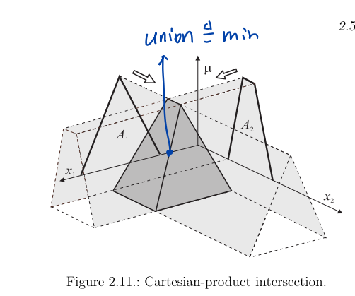

# 01_01_Mathematical Structure of Fuzzy Logic

[toc]

# 1. Definition of Fuzzy Set

A fuzzy set $A$ on universe (domain) $X$ is a **set** defined by the **membership function** $\mu_A(x)$ which is a mapping from the universe $X$ into the unit interval:

$$
\mu_{A}(x): X \rightarrow[0,1]
$$

$\mathcal{F}(X)$ denotes the set of all fuzzy sets on X

$$
\mu_{A}(x)\left\{\begin{array}{ll}=1 & x \text { is a full member of } A \\\in(0,1) & x \text { is a partial member of } A \\=0 & x \text { is not member of } A\end{array}\right.
$$

# 2. Properties of Fuzzy Set

### Complement

Let $A$ be a fuzzy set in $X$. The complement of $A$ is a fuzzy set, denoted $\overline{A}$, such that for each $x \in  X$

$$
\mu_{\bar{A}}(x)=1-\mu_{A}(x)
$$

$\lambda$-complement

$$
\mu_{\bar{A}}(x)=\frac{1-\mu_{A}(x)}{1+\lambda \mu_{A}(x)}
$$

### Intersection of Fuzzy Sets

Let $A$ and $B$ be two fuzzy sets in $X$. The intersection of $A$ and $B$ is a fuzzy set $C$, denoted $C$ = $A∩B$, such that for each $x ∈ X$

$$
\mu_{C}(x)=\min \left(\mu_{A}(x), \mu_{B}(x)\right)
$$

The minimum operator is also denoted by $∧$, i.e., $\mu_C(x) = \mu_A(x) ∧ \mu_B(x)$

### Union of Fuzzy Sets

Let $A$ and $B$ be two fuzzy sets in $X$. The union of $A$ and $B$ is a fuzzy set $C$, denoted $C = A ∪ B$, such that for each $x ∈ X$

$$
\mu_C(x)=max(\mu_A(x),\mu_B(x))
$$

The maximum operator is also denoted by $∨$, i.e., $\mu_C(x) = \mu_A(x) ∨ \mu_B(x)$

## T-norms and T-conorms

### T-Norm (Intersection)

$A$ **t-norm** $T$ is a **binary operation** on the unit interval that satisfies at least the following axioms for all $a, b, c ∈ [0, 1]$ :

$$
T(a, 1)=a \quad \text{( boundary condition)} \\
b \leq c \quad implies \quad T(a, b) \leq T(a, c) \text{(monotonicity)} \\
T(a, b)=T(b, a)\text{(commutativity)}, \\
T(a, T(b, c))=T(T(a, b), c) \quad \text{(associativity)}.
$$

* **minimum** is the **largest t-norm** (intersection operator)
* means the membership functions of fuzzy intersections $A∩B$ obtained with other t-norms are all **below** the bold membership function

### T-Conorm(Union)

A **t-conorm** S is a binary operation on the unit interval that satisfies at least the following axioms for all a, b, c ∈ [0, 1] (Klir and Yuan, 1995):

$$
S(a, 0)=a \quad \text{( boundary condition )} \\
b \leq c \quad implies \quad S(a, b) \leq S(a, c) \quad \text{ (monotonicity)}, \\
S(a, b)=S(b, a) \quad\text{( commutativity )} \\
S(a, S(b, c))=S(S(a, b), c)\text{(associativity)}.
$$

* The **maximum** is the **smallest** t-conorm (union operator)
* the membership functions of fuzzy unions A ∪ B obtained with other t-conorms are all **above** the bold membership function

## Projection and Cylindrical Extention

<u>**Projection**</u> **reduces** a fuzzy set defined in a multi-dimensional domain

**<u>Cylindrical extension</u>** extend of a fuzzy set defined in low-dimensional domain into a higher-dimensional domain

### Projection

Let $U\in U_1 ×U_2$ be a subset of a Cartesian product space, where $U_1$ and $U_2$ can themselves be Cartesian products of lower dimensional domains. The projection of fuzzy set $A$ defined in $U$ onto $U_1$ is the mapping $proj_{U_1}: \mathcal{F}(U) → \mathcal{F}(U_1)$ defined by:

$$
\operatorname{proj}_{U_{1}}(A)=\left\{\sup_{U_{2}} \mu_{A}(u) / u_{1} \mid u_{1} \in U_{1}\right\}
$$

where $sup$ is the supremum operation

> The **supremum** (abbreviated sup; plural suprema) of a subset $S$ of a partially ordered set $T$ is the least element in $T$ that is greater than or equal to all elements of $S$, if such an element exists. Consequently, the supremum is also referred to as the **least upper bound (or LUB)** .

### Cylindrical Extension

Let $U ⊆ U_1 ×U_2$ be a subset of a Cartesian product space, where $U_1$ and $U_2$ can themselves be Cartesian products of lower-dimensional domains. The cylindrical extension of fuzzy set A defined in U1 onto U is the mapping $ext_U : \mathcal{F}(U_1) → \mathcal{F}(U)$ defined by

$$
\operatorname{ext}_{U}(A)=\left\{\mu_{A}\left(u_{1}\right) / u \mid u \in U\right\}
$$

* Cylindrical extension thus **simply replicates** the membership degrees from the existing dimensions into the new dimensions.

### Properties

* **projection** leads to **a loss of information** , so we have

$$
\begin{array}{l}A=\operatorname{proj}_{X^{n}}\left(\operatorname{ext}_ {X^{m}}(A)\right) \\A \neq \operatorname{ext}_{X^{m}}\left(\operatorname{proj}_ {X^{n}}(A)\right)\end{array}
$$

## Operations on Cartesian Product Domains

Set-theoretic operations such as the **union or intersection** applied to fuzzy sets **defined in different domains** result in a **multi-dimensional fuzzy set** in the Cartesian product of those domains.

* first **extending** the original fuzzy sets into the Cartesian product domain

* then **computing the operation** on those multi-dimensional sets.

  

# 4. Fuzzy Relations

An n-ary **fuzzy relation** is a **mapping**

$$
R: X_{1} \times X_{2} \times \cdots \times X_{n} \rightarrow[0,1]
$$

which assigns membership grades to all n-tuples $(x_1, x_2, . . . , x_n)$ from the Cartesian product $X_1 ×X_2 × · · · ×X_n$.

* For **computer implementations** , R is conveniently represented as an **n-dimensional array:**  $R=\left[r_{i_{1}, i_{2}, \ldots, i_{n}}\right]$
* A **fuzzy relation** is a **fuzzy set** in the Cartesian product $X_1×X_2×· · ·×X_n$. The membership grades represent the degree of association (correlation) among the elements of the different domains $X_i$.

# 5. Relational Composition

The **composition** is defined as follows :  suppose there exists a fuzzy relation $R$ in $X ×Y$ and $A$ is a fuzzy set in $X$. Then, fuzzy subset $B$ of $Y$ can be **induced** by $A$ through the composition of $A$ and $R$:

$$
B=A \circ R
$$

And is definied by:

$$
B=\operatorname{proj}_{Y}\left(R \cap \operatorname{ext}_ {X \times Y}(A)\right)
$$

## Understanding

The composition can be regarded in two phases:

* combination(intersection)
* projection

## sup-min composition

$$
\mu_{B}(y)=\sup _{x}\left(\min \left(\mu_ {A}(x), \mu_{R}(x, y)\right)\right)
$$

"given y, find x, in which make the min() part max"

### More general form

$$
\mu_{B}(y)=\sup _{x}\left(\mathrm{~T}\left(\mu_ {A}(x), \mu_{R}(x, y)\right)\right)
$$

the $T$ means a t-norm T

## Example

In this graph, different column means different x

This resulting fuzzy set, defined in Y **can be interpreted as “approximately 5”** . Note, however, that it is **broader (more uncertain)** than the set from which it was induced。 This is because the combination of uncertainty in input fuzzy and relation