# 01_02_Fuzzy System Constructions and Fuzzy Control

[toc]

# 1. Fuzzy System Constructions

## Structures and Parameters

With regard to the design of fuzzy (and also other) models, two basic items are distinguished: the **structure** and the **parameters** of the model.

A model with a **rich structure** is able to approximate **more complicated functions**, but, at the same time, has **worse generalization** properties.

## From prior knowledge

The expert knowledge expressed in a **verbal form** is **translated** into a collection of **if–then rules**.

can be seen as "Fuzzy expert systems"

## From Data

It is expected that the extracted rules and membership functions can provide an a posteriori interpretation of the system’s behavior


## Overall Process

1. Select the **input and output** variables, the **structure** of the rules, and the **inference** and **defuzzification** methods.
2. Decide on the **number of linguistic terms** for each variable and define the corresponding **membership functions.**
3.  **Formulate the available knowledge** in terms of fuzzy if-then rules
4.  **Validate the model** (typically by using data). If the model does not meet the expected performance, iterate on the above design steps.


# 2. Constructions From Data

## Overall Model


a set of N input-output data pairs ${(x_i, y_i) | i = 1, 2, . . . , N}$ is available for the construction of a fuzzy system. 
$$
\mathbf{X}=\left[\mathbf{x}_{1}, \ldots, \mathbf{x}_{N}\right]^{T}, \quad \mathbf{y}=\left[y_{1}, \ldots, y_{N}\right]^{T}
$$
$x_k$ is column vector

## Least-Squares Estimation of Singletons

### Model

Given $A_i$ and a set of input–output data:
$$
\left\{\left(\boldsymbol{x}_{k}, y_{k}\right) \mid k=1,2, \ldots, N\right\}
$$
Estimate optimal consequent parameters $b_i$
$$
R_{i}: \text { If } x \text { is } A_{i} \text { then } y=b_{i}
$$

### Method

* Compute the membership degrees $\mu_{A_i}(x_k)$

* Normalize
  $$
  \gamma_{k i}=\mu_{A_{i}}\left(x_{k}\right) / \sum_{j=1}^{K} \mu_{A_{j}}\left(x_{k}\right)
  $$
* put output $y_{k}=\sum_{i=1}^{K} \gamma_{k i} b_{i}$ in a matrix form $y=\Gamma b$

* Least-square Estimate

$$
\boldsymbol{b}=\left[\mathbf{\Gamma}^{T} \mathbf{\Gamma}\right]^{-1} \mathbf{\Gamma}^{\top} \boldsymbol{y}
$$

## Least-Squares Estimation of TS Consequents

### Model

$$
\boldsymbol{X}=\left[\begin{array}{c}
\boldsymbol{x}_{1}^{T} \\
\boldsymbol{x}_{2}^{T} \\
\vdots \\
\boldsymbol{x}_{N}^{T}
\end{array}\right], \quad \boldsymbol{y}=\left[\begin{array}{c}
y_{1} \\
y_{2} \\
\vdots \\
y_{N}
\end{array}\right], \quad \boldsymbol{\Gamma}_{i}=\left[\begin{array}{cccc}
\gamma_{i 1} & 0 & \cdots & 0 \\
0 & \gamma_{i 2} & \cdots & 0 \\
\vdots & \vdots & \ddots & \vdots \\
0 & 0 & \cdots & \gamma_{i N}
\end{array}\right]
$$

$$

$$
$$
\boldsymbol{\theta}_{i}=\left[\begin{array}{ll}
\boldsymbol{a}_{i}^{T} & b_{i}
\end{array}\right]^{T}, \quad \boldsymbol{X}_{e}=\left[\begin{array}{ll}
\boldsymbol{X} & \boldsymbol{1}
\end{array}\right]
$$

### Method

**<u>Global LS</u>**
$$
\boldsymbol{\theta}^{\prime}=\left[\left(\boldsymbol{X}^{\prime}\right)^{T} \boldsymbol{X}^{\prime}\right]^{-1}\left(\boldsymbol{X}^{\prime}\right)^{T} \boldsymbol{y}
$$

$$
\mathbf{X}^{\prime}=\left[\mathbf{\Gamma}_{1} \mathbf{X}_{e}\right. \mathbf{\Gamma}_{2} \mathbf{X}_{e} \left.\ldots \boldsymbol{\Gamma}_{c} \boldsymbol{X}_{e}\right] \\
\boldsymbol{\theta}^{\prime}= [\boldsymbol{\theta}_{1}^{T}  \boldsymbol{\theta}_{2}^{T}  \ldots \boldsymbol{\theta}_{c}^{T}]
$$


## Fuzzy Clustering way

### Rule-Based Interpretation of fuzzy clusters

* Cluster
* Interpretation


### Fuzzy Clusters with TS-Model: An example

* cluster
* use linear prototypes to approximate subspaces


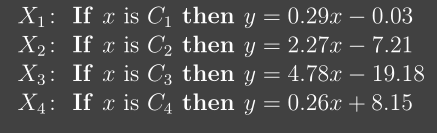
$$
\boldsymbol{\theta}_{i}=\left[\begin{array}{ll}
\boldsymbol{a}_{i}^{T} & b_{i}
\end{array}\right]^{T}, \quad \boldsymbol{X}_{e}=\left[\begin{array}{ll}
\boldsymbol{X} & \boldsymbol{1}
\end{array}\right]
$$

# 2. Fuzzy-Control

## Motivation

The underlying principle of **knowledge-based (expert) control** is to **capture and implement experience and knowledge** available from experts (e.g., process operators)

## Overview

Three aspects of a fuzzy controller

1. approximation capability
2. efficiency
3. transparent

Two view of a fuzzy controller

* fuzzy if-then rules
* non-linear mapping


## Fuzzy Controllers

A fuzzy controller is a controller that contains a (nonlinear) mapping that has been defined by using fuzzy if-then rules.

* In most cases a fuzzy controller is used for direct feedback control. 

Most often used fuzzy controller:

* Mamdani
* TS model

## Mamdani Controller


### Rule Base

$$
\mathcal{R}_{i}: \text { If } x_{1} \text { is } A_{i 1} \ldots \text { and } x_{n} \text { is } A_{i n} \text { then } u \text { is } B_{i}, \quad i=1,2, \ldots, K
$$

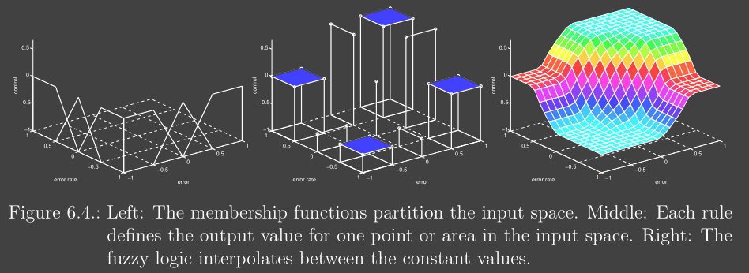

## TS Controller

 **Several linear controllers** are defined, each valid in one particular region of the controller’s input space. The output is based on:

* Selecting one 
* Interpolation 

Therefore, the TS controller can be seen as a simple form of supervisory control.

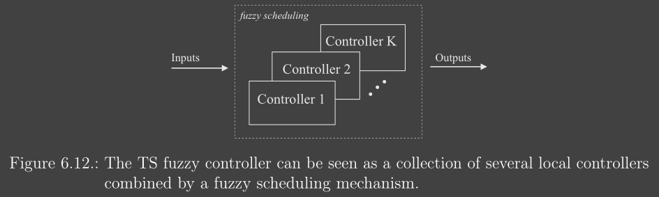

### A simple example

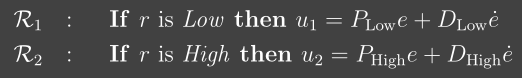

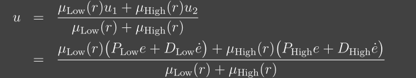

## Fuzzy Supervisory Control

### Supervisory Controller

 A **<u>supervisory controller</u>** is a **secondary controller** which augments the existing controller so that the control objectives can be met which would not be possible without the supervision.

* For instance,  adjust the parameters of a low-level controller according to the process information 

### Fuzzy Controller ways

static or dynamic behavior of the low-level control system can be modified in order to cope with process nonlinearities or changes in the operating or environmental conditions.

An **advantage** of a supervisory structure is that it can be added to already existing control systems.

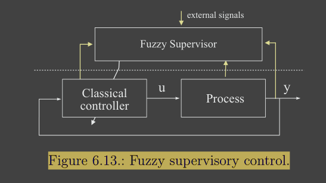

Many processes in the industry are controlled by PID controllers, they tried to retune PD when the operating conditions change, For example:

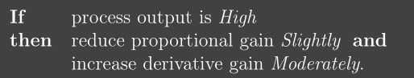


# 3. Basic Process of Designing Fuzzy Controller

## Process

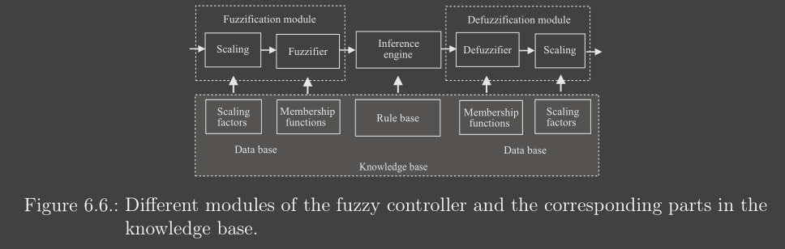

* decide **how many linguistic terms** per input variable will be used
  * A good choice may be to **start with a few terms** (e.g. 2 or 3 for the inputs and 5 for the outputs) and increase these numbers when needed. 
* Decide **Membership Function**s and **Scaling Factors** 
  * Membership Functions based on expert's knowledge, If such knowledge is not available, membership functions of the same shape, **uniformly distributed over the domain** can be used as an initial setting and can be tuned later.
* Design the **Rule Base**
  * based entirely on the expert’s intuitive knowledge and experience.
  * uses a fuzzy model of the process from which the controller rule base is derived.
* **Tune** the controller
  * The scaling factors $\rightarrow$ the most global effect
  * the membership functions $\rightarrow$ more localized effect

Or another way can be followed:

* Initialized a fuzzy controller by using an existing linear control low
* Then Tune it

## Example 1: Fuzzy Friction Compenstation

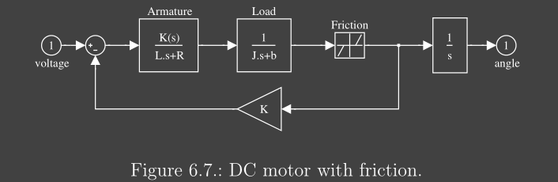

* First **Mimic** the linear controller

  ```
  If error is Zero
  	then control input is Zero;
  If error is Positive Big
  	then control input is Positive Big;
  If error is Negative Big
  	then control input is Negative Big;
  ```

* Then tune it

  ```
  If error is Negative Small
  	then control input is NOT Negative Small;
  If error is Positive Small
  	then control input is NOT Positive Small;
  ```

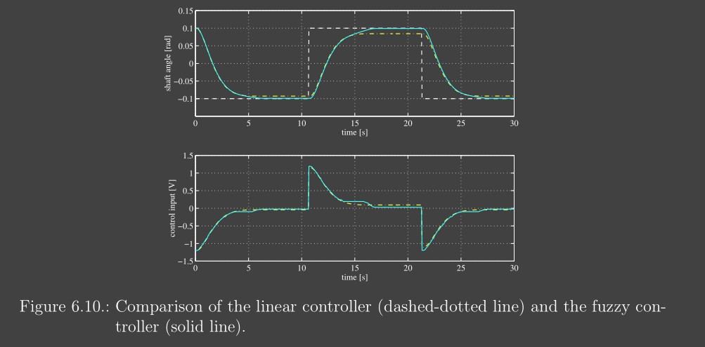

## Example 2: Supervisory fuzzy controller

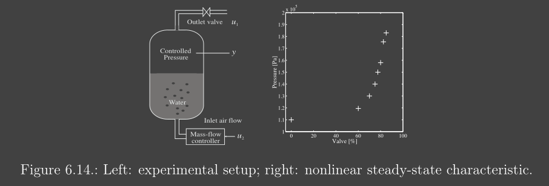

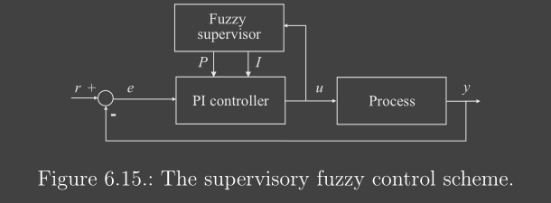

The domain of the valve position (0–100%) was **partitioned into four fuzzy sets** (‘Small’, ‘Medium’, ‘Big’ and ‘Very Big’), and define P and I for each set

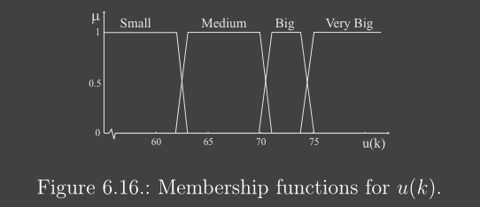

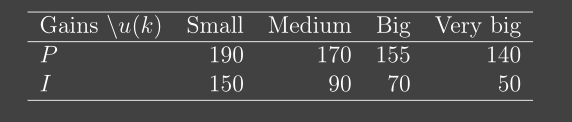


# Summary

* A fuzzy logic controller can be seen as a **small real-time expert system** implementing a part of human operator’s or process engineer’s expertise. 
* From the control engineering perspective, a fuzzy controller is a **nonlinear controller**
* **Nonlinear and partially known systems** that pose problems to conventional control techniques can be tackled using fuzzy control. 

