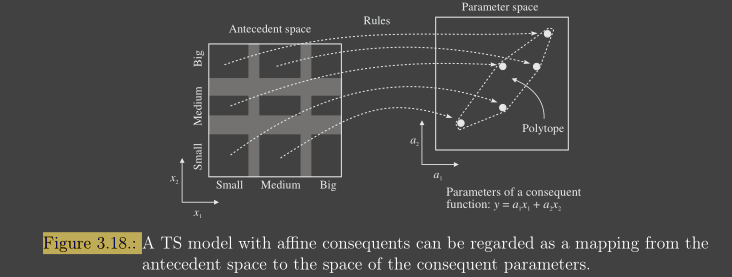

# 01_03_Fuzzy Systems and Fuzzy Clustering

[toc]

# 1. Fuzzy Systems

## Linguistic （Mamdani）fuzzy model

$$
\text{if } x \text{ is } A \text{ then } y \text{ is } B \\
x \text{ is } A \rightarrow \text{antecedent(fuzzy proposition)} \\
y \text{ is } B \rightarrow \text{consequent(fuzzy proposition)}
$$

## Fuzzy Relational Model

$$
\text{if } x \text{ is } A \text{ then } y \text{ is } B_1(0.1), B_2(0.8)
$$

## Takagi-sugeno Fuzz model

$$
\text{if } x \text{ is } A \text{ then } y=f(x)
$$

# 2. Mamdani Fuzzy Systems

Given the if-then **rules** and an **input** fuzzy set, deduce the **corresponding output fuzzy set**

## Fuzzy implication and Conjunctions

$$
\begin{array}{c}R:[0,1] \times[0,1] \rightarrow[0,1] \\\mu_{R}(x, y)=\mathrm{I}\left(\mu_{A}(x), \mu_{B}(y)\right)\end{array}
$$

**<u>Mamdani implication</u>**
$$
\mathrm{I}\left(\mu_{A}(\mathbf{x}), \mu_{B}(\mathbf{y})\right)=\min \left(\mu_{A}(\mathbf{x}), \mu_{B}(\mathbf{y})\right)
$$
**<u>Larsen Implication</u>**
$$
\mathrm{I}\left(\mu_{A}(\mathbf{x}), \mu_{B}(\mathbf{y})\right)=\mu_{A}(\mathbf{x}) \cdot \mu_{B}(\mathbf{y})
$$

## Normal Inference

### Inference with One Rule

1. construct implication relation

   $$
   \mu_{R}(x, y)=\mathrm{I}\left(\mu_{A}(x), \mu_{B}(y)\right)
   $$

2. use relational composition to derive $B'$ from $A'$

$$
B^{\prime}=A^{\prime} \circ R
$$

For the minimum t-norm
$$
\mu_{B^{\prime}}(\mathbf{y})=\max _{X}\left(\min \left(\mu_{A^{\prime}}(\mathbf{x}), \mu_{R}(\mathbf{x}, \mathbf{y})\right)\right)
$$

### Inference with Several Rules

1. Construct implication relation for each rule $i$

   $$
   \mu_{R_{i}}(x, y)=\mathrm{I}\left(\mu_{A_{i}}(x), \mu_{B_{i}}(y)\right)
   $$

2. Aggregate relations $R_i$ into one

   $$
   \mu_{R}(x, y)=\operatorname{aggr}\left(\mu_{R_{i}}(x, y)\right) \\
   \text{The aggr operator is the minimum for implications and the maximum for conjunctions}
   $$

3. Use relational composition to derive $B'$ from $A'$

$$
B^{\prime}=A^{\prime} \circ R
$$

**<u>If R is Fuzzy implication</u>**
$$
R=\bigcap_{i=1}^{K} R_{i}, \quad \text { that is, } \quad \mu_{R}(\mathbf{x}, \mathbf{y})=\min _{1 \leq i \leq K} \mu_{R_{i}}(\mathbf{x}, \mathbf{y})
$$

**<u>If R is T-norm</u>**
$$
R=\bigcup_{i=1}^{K} R_{i}, \text { that is, } \mu_{R}(\mathbf{x}, \mathbf{y})=\max _{1 \leq i \leq K} \mu_{R_{i}}(\mathbf{x}, \mathbf{y})
$$

### Example (3.3 in Lecture Notes)

### T-norm VS Fuzzy Implication

Since the input fuzzy set A′ is different from the antecedent set A, the derived conclusion B′ is in both cases “**less certain**” than B.

For **<u>Fuzzy Implication</u>**: uncertainty is reflected in the **increased membership** values for the domain elements that have low or zero membership in B

For **<u>T-norm</u>**: results in **decreasing the membership degree** of the elements that have high membership in B

## A simpler way: Mamdani (Max-min) Inference

For the t-norm, we have a simpler way
$$
\mu_{B^{\prime}}(\mathbf{y})=\max _{1 \leq i \leq K}\left[\beta_{i} \wedge \mu_{B_{i}}(\mathbf{y})\right], \quad \mathbf{y} \in Y
$$

$$
\beta_{i}=\max _{X}\left[\mu_{A^{\prime}}(\mathbf{x}) \wedge \mu_{A_{i}}(\mathbf{x})\right]
$$

1. Compute the degree of fulfillment for each rule by $\beta_{i}=\max _{X}\left[\mu_{A^{\prime}}(\mathbf{x}) \wedge \mu_{A_{i}}(\mathbf{x})\right]$, Note that for a singleton set $\left(\mu_{A^{\prime}}(\mathbf{x})=1 \text { for } \mathbf{x}=\mathbf{x}_{0}\right. \text { and } \mu_{A^{\prime}}(\mathbf{x})=0 \text{ otherwise} )$ the equation $\beta_i$ simplifies to $\beta_i=\mu_{A_i}(x_0)$
2. Derive the output fuzzy sets $B_{i}^{\prime}: \mu_{B_{i}^{\prime}}(\mathbf{y})=\beta_{i} \wedge \mu_{B_{i}}(\mathbf{y}), \quad \mathbf{y} \in Y, \quad 1 \leq i \leq K$
3. **Aggregate** output fuzzy sets of all the rules into one fuzzy set. $B_{i}^{\prime}: \mu_{B^{\prime}}(\mathbf{y})=\max _{1 \leq i \leq K} \mu_{B_{i}^{\prime}}(\mathbf{y}), \quad \mathbf{y} \in Y$

It can be seen as :

1. first finding the highest point (maximum fulfilment)

2. Then all inference result should less than the result of maximum fulfilment and at the same time meet the property of initial result.

   

# 3. Singleton and Takagi-Sugeno Fuzzy System

## Singleton Fuzzy model

$$
\text { If } x \text { is } A_{i} \text { then } y=b_{i}
$$

* Defuzzication/Infererence:

  $$
  y=\frac{\sum_{i=1}^{K} \mu_{A_{i}}(x) b_{i}}{\sum_{i=1}^{K} \mu_{A_{i}}(x)} \\
  =\Sigma_{i=1}^{k}\phi_i(x)b_i
  $$
  
  * the basis functions $\phi_i(x)$ are given by the (normalized) degrees of fulfillment of the rule antecendents
  * the constants $b_i$ are the consequents

 a singleton model can also **represent any given linear mapping of the form**:
$$
y=\mathbf{k}^{T} \mathbf{x}+q=\sum_{i=1}^{p} k_{i} x_{i}+q .
$$

## Takagi-Sugeno (TS) Fuzzy model

$$
\begin{aligned}&\text { If } x \text { is } A_{i} \text { then } y_{i}=a_{i} x+b_{i}\\&y=\frac{\sum_{i=1}^{K} \mu_{A_{i}}(x) y_{i}}{\sum_{i=1}^{K} \mu_{A_{i}}(x)}=\frac{\sum_{i=1}^{K} \mu_{A_{i}}(x)\left(a_{i} x+b_{i}\right)}{\sum_{i=1}^{K} \mu_{A_{i}}(x)}\end{aligned}
$$

* Quasi-Linear Property
  $$
  y=\left(\sum_{i=1}^{K} \gamma_{i}(\mathbf{x}) \mathbf{a}_{i}^{T}\right) \mathbf{x}+\sum_{i=1}^{K} \gamma_{i}(\mathbf{x}) b_{i}=\mathbf{a}^{T}(\mathbf{x}) \mathbf{x}+b(\mathbf{x})
  $$
  
  $$
  \gamma_{i}(\mathbf{x})=\frac{\beta_{i}(\mathbf{x})}{\sum_{j=1}^{K} \beta_{i}(\mathbf{x})}
  $$

$$
\mathbf{a}(\mathbf{x})=\sum_{i=1}^{K} \gamma_{i}(\mathbf{x}) \mathbf{a}_{i}, \quad b(\mathbf{x})=\sum_{i=1}^{K} \gamma_{i}(\mathbf{x}) b_{i}
$$

The ‘parameters’ $a(x), b(x)$ are convex linear combinations of the consequent parameters $a_i$ and $b_i$

### Inference in the TS Model

$$
y=\frac{\sum_{i=1}^{K} \beta_{i} y_{i}}{\sum_{i=1}^{K} \beta_{i}}=\frac{\sum_{i=1}^{K} \beta_{i}\left(\mathbf{a}_{i}^{T} \mathbf{x}+b_{i}\right)}{\sum_{i=1}^{K} \beta_{i}}
$$

# 4. Defuzzification

Defuzzification convert a fuzzy set to a crisp value

* Center of Gravity Method (COG):

  $$
  y^{\prime}=\frac{\sum_{j=1}^{F} \mu_{B^{\prime}}\left(y_{j}\right) y_{j}}{\sum_{j=1}^{F} \mu_{B^{\prime}}\left(y_{j}\right)}
  $$
  
* Mean of Maxima (MOM):
  $$
  \operatorname{mom}\left(B^{\prime}\right)=\operatorname{cog}\left\{y \mid \mu_{B^{\prime}}(y)=\max _{y \in Y} \mu_{B^{\prime}}(y)\right\}
  $$
  

For **Mamdani max-min inference**, we always use COG

* Mamdani: only use min, no implication, so no interpolate itself. By using COG, consider each part weight, not only max

For **Fuzzy Implication**, we always use MOM

* The COG method cannot be directly used in this case, because the
  **uncertainty in the output** results in an increase of the membership degrees,

**<u>Fuzzy-mean defuzzification</u>**

* consequent fuzzy sets are first defuzzified, for example, use MOM $b_{j}=\operatorname{mom}\left(B_{j}\right)$

* Then use COG:
  $$
  y^{\prime}=\frac{\sum_{j=1}^{M} \omega_{j} b_{j}}{\sum_{j=1}^{M} \omega_{j}} \\
  \omega_j=\mu_{B'}(b_j)
  $$
  

# 5. Clustering

## Hard Partitions

### Problem Model

$$
\begin{array}{ll}
\bigcup_{i=1}^{c} A_{i}=\mathbf{Z} & \\
A_{i} \cap A_{j}=\emptyset, & 1 \leq i \neq j \leq c \\
\emptyset \subset A_{i} \subset \mathbf{Z}, & 1 \leq i \leq c
\end{array}
$$

### Optimization Approach Model

$$
\begin{array}{ll}
\mu_{i k} \in\{0,1\}, & 1 \leq i \leq c, \quad 1 \leq k \leq N, \\
\sum_{i=1}^{c} \mu_{i k}=1, & 1 \leq k \leq N \\
0<\sum_{k=1}^{N} \mu_{i k}<N, & 1 \leq i \leq c
\end{array}
$$

### Hard Partitioning Space

$$
M_{h c}=\left\{\mathbf{U} \in \mathbb{R}^{c \times N} \mid \mu_{i k} \in\{0,1\}, \forall i, k ; \sum_{i=1}^{c} \mu_{i k}=1, \forall k ; 0<\sum_{k=1}^{N} \mu_{i k}<N, \forall i\right\} 
$$

### Shortcoming

**Boundary data points** may represent patterns with a mixture of properties of data in $A_1$ and $A_2$, and therefore cannot be fully assigned to either of these classes, or do they constitute a separate class. 

## Fuzzy Partitions

More information is preserved in this form of clustering, which is exactly the advantage of fuzzy clustering over hard partitioning.

### Problem Model

**Given:**

$$
z_{k}=\left[z_{1 k}, z_{2 k}, \ldots, z_{n k}\right]^{T} \in \mathbb{R}^{n}, \quad k=1, \ldots, N
$$

**Find:**

* the fuzzy partition matrix

$$
\boldsymbol{U}=\left[\begin{array}{ccccc}\mu_{11} & \ldots & \mu_{1 k} & \ldots & \mu_{1 N} \\\vdots & \ldots & \vdots & \ldots & \vdots \\\mu_{c 1} & \ldots & \mu_{c k} & \ldots & \mu_{c N}\end{array}\right]
$$

* the cluster centers

$$
\boldsymbol{V}=\left\{\boldsymbol{v}_{1}, \boldsymbol{v}_{2}, \ldots, \boldsymbol{v}_{c}\right\}, \quad \boldsymbol{v}_{i} \in \mathbb{R}^{n}
$$

### An optimization Model

$$
J(Z ; V, U, A)=\sum_{i=1}^{c} \sum_{j=1}^{N} \mu_{i, j}^{m} d_{A_{i}}^{2}\left(z_{j}, v_{i}\right) \\
\text{s.t.} \\
\begin{aligned}
&0 \leq \mu_{i, j} \leq 1, \quad i=1, \ldots, c, j=1, \ldots, N \quad \text { (membership degree) }\\
&0<\sum_{j=1}^{N} \mu_{i, j}<N, \quad i=1, \ldots, c \quad \text { (no cluster empty) }\\
&\sum_{i=1}^{c} \mu_{i, j}=1, \quad j=1, \ldots, N
\text { (total membership) }
\end{aligned}
$$

### Partitioning Space

$$
M_{h c}=\left\{\mathbf{U} \in \mathbb{R}^{c \times N} \mid \mu_{i k} \in[0,1], \forall i, k ; \sum_{i=1}^{c} \mu_{i k}=1, \forall k ; 0<\sum_{k=1}^{N} \mu_{i k}<N, \forall i\right\} .
$$

### Distance Matrics

* **Euclidean norm**

  $$
  d^{2}\left(z_{j}, v_{i}\right)=\left(z_{j}-v_{i}\right)^{T}\left(z_{j}-v_{i}\right)
  $$

* **Inner-product norm**

  $$
  d_{A_{i}}^{2}\left(z_{j}, v_{i}\right)=\left(z_{j}-v_{i}\right)^{T} A_{i}\left(z_{j}-v_{i}\right)
  $$

## Possibilistic Partition

### Optimization Approach Model

$$
\begin{aligned}
\mu_{i k} \in[0,1], & & 1 \leq i \leq c, \quad 1 \leq k \leq N, \\
\exists i, \mu_{i k}>0, & & \forall k, \\
0<\sum_{k=1}^{N} \mu_{i k}<N, & & 1 \leq i \leq c
\end{aligned}
$$

The difference between possibilistic partition and fuzzy partition is the second constraint.

###  possibilistic partitioning space

$$
M_{p c}=\left\{\mathrm{U} \in \mathbb{R}^{c \times N} \mid \mu_{i k} \in[0,1], \forall i, k ; \forall k, \exists i, \mu_{i k}>0 ; 0<\sum_{k=1}^{N} \mu_{i k}<N, \forall i\right\} .
$$

## Fuzzy c-Means Clustering

### Functional

$$
\bar{J}(\mathbf{Z} ; \mathbf{U}, \mathbf{V}, \boldsymbol{\lambda})=\sum_{i=1}^{G} \sum_{k=1}^{\mathbb{N}}\left(\mu_{i k}\right)^{m} D_{i k \mathbf{A}}^{2}+\sum_{k=1}^{N} \lambda_{k}\left[\sum_{i=1}^{c} \mu_{i k}-1\right],
$$

data matrix $Z$ contains all the samples (column)

fuzzy partition matrix $U$

prototype matrix $V$

$\mu_{ik}$s the membership degrees of sample k to cluster is

$\lambda_k$ ensures that the constraint

$D_{ikA}^2$ is the squared inner-product distance norm

### Algorithms

* The FCM algorithm **converges to a local minimum** of the c-means functional. Hence, **different initializations may lead to different results.**
* Alternatively, the algorithm can be initialized with $V^{(0)}$, loop through $V^{(l−1)} → U^{(l)} → V^{(l)}$, and terminate on $||V^{(l)} − V^{(l−1)}|| < \epsilon$

### Parameters Analysis

**<u>Number of Clusters c</u>**

The number of clusters c is the most important parameter. So, how to choose c?

**Validity measures**

Validity measures are scalar indices that assess the goodness of the obtained partition. It use measures to **quantify the separation and the compactness of**
**the clusters.**

Xie-Beni index: minimize:
$$
\chi(\mathbf{Z} ; \mathbf{U}, \mathbf{V})=\frac{\sum_{i=1}^{c} \sum_{k=1}^{N} \mu_{i k}^{m}\left\|\mathbf{z}_{k}-\mathbf{v}_{i}\right\|^{2}}{c \cdot \min _{i \neq j}\left(\left\|\mathbf{v}_{i}-\mathbf{v}_{j}\right\|^{2}\right) \mathbf{V}}
$$

* numerator: within-group variance

* denominator: separation of the cluster centers

  

**Iterative merging or insertion of clusters**

start with a sufficiently large number of clusters

* merging clusters that are similar (compatible)

start with a small number of clusters 

* iteratively insert clusters in the regions where the data points have low degree of membership in the existing clusters 

**<u>Fuzziness Parameters (m and v)</u>**

As m approaches one from above, the partition becomes **hard** ($µ_{ik} \in \{0, 1\}$) and $v_i$ are ordinary means of the clusters.

m influnces the fuzziness of the resulting partition. As $m \rightarrow \infty$ the partition become completely fuzzy ($\mu_{ik}=\frac{1}{c}$) and the cluster means are all equal to the mean of $Z$ 

**<u>Termination Criterion （$\epsilon$）</u>**

the usual choice is $\epsilon = 0.001$, even though $ϵ = 0.01$ works well 

**<u>Norm-Inducing Matrix (A)</u>**

 changing the **measure of dissimilarity.**

A common choice is $A = I$, which generates
$$
D_{i k}^{2}=\left(\mathbf{z}_{k}-\mathbf{v}_{i}\right)^{T}\left(\mathbf{z}_{k}-\mathbf{v}_{i}\right)
$$
Another choice is A is a a **diagonal matrix** that accounts for **different variances in the directions** of the coordinate axes of Z:
$$
\mathbf{A}=\left[\begin{array}{cccc}
\left(1 / \sigma_{1}\right)^{2} & 0 & \cdots & 0 \\
0 & \left(1 / \sigma_{2}\right)^{2} & \cdots & 0 \\
\vdots & \vdots & \ddots & \vdots \\
0 & 0 & \cdots & \left(1 / \sigma_{n}\right)^{2}
\end{array}\right]
$$
Another choice is the inverse of the covariance matrix of Z: $A = R^{−1} $ (Mahalanobis norm)
$$
\mathbf{R}=\frac{1}{N} \sum_{k=1}^{N}\left(\mathbf{z}_{k}-\overline{\mathbf{z}}\right)\left(\mathbf{z}_{k}-\overline{\mathbf{z}}\right)^{T}
$$
The norm influences the clustering criterion by changing the measure of dissimilarity.

### ShortComes

* A common limitation of clustering algorithms based on a fixed distance norm is that such a norm **forces the objective function to prefer clusters of a certain shape** even if they are not present in the data.
* inclusion of pre-defined volume per cluster ($\rho_i$)

### Extensions of the Fuzzy c-Means Algorithm

