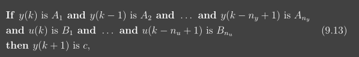
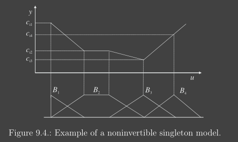

# 02_02_Model-Based Control

[toc]

# 1. Inverse Control

The objective of inverse control is to compute for the current state $x(k)$ the control input $u(k)$, such that the system’s output at the next sampling instant is **equal to the desired (reference) output $r(k + 1)$.**
$$
\text{system model: } y(k+1)=f(\mathbf{x}(k),u(k)) \\
\text{contro signal: } u(k)=f^{-1}(\mathbf{x}(k),r(k+1))
$$

## Applicable condition

1. Process (model) is stable and invertible

2. The inverse model is stable 
   $$
   G(s)=\frac{B(s)}{A(s)}, \text{the right side may has root, when inversed, it becom unstable}
   $$
   
3. Process model is accurate (enough)

4. Little influence of disturbances

## Two Classical Ways

### Open-Loop Feedforward Control

*  Stable control is guaranteed for open-loop stable, minimum-phase system
* a model-plant mismatch or a disturbance d will cause a **steady-state error** at the process output

### Open-Loop Feedback Control

* improve the prediction accuracy and eliminate offsets
* in the presence of noise or a significant model–plant mismatch, in which cases it can cause oscillations or instability.

## Methods of Inverse $f(.)$

### Numerically Method

$$
J(u(k))=(r(k+1)-f(\mathbf{x}(k), u(k)))^{2}
$$

The minimization of $J$ with respect to $u(k)$ gives the control corresponding to the inverse function

### Affine TS Model

Consider the following fuzzy process model

So, the state space should have:
$$
\mathbf{x}(k)=\left[y(k), y(k-1), \ldots, y\left(k-n_{y}+1\right), u(k-1), \ldots, u\left(k-n_{u}+1\right)\right]
$$
And the output  $y(k+1)$ should be:
$$
y(k+1)=\frac{\sum_{i=1}^{K} \beta_{i}(\mathbf{x}(k)) y_{i}(k+1)}{\sum_{i=1}^{K} \beta_{i}(\mathbf{x}(k))}
$$
where 
$$
\begin{aligned}
\beta_{i}(\mathbf{x}(k))=& \mu_{A_{i 1}}(y(k)) \wedge \ldots \wedge \mu_{A_{i n_{y}}}\left(y\left(k-n_{y}+1\right)\right) \wedge \\
& \mu_{B_{i 2}}(u(k-1)) \wedge \ldots \wedge \mu_{B_{i n_{u}}}\left(u\left(k-n_{u}+1\right)\right) .
\end{aligned}
$$

We can rewrite it as:
$$
\begin{aligned}
y(k+1)=& \sum_{i=1}^{K} \lambda_{i}(\mathbf{x}(k))\left[\sum_{j=1}^{n_{y}} a_{i j} y(k-j+1)+\sum_{j=2}^{n_{u}} b_{i j} u(k-j+1)+c_{i}\right]+\\
&+\sum_{i=1}^{K} \lambda_{i}(\mathbf{x}(k)) b_{i 1} u(k)
\end{aligned}
$$
where
$$
\lambda_{i}(\mathbf{x}(k))=\frac{\beta_{i}(\mathbf{x}(k))}{\sum_{j=1}^{K} \beta_{j}(\mathbf{x}(k))}
$$
So, now we have:
$$
y(k+1)=g(\mathbf{x}(k))+h(\mathbf{x}(k)) u(k)
$$
so we can calculate:
$$
u(k)=\frac{r(k+1)-g(\mathbf{x}(k))}{h(\mathbf{x}(k))}
$$
and it will be:
$$
u(k)=\frac{r(k+1)-\sum_{i=1}^{K} \lambda_{i}(\mathbf{x}(k))\left[\sum_{j=1}^{n_{y}} a_{i j} y(k-j+1)+\sum_{j=2}^{n_{u}} b_{i j} u(k-j+1)+c_{i}\right]}{\sum_{i=1}^{K} \lambda_{i}(\mathbf{x}(k)) b_{i 1}} .
$$

### Singleton Model

First, simplify the rule base to:

​	Assume we use the product t-norm for "and":
$$
\beta_{i j}(k)=\mu_{X_{i}}(\mathbf{x}(k)) \cdot \mu_{B_{j}}(u(k))
$$

$$
\begin{aligned}
y(k+1) &=\frac{\sum_{i=1}^{M} \sum_{j=1}^{N} \beta_{i j}(k) \cdot c_{i j}}{\sum_{i=1}^{M} \sum_{j=1}^{N} \beta_{i j}(k)}=\\
&=\frac{\sum_{i=1}^{M} \sum_{j=1}^{N} \mu_{X_{i}}(\mathbf{x}(k)) \cdot \mu_{B_{j}}(u(k)) \cdot c_{i j}}{\sum_{i=1}^{M} \sum_{j=1}^{N} \mu_{X_{i}}(\mathbf{x}(k)) \cdot \mu_{B_{j}}(u(k))}
\end{aligned}
$$
Then we keep simplify the output equation
$$
\begin{aligned}
y(k+1) &=\frac{\sum_{i=1}^{M} \sum_{j=1}^{N} \mu_{X_{i}}(\mathbf{x}(k)) \cdot \mu_{B_{j}}(u(k)) \cdot c_{i j}}{\sum_{i=1}^{M} \sum_{j=1}^{N} \mu_{X_{i}}(\mathbf{x}(k)) \mu_{B_{j}}(u(k))} \\
&=\sum_{i=1}^{M} \sum_{j=1}^{N} \lambda_{i}(\mathbf{x}(k)) \cdot \mu_{B_{j}}(u(k)) \cdot c_{i j} \\
&=\sum_{j=1}^{N} \mu_{B_{j}}(u(k)) \sum_{i=1}^{M} \lambda_{i}(\mathbf{x}(k)) \cdot c_{i j}
\end{aligned}
$$
where $\lambda_{i}(\mathbf{x}(k))=\frac{\mu_{X_{i}}(\mathbf{x}(k))}{\sum_{j=1}^{K} \mu_{X_{j}}(\mathbf{x}(k))}$

For **invertible**, The inversion method requires that the **antecedent membership** functions $µ_{B_j}(u(k))$ are **triangular** and form a partition $\sum_{j=1}^{N} \mu_{B_{j}}(u(k))=1$ (Invertible condition 1)

we have
$$
y(k+1)=\sum_{j=1}^{N} \mu_{B_{j}}(u(k)) c_{j}
$$
where
$$
c_{j}=\sum_{i=1}^{M} \lambda_{i}(\mathbf{x}(k)) \cdot c_{i j}
$$
Then we have some rules like:

Then we will invert it to:

Because it is singleton, we need interpolate
$$
\begin{array}{l}
\mu_{C_{1}}(r)=\max \left(0, \min \left(1, \frac{c_{2}-r}{c_{2}-c_{1}}\right)\right) \\
\mu_{C_{j}}(r)=\max \left(0, \min \left(\frac{r-c_{j-1}}{c_{j}-c_{j-1}}, \frac{c_{j+1}-r}{c_{j+1}-c_{j}}\right)\right), \quad 1<j<N, \\
\mu_{C_{N}}(r)=\max \left(0, \min \left(\frac{r-c_{N-1}}{c_{N}-c_{N-1}}, 1\right)\right)
\end{array}
$$
Then we can calculate the output:
$$
u(k)=\sum_{j=1}^{N} \mu_{C_{j}}(r(k+1)) b_{j}
$$

$$
y(k+1)=f_{x}(u(k))=f_{x}\left(f_{x}^{-1}(r(k+1))\right)=r(k+1)
$$

**<u>Notes</u>**

A invertible singleton model must with monotonous model.

## 2. Internal Model Control

The **purpose of the process model working in parallel** with the process is to **subtract the effect of the control action from the process output**. 

* If the predicted and the measured process outputs **are equal**, the error e is zero and the controller works in an **open-loop configuration**. 
  * If a **disturbance d** acts on the process output, the feedback signal e is equal to the influence of the disturbance and is not affected by the effects of the control action.
* This signal is subtracted from the reference. With a perfect process model, the IMC scheme
  is hence able to **cancel the effect of unmeasured output-additive disturbances.**

