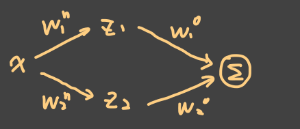
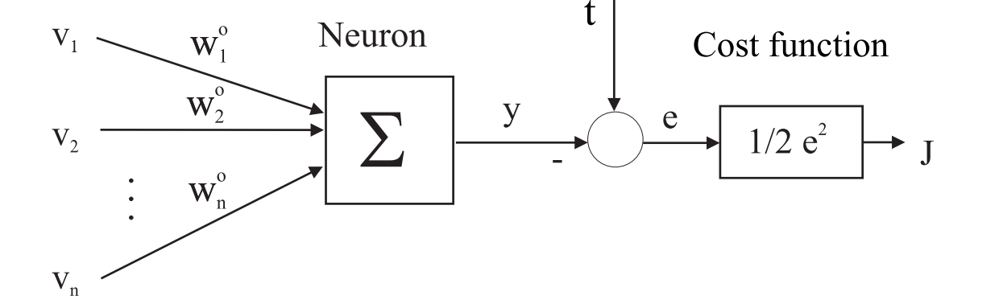

# 03_Artificial Neural Network

[toc]

# 1. Introduction

## Artificial Neuron

$x_i$: ith **input** of the neuron

$w_i$: adaptive **weight** (synaptic strength) for $x_i$

$z$: weighted sum of inputs:

$$
z=\sum_{i=1}^{p} w_{i} x_{i}=\mathbf{w}^{T}\mathbf{x}+b
$$

$\sigma(z)$: **activation function**

$v$: output of the neuron

## Activation functions

**Transformation** of the input space (squeezing).

### Projection Functions

threshold function, piece-wise linear function, tangent hyperbolic, sigmoidal, rectified linear, ... function:

$$
\sigma(z)=1 /(1+\exp (-2 z))
$$

### Kernel Functions

$$
\sigma(\mathbf{x})=\exp \left(-(\mathbf{x}-\mathbf{c})^{2} / s^{2}\right)
$$

### Common Choices

**Sigmoid:**

$$
\sigma(z)=1 /(1+\exp (-z))
$$

**Tangent Hyperbolic:**

$$
\sigma(z)=\frac{2}{1+e^{-2 z}}-1
$$

**Rectified Linear Unit (ReLU):**

$$
\sigma(z)=\left\{\begin{array}{ll}0 & \text { if } z<0 \\z & \text { if } z \geq 0\end{array}\right.
$$

**Exponential Linear Unit (ELU):**

$$
\sigma(z)=\left\{\begin{array}{ll}z & \text { if } z>0 \\\alpha\left(e^{z}-1\right) & \text { if } z \leq 0\end{array}\right.
$$

# 2. Simple Networks

## Feedforward neural network example

- Activation of hidden-layer neuron j:

$$
z_{j}=\sum_{i=1}^{p} w_{i j}^{h} x_{i}+b_{j}^{h}
$$

- Output of hidden-layer neuron j

  $$
  v_j=\sigma(z_j)
  $$
  
- Output of output-layer neuron l:

  $$
  y_{l}=\sum_{j=1}^{m} w_{j l}^{o} v_{j}+b_{l}^{o}
  $$
  

## Function approximation with neural nets: examples

$$
y=w_{1}^{o} \tanh \left(w_{1}^{h} x+b_{1}^{h}\right)+w_{2}^{o} \tanh \left(w_{2}^{h} x+b_{2}^{h}\right)
$$

## Input–Output Mapping

$$
\begin{aligned}\mathbf{Z} &=\mathbf{X}_{b} \mathbf{W}^{h} \\\mathbf{V} &=\sigma(\mathbf{Z}) \\\mathbf{Y} &=\mathbf{V}_{b} \mathbf{W}^{\circ} &\end{aligned}
$$

$$
\text { with } \mathbf{X}_{b}=[\mathbf{X} ,\mathbf{1}] \text { and } \mathbf{V}_{b}=[\mathbf{V}, 1] 
$$

### Compact formula:

$$
\mathbf{Y}=\left[\sigma\left([\mathbf{X} \mathbf{1}] \mathbf{W}^{h}\right) \mathbf{1}\right] \mathbf{W}^{\circ}
$$

## Approximation capability of neural nets

### Cybenko Theorem

A feedforward neural net with **at least one hidden layer** can **approximate any** continuous nonlinear function $\mathbb{R}^p → \mathbb{R}^n$ **arbitrarily well**, provided that **sufficient number of hidden neurons are available (not constructive**).

### Barron Theorem

- A feedforward neural net **with one hidden layer** with **sigmoidal activation functions** can achieve an integrated squared error of the order

$$
J=\mathcal{O}\left(\frac{1}{h}\right)
$$

- **independently** of the dimension of the **input space p**, where **h denotes the number** of hidden neurons
- For a **basis function expansion** (polynomial, trigonometric expansion, singleton fuzzy model, etc.) with **h terms**, in which only the parameters of the linear combination are adjusted

$$
J=\mathcal{O}\left(\frac{1}{h^{2 / p}}\right)
$$

### Understanding

- Does mean neural networks are suitable for a range of problems with high dimensional inputs.
- Does not mean it is always possible to get near the theoretical limit.
- Does not mean adding more neurons per layer always results in a lower approximation error.
- Does not mean one layer is optimal

# 3. Deep Learning

# 4. Training

## Goal

Find the **weight vector W** that minimizes some **cost function** $J(f(x;W))$ for **all (especially unseen) inputs x**.

### Important Notes

When training, we always calculate th**e loss over the examples** in the dataset. We **actually want to minimize the loss over the true underlying distribution of examples (Regularization)**

### Supervised Learning Example

Make a neural network approximate a known function $x → t$ by minimizing: $J(W) = \frac{1}{2}(f(x;W) − t)^2$

## General Process

1. **Initialize** W to small random values

2. Repeat until the performance (on a separate test-set) stops improving

    1. **Forward pass**: Given an input x, calculate the neural network output $y = f(x;W)$. Then calculate the cost $J(y; t)$ of predicting y instead of the target output t.

   2. **Backward pass**: Calculate the **gradient** of the cost with respect to the weights

      $$\nabla J(y(x ; W), t)=\left[\frac{\partial J}{\partial w_{1}}, \quad \ldots, \quad \frac{\partial J}{\partial w_{n}}\right]^T$$

   3. **Optimization step**: **Change the weights** based on the gradient to reduce the cost.

## Back-Propagation

Calculate the **gradient** of the cost with respect to the weights

$$
\nabla J(y(x ; W), t)=\left[\frac{\partial J}{\partial w_{1}}, \quad \ldots, \quad \frac{\partial J}{\partial w_{n}}\right]^T
$$

### Recall Chain Rules

$$
\frac{d}{d x} f\left(g_{1}(x), \ldots, g_{k}(x)\right)=\sum_{i=1}^{k}\left(\frac{d}{d x} g_{i}(x)\right) D_{i} f\left(g_{1}(x), \ldots, g_{k}(x)\right)
$$

### Examples

Output-layer weights example

$$
\begin{array}{c}J=\frac{1}{2} \sum_{l} e_{l}^{2}, \quad e_{l}=t_{l}-y_{l}, \quad y_{l}=\sum_{j} w_{j}^{o} v_{j} \\\frac{\partial J}{\partial w_{j l}^{o}}=\frac{\partial J}{\partial e_{l}} \cdot \frac{\partial e_{l}}{\partial y_{l}} \cdot \frac{\partial y_{l}}{\partial w_{j l}^{o}}=-v_{j} e_{l}\end{array}
$$

Hidden-layer weights example

$$
\begin{array}{l}\frac{\partial J}{\partial w_{i j}^{h}}=\frac{\partial J}{\partial v_{j}} \cdot \frac{\partial v_{j}}{\partial z_{j}} \cdot \frac{\partial z_{j}}{\partial w_{i j}^{h}}=-x_{i} \cdot \sigma_{j}^{\prime}\left(z_{j}\right) \cdot \sum_{l} e_{i} w_{j}^{o} \\\frac{\partial J}{\partial v_{j}}=\sum_{l}-e_{i} w_{j l}^{o}, \quad \frac{\partial v_{j}}{\partial z_{j}}=\sigma_{j}^{\prime}\left(z_{j}\right), \quad \frac{\partial z_{j}}{\partial w_{i j}^{h}}=x_{i}\end{array}
$$

More General Example

$$
\frac{\partial J}{\partial w_{11}^{h 1}}=\left(\frac{\partial J}{\partial v_{1}^{h 2}} \frac{\partial v_{1}^{h 2}}{\partial v_{1}^{h 1}}+\frac{\partial J}{\partial v_{2}^{h 2}} \frac{\partial v_{2}^{h 2}}{\partial v_{1}^{h 1}}\right) \frac{\partial v_{1}^{h 1}}{\partial w_{11}^{h 1}}
$$

## Cost Function

Two main **criteria**:

- The minimum of the cost function $w^{*}=\arg \min _{w} J(f(w))$ should correspond to desirable behavior.

  e.g.

  $$\begin{aligned}&J(y, t)=\|y-t\|^{2} \quad: y=f\left(x ; w^{*}\right) \rightarrow \text { mean } t \text { for each } x\\&J(y, t)=\|y-t\|_{1} \quad: y=f\left(x ; w^{*}\right) \rightarrow \text { median of } t \text { for each } x\end{aligned}$$

Illustration:

- the first one like minimize $(x-a)^2+(y-a)^2$, when a is mean, the least

- the second one like "absolute distance", the median is the smallest

- The error gradient should be informative (**below are some classical examples**)

  - linear output, Minimum Square Error (MSE):

    $$y=z, \quad J=\frac{1}{2}(y-t)^{2} \quad \rightarrow \frac{\partial J}{\partial z}=\frac{\partial J}{\partial y} \frac{\partial y}{\partial z}=(y-t) \cdot 1$$

  - Sigmoidal output, MSE

    $$\begin{array}{l}y=\frac{1}{1+e^{-z}}, \quad J=\frac{1}{2}(y-t)^{2}, \\ \rightarrow \frac{\partial J}{\partial z}=\frac{\partial J}{\partial y} \frac{\partial y}{\partial z}=(y-t) \cdot y(1-y)=\left(y^{2}-t y\right)(1-y)\end{array}$$

    Note: may have a problem when y=0 or y=1

  - sigmoidal output, negative log likelihood

    $$\begin{array}{l}y=\frac{1}{1+e^{-z}}, \quad J=-t \ln (y)-(1-t) \ln (1-y) \\\rightarrow \frac{\partial J}{\partial z}=\frac{\partial J}{\partial y} \frac{\partial y}{\partial z}=\left(\frac{-t}{y}+\frac{1-t}{1-y}\right) y(1-y)=y-t\end{array}$$

Different gradient features: $\rightarrow$ different "**aggressive**" extent to modify error and weight

## (Stochastic) Gradient Descent

### Basic Way to Update Weights

$$
\mathbf{w}_{n+1}=\mathbf{w}_{n}-\alpha_{n} \nabla J\left(\mathbf{w}_{\mathbf{n}}\right)\\ \text{where} \nabla J(\mathbf{w})=\left(\frac{\partial J}{\partial w_{1}}, \frac{\partial J}{\partial w_{2}}, \ldots, \frac{\partial J}{\partial w_{M}}\right)^{T}
$$

- **Gradient Discent:**

  use  $\nabla J(\mathbf{w})=\frac{1}{K} \sum_{i=1}^{K}\left(\frac{\partial J\left(t_{i}, f\left(x_{i} ; W\right)\right)}{\partial W}\right)$ with **K equal to the size of the database**

- **Stochastic Gradient Descent:**

  use $\hat{\nabla} J(\mathbf{w})=\frac{1}{k} \sum_{i=1}^{k}\left(\frac{\partial J\left(t_{i}, f\left(x_{i} ; W\right)\right)}{\partial W}\right)$ with **k << K the <u>batch size**</u>

  - The $x_i$; $t_i$ data points in the batches should be independent and identically distributed (i.i.d)
  - In practice: $k \approx 10^0 -10^{2}$, $K\approx 10^4 - 10^9$

### Improvement 1: Second-order gradient methods

$$
J(\mathbf{w}) \approx J\left(\mathbf{w}_{0}\right)+\nabla J\left(\mathbf{w}_{0}\right)^{T}\left(\mathbf{w}-\mathbf{w}_{0}\right)+\frac{1}{2}\left(\mathbf{w}-\mathbf{w}_{0}\right)^{T} \mathbf{H}\left(\mathbf{w}_{0}\right)\left(\mathbf{w}-\mathbf{w}_{0}\right)
$$

Update rule for the weights:

$$
\mathbf{w}_{n+1}=\mathbf{w}_{n}-\mathbf{H}^{-1}\left(\mathbf{w}_{n}\right) \nabla J\left(\mathbf{w}_{\mathbf{n}}\right)
$$

- $H^{−1}∇J$ computes a good step for each weight, **only feasible for (very) small networks.**

### Improvement 2: Momentum

increase step-size if we keep going in the same direction

$$
\mathbf{v} \leftarrow \beta \mathbf{v}-{\alpha \nabla J} \\ \mathbf{w} \leftarrow \mathbf{w}+\mathbf{v}
$$

- the v is initialized 0, $\beta \in [0,1)$
- if keep going in the same $\nabla J$, then the speed will be faster
- if there once be $\nabla J$, the later movement always keep the trend
- if one dimension (component) always positive in $\nabla J$, then the effect on this dimension will be accumulated

### Improvement 3: RMSProp

decrease step-size over time, especially if gradients are large

$$
\begin{aligned}& \mathbf{r} \leftarrow \gamma \mathbf{r}+(1-\gamma) \nabla J \odot \nabla J \\\mathbf{w} \leftarrow & \mathbf{w}-\frac{\alpha}{\sqrt{10^{-6}+\sqrt{\mathbf{r}}}} \odot \nabla J\end{aligned}
$$

> $\odot$ menas **Hadamard Product,** "element-wise product"

- the r is initialized 0, $\gamma \in [0,1)$

### Improvement 4: ADAM

combine both previous ideas and correct for their initial bias

$$
\begin{array}{r}\mathbf{s} \leftarrow \beta \mathbf{s}+(1-\beta) \nabla J \\\mathbf{r} \leftarrow \gamma \mathbf{r}+(1-\gamma) \nabla J \odot \nabla J \\\hat{\mathbf{s}} \leftarrow \frac{\mathbf{s}}{1-\beta^{t}} \\\hat{\mathbf{r}} \leftarrow \frac{\mathbf{r}}{1-\gamma^{t}} \\\mathbf{w} \leftarrow \mathbf{w}-\alpha \frac{\hat{\mathbf{s}}}{\sqrt{10^{-6}+\hat{\mathbf{r}}}}\end{array}
$$

- Initialize s; r to 0. Choose $\beta, \gamma∈ [0; 1)$: Common values:  $\beta= 0.9; \gamma= 0.999$
- when time growing, the denominator of third and forth equation is larger, means, smaller change between $\hat{x} \text{ and } x$

# 5. Regularization & Validation

## Overfitting

## Validation & Cross-Validation

**True Criterion**

$$
I=\int_{X}\|f(\mathbf{x})-F(\mathbf{x})\| \mathbf{d} \mathbf{x}
$$

But, Usually cannot be computed as $f(x)$ **is not available**, use available data to **numerically approximate**

**Cross-Validation Ways**

- Regular Criterion (for two data sets)

$$
\mathrm{RC}=\frac{1}{2}\left[\frac{1}{N_{A}} \sum_{i=1}^{N_{A}}\left(y^{A}(i)-\hat{y}_{B}^{A}(i)\right)^{2}+\frac{1}{N_{B}} \sum_{i=1}^{N_{B}}\left(y^{B}(i)-\hat{y}_{A}^{B}(i)\right)^{2}\right]
$$

- Means Squared Error

$$
\mathrm{MSE}=\frac{1}{N} \sum_{i=1}^{N}(y(i)-\hat{y}(i))^{2}
$$

- Variance accounted for (VAF)

Is a summary of how much of the variability of the data can be explained by a fitted regression model

$$
\mathrm{VAF}=100 \% \cdot\left[1-\frac{\operatorname{var}(y-\hat{y})}{\operatorname{var}(y)}\right]
$$

> From: https://blog.csdn.net/qq_36330643/article/details/77452951 
>
> From: https://baike.baidu.com/item/交叉验证/8543100?fromtitle=Cross validation&fromid=18081946&fr=aladdin

- 简单交叉验证（simple cross validation）

常识来说，Holdout 验证并非一种交叉验证，因为数据并没有交叉使用。 随机从最初的样本中选出部分，形成交叉验证数据，而剩余的就当做训练数据。 一般来说，少于原本样本三分之一的数据被选做验证数据。

- k-fold cross validation

K折交叉验证，初始采样分割成K个子样本，一个单独的子样本被保留作为验证模型的数据，其他K-1个样本用来训练。**交叉验证重复K次**，每个子样本验证一次，平均K次的结果或者使用其它结合方式，最终得到一个单一估测。这个方法的优势在于，同时重复运用随机产生的子样本进行训练和验证，每次的结果验证一次，10折交叉验证是最常用的

## Test Set

The **validation set** is used to **select the right hyper-parameters,** Use a **separate test set** to verify the hyper-parameters have not been over-fitted to the validation set.

- Structure of the network
- Cost function
- Optimization parameters

## Regularization

Any strategy that attempts to **improve the test performance**, but not the training performance

### Weight Penalty

- Large weights in a neural network are a sign of overfitting.
- A network with large weights has very likely **learned the statistical noise** in the training data. This results in a model that is unstable, and **very sensitive** to changes to the input variables. In turn, the overfit network has **poor performance** when making predictions on new unseen data.

$$
J_{r}(y, t, \mathbf{w})=J^{*}(y, t)+\lambda\|\mathbf{w}\|_{p}^{p}
$$

- p = 1: $L^1$ : Leads to 0-weights (sparsity, feature selection) 
- p = 2: $L^2$ : Leads to small weights

### Dropout

Practical approximation of an automatic ensemble method. During training, **drop out units (neurons) with probability p. During testing use all units, multiply weights by (1 − p).**

> From: https://blog.csdn.net/u013007900/article/details/78120669/

第一种理解方式是，在每次训练的时候使用dropout，每个神经元有百分之50的概率被移除，这样可以使得一个神经元的训练不依赖于另外一个神经元，同样也就使得特征之间的协同作用被减弱。Hinton认为，过拟合可以通过**阻止某些特征的协同作用来缓解**。

第二种理解方式是，我们可以把dropout当做一种多模型效果平均的方式。对于减少测试集中的错误，我们可以将多个不同神经网络的预测结果取平均，而因为dropout的随机性，我们每次dropout后，网络模型都可以看成是一个不同结构的神经网络，而此时要训练的参数数目却是不变的，这就解脱了训练多个独立的不同神经网络的时耗问题。在测试输出的时候，将输出权重除以二，从而达到类似平均的效果。

### Model ensembles

- For k models, where the errors made are zero mean, normally distributed, with variance $v = E[\epsilon_i^2]$, covariance $c=E[\epsilon_i \epsilon_j]$

- The variance of the ensemble is:

  $$\mathbb{E}\left[\left(\frac{1}{k} \sum_{i} \epsilon_{i}\right)^{2}\right]=\frac{1}{k^{2}} \mathbb{E}\left[\sum_{i}\left[\epsilon_{i}^{2}+\sum_{j \neq i} \epsilon_{i} \epsilon_{j}\right)\right]=\frac{1}{k} v+\frac{k-1}{k} c$$

- When the errors are not fully correlated (c < v), the variance will reduce.

### Data augmentation

Sometimes existing data **can be transformed to get more data**. Noise can be added to inputs, weights, outputs,  Make noise realistic.

- e.g. rotate, noise

# 6. Specialized Network Architetures

## Recurrent Neural Networks (RNN)

> Also Refer to: https://zhuanlan.zhihu.com/p/123211148

RNN对具有序列特性的数据非常有效，它能挖掘数据中的时序信息以及语义信息，利用了RNN的这种能力，使深度学习模型在解决语音识别、语言模型、机器翻译以及时序分析等NLP领域的问题时有所突破。

> Example: sequence with time characteristic 举个例子，现在有两句话： 第一句话：I like eating apple！（我喜欢吃苹果！） 第二句话：The Apple is a great company！（苹果真是一家很棒的公司！）

**RNN training: Back Propagation Through Time (BPTT)**

1. Make n copies of the network, calculate $y_1, \cdots, y_n$

2. Start at time step n and propagate the loss backwards through the unrolled networks

3. Update the weights based on the average gradient of the network copies

   $$\nabla_{w} J=\frac{1}{n} \sum_{i=1}^{n} \nabla_{w_{i}} J$$

**Exploding/vanishing gradients problem**

Scalar case with no input: $x_n = w^n · x_0$ , For $w < 1; x_n → 0$, for $w > 1; x_n →∞$.

This makes it hard to learn long term dependencies

## LSTM

> Also Refer to:  https://zhuanlan.zhihu.com/p/123211148

LSTM不一样，它会**选择性的存储信息**，它有**门控装置**，它可以尽情的选择

this is a structure grarph of a **single memory cell**

- Input Gate：中文是输入门，在每一时刻从输入层输入的信息会首先经过输入门，输入门的开关会决定这一时刻是否会有信息输入到Memory Cell。
- Output Gate：中文是输出门，每一时刻是否有信息从Memory Cell输出取决于这一道门。
- Forget Gate：中文是遗忘门，每一时刻Memory Cell里的值都会经历一个是否被遗忘的过程，就是由该门控制的，如果打卡，那么将会把Memory Cell里的值清除，也就是遗忘掉。

按照上图的顺序，信息在传递的顺序，是这样的：

先经过输入门，看是否有信息输入，再判断遗忘门是否选择遗忘Memory Cell里的信息，最后再经过输出门，判断是否将这一时刻的信息进行输出。

## Convolutional Neural Networks (CNN)

> Also refer to: https://zhuanlan.zhihu.com/p/27908027

### Convolution & Nonlinear Detector

# 7. Unsupervised Learning

## Additional Training Criteria

Inputs x are often much easier to obtain than targets t.

* For deep networks, many of the earlier layers perform very **general functions** (e.g. edge detection).
* These layers can be **trained on different tasks for which there is data.**

## Auto Encoders

> Also From: https://zhuanlan.zhihu.com/p/24813602

**<u>Unsupervised Learning (UL):</u>** find some structure in input data without extra information

**<u>Auto Encoders (AE)</u>** do this by reconstructing their input

* 有时神经网络要接受大量的输入信息, 比如输入信息是高清图片时, 输入信息量可能达到上千万, 让**神经网络直接从上千万个信息源中学习是一件很吃力的工作**. 
* 通过**压缩**, 提取出原图片中的**最具代表性的信息**, 缩减输入信息量, 再把缩减过后的信息放进神经网络学习. 这样学习起来就简单轻松了. 
* **自编码**就能在这时发挥作用. 通过将原数据白色的X 压缩, 解压 成黑色的X, 然后通过**对比黑白 X ,求出预测误差, 进行反向传递, 逐步提升自编码的准确性.** 训练好的自编码中间这一部分就是能总结原数据的精髓. 
* 从头到尾, 我们**只用到了输入数据 X, 并没有用到 X 对应的数据标签**, 所以也可以说自编码是一种非监督学习. 到了真正使用自编码的时候. 通常只会用到自编码前半部分.
* 换句话说, 自编码 可以像 主成分分析(PCA) 一样 给特征属性降维.

### ENCODER

**compresses** the input, useful feature hierarchy for later supervised tasks.

### Decoder

decompresses the input, can be used as a generative model.

## Auxiliary training objectives

Auxiliary training objectives can be added

* Because they are easier and allow the optimization to make faster initial progress.
* To force the network to keep more generic features, as a regularization technique.

