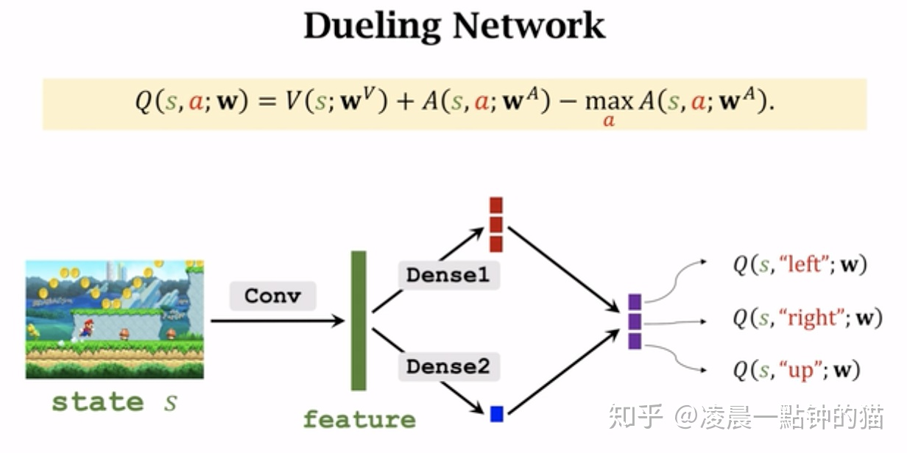

# Deep Reinforcement Learning

[toc]

# 1. Background: From actor-critic & Q-learning to DQN

## Main problem of Q-learning

> https://zhuanlan.zhihu.com/p/46852675

1. Q-Learning可以很好的解决迷宫问题，但这终究是个小问题，它的**状态空间和动作空间都很小**。而在实际的情况下，大部分问题都有巨大的状态空间或动作空间，建立Q表，内存是不允许的，而且数据量和时间开销也是个问题。
2. 如果一个状态从未出现过，Q-learning是无法处理的。也就是说**Q-learning压根没有预测能力，也就是没有泛化能力**。

## DQN

DQN tries to use a deep learning neural network to represent the **critic** of a problem, i.e. Q-table. It will solve the above two problems:

1. neural network can approximate arbitrary function theoretically. It saves memory and helps the generalization capability.

The network architecture of DQN is shown in the right part of following picture

### Loss function

$$
J=\mathbb{E}\left\{\|\underbrace{r+\gamma \max _{u^{\prime}} Q\left(x^{\prime}, u^{\prime}\right)}_{\text {target }}-\underbrace{Q(x, u)}_{\text {prediction }}\|\right\}
$$

### Experience Replay

DeepLearning取得重大进展的监督学习中，样本间都是独立同分布的。而RL中的样本是有关联的，非静态的（highly correlated and non-stationary），训练的结果很容易难以收敛

Data {x, u, x’, r} is **collected on-line** by following the exploration policy and stored in a buffer.

### Target Network

Introduce a target network with parameters $\theta^{−}$ that slowly track $\theta$ for stability, updated only occasionally.
$$
J=\mathbb{E}\left\{\left(r+\gamma \max _{u^{\prime}} Q\left(x^{\prime}, u^{\prime}, \theta^{-}\right)-Q(x, u, \theta)\right)^{2}\right\}
$$

# 2. Improvement on DQN

## Prioritized Experience Replay

Different sample has different weight(priority):

Sample according to:
$$
P(i)=\frac{p_{i}^{a}}{\sum_{k} p_{k}^{a}}
$$
with priority $p_{j}=\left|\Delta_{j}\right|+\text { const }$

It can be used to compensate for bias with importance sampling

## DDPG

Although DQN give deep learning method to find Q-table, it still meet trouble when facing to choose action. It is because:

* It still use $\max_a{Q(s,a)}$ to find the corresponding best action, cannot handle large action space.
* DQN的第二个问题是**只能给出一个确定性的action**，无法给出概率值。而有些场景，比如围棋的开局，只有一种走法显然太死板了

So we try to directly learn policy(action)

### Policy Gradient

策略梯度方法中，参数化策略$\pi$为$\pi(\theta)$，然后计算得到动作上策略梯度，沿着梯度方法，一点点的调整动作，逐渐得到最优策略。

> From: https://zhuanlan.zhihu.com/p/337976595

**<u>Stochastic Policy Gradient</u>**

用一个参数化的概率分布$\pi_{\theta}(a|s)=P[a|s;\theta]$ 来表示policy，并且由于policy是一个概率分布，那么action ![[公式]](https://www.zhihu.com/equation?tex=a) 就是随机选取的.

**<u>Deterministic Policy Gradient</u>**

摒弃了用概率分布表示policy的方法，转而用一个确定性的函数$a=\mu_{\theta}(s)$ 表示policy。

但缺点也很明显，对于每个state，下一步的action是确定的。这就导致只能做exploitation而不能做exploration。这可能也是为什么policy gradient一开始就采用stochastic算法的原因。

为了解决不能做exploration的问题，DPG采用了off-policy的方法。也就是说，采样的policy和待优化的policy是不同的：其中采样的policy是stochastic的，而待优化的policy是deterministic的。采样policy的随机性保证了充分的exploration。

### DDPG

将DQN中将神经网络用于拟合Q函数的两个trick用到了DPG中，也就是将DPG中的Q函数也变成了一个神经网络。

## Dueling DQN

A(s, a)与动作相关，是a相对s平均回报的相对好坏，是优势，解决reward-bias问题。RL中真正关心的还是策略的好坏，更关系的是优势，另外在某些情况下，任何策略都不影响回报，显然需要剔除

By using **<u>Advantage</u>** A(x,u): 
$$
Q(x, u)=V(x)+A(x, u)
$$
Here, we give an one more step explanation of each part:

$V(s)$: value function, but we can understand it as "评价状态s的好坏，记为baseline"

$Q(s,a)$ Q-table, it is used to " 评价在状态s下，执行动作a的好坏"

$A(s,a)$ Advantage, it is used to "衡量动作a相对于baseline的优势，a越好，优势就越大"

red part: get $A(s,a)$

blue part: get $V(s)$

## Sim2Real

 Train in simulation, apply on real system

### Problem

Overfitting to simulation, resulting policy performing
poorly

### Solution

Make learned policy more robust, e.g.  via domain
randomization

## Curriculum Learning

Start with learning simple tasks, once mastered learn more complex tasks