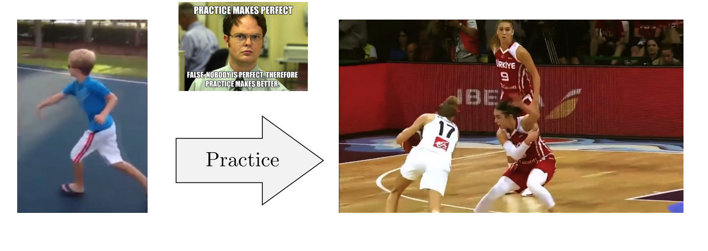
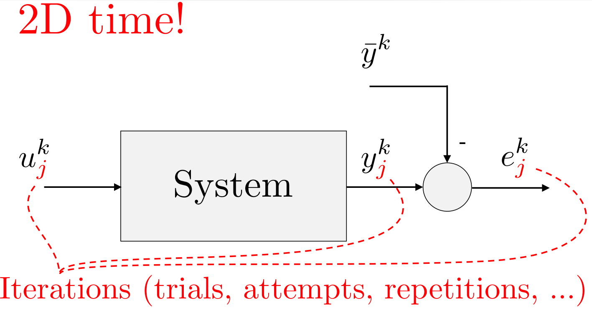
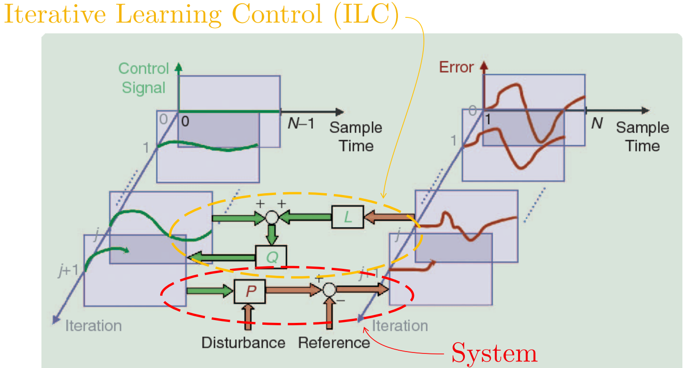

# Iterative Control

[toc]

# 1. Background (Intuition)

Simple Repetitions imporve performance in prototypical motions

# 2. Introduction

## Architecture

## Model

Given **Desired Trajectory**: $\bar{y}:\{1 \ldots N\} \rightarrow \mathbb{R}^{m}$

Find a **Learning Rule**: $u_{j+1}^{k}=F\left(u_{j}^{k}, e_{j}^{k}\right)$

s.t.: 

​	If 

* (dynamic model): 
  $$
  \begin{array}{l}
  x_{j}^{k+1}=A(k) x_{j}^{k}+B(k) u_{j}^{k} \\
  y_{j}^{k+1}=C(k+1) x_{j}^{k+1}+D(k+1) u_{j}^{k+1}
  \end{array}
  $$

And 

* (same initial condition)
  $$
  x_{j}^{0}=x_{j+1}^{0}, \quad \forall j
  $$

Then (**Asymptotically perfect execution**)
$$
\lim _{j \rightarrow \infty} y_{j}^{k}=\bar{y}^{k}, \quad \forall k \in 1 \ldots N
$$
