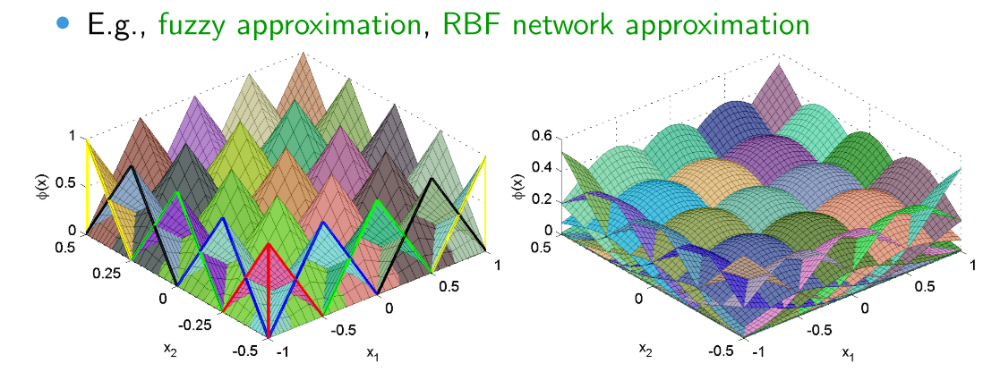
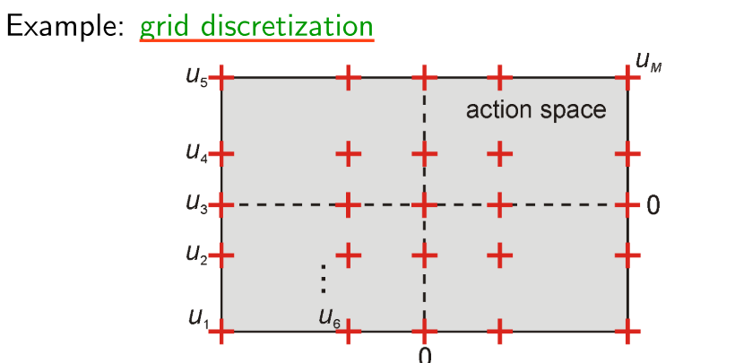
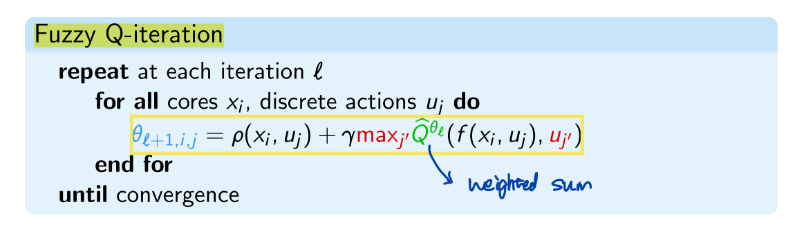
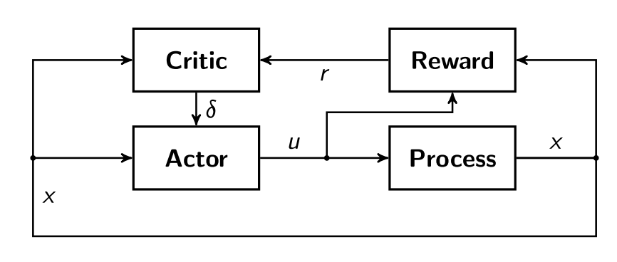
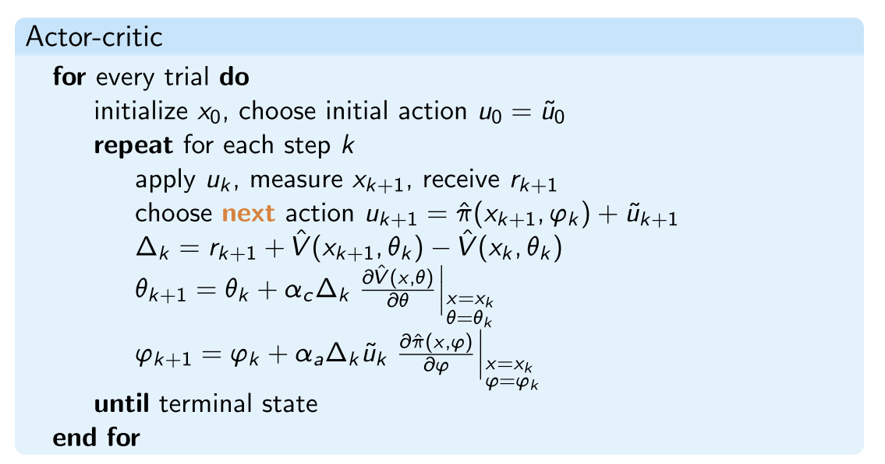

# RL using Function Approximation_ For continuous space

[toc]

# 1. Q-function Approximation

## 1.1. Background & Basic Idea

In real-life control, X, U continuous

- approximate Q-function $\hat{Q}$ must be used

## 1.2. Method 1: use linearly parametrized approximation

### Q-function Approximation

- use **Basis Function** to approximate Q-function in a continuous space

$$
\widehat{Q}=\sum_{i=1}^{N} \theta_{i} \phi_{i}(x, u) \\ \phi_{i}(x, u): X \times U \mapsto \mathbb{R}
$$

usually normalized: $\sum_i \phi_i(x)=1$

- Policy is greedy in $\hat{Q}$, computed on demand for given x:

  $$\pi(x)=\underset{u}{\arg \max } \widehat{Q}(x, u)$$

  - Approximator must ensure efficient arg max solution

### Action Space Discretization

- Choose M discrete actions $u_1,\cdots,u_M ∈ U$
- Solve “arg max” by explicit enumeration
- In a control problem, we always make the grid more detail arround the attractor, for example, 0 in the graph

## 1.3.Fuzzy Q-iteration

### Model

Given:

- N basis functions $\phi_1,\cdots, \phi_N$
- M discrete actions $u_1,\cdots, u_M$

Store

- N ×M matrix of parameters $\theta$ (one for each pair basis function–discrete action)
  - same row: same $\phi$
  - same column: same action

$$
\widehat{Q}^{\theta}\left(x, u_{j}\right)=\sum_{i=1}^{N} \phi_{i}(x) \theta_{i, j}=\left[\phi_{1}(x) \ldots \phi_{N}(x)\right]\left[\begin{array}{c}\theta_{1, j} \\\vdots \\\theta_{N, j}\end{array}\right]
$$

### Policy

$$
\widehat{\pi}^{*}(x) =\underset{u_{j}, j=1, \ldots, M}{\arg \max } \widehat{Q}^{\theta^{*}}\left(x, u_{j}\right) \\\left(\theta^{*}=\text { converged parameter matrix }\right)
$$

### Fuzzy Q-iteration

# 2. Actor-critic methods

## 2.1. Structure

**Explicitly separated value function and policy**

- Actor = control policy $\pi(x)$
- Critic = state value function $V(x)$

**When facing continuity:**

- Actor parameterized in $\phi: \hat{\pi}(x; \phi)$
- Critic parameterized in $\theta: \hat{V}(x; \theta)$

Parameters $\phi$ and $\theta$, have finite size, but approximate functions on continuous (infinitely large) spaces

## 2.2. Update Critic: Value Estimation

The task of the critic is to **predict the expected future reinforcement r the process will receive being in the current state and following the current control policy.**

- For doing that, we need to train critic, the prediction error is always a train input:

  Use sample $(x_k; u_k; x_{k+1}; r_{k+1})$ at each step k and parameterized V:

  Note that both $\hat{V}(s_k)$ and $\hat{V}(s_{k+1})$ are known at time k, since $\hat{V}(s_{k+1})$ is a prediction obtained for the current process state: For example, assuming a NN, we can always get a prediction of next state value based on current state, we get the $\Delta$ from **real system feedback $r_{k+1}$** and **critic originial prediction**

$$
\Delta_{k}=V\left(s_{k}\right)-\hat{V}\left(s_{k}\right)=r_{k+1}+\gamma \hat{V}\left(s_{k+1}\right)-\hat{V}\left(s_{k}\right)
$$

- For example, Let the critic be represented by a neural network or a fuzzy system,  in my opinion, **the index of $\theta$ represents the iteration version, it accidentally equal to state/step number, because each step we make a update. It does not mean the corresponding $\theta$ of state k or k+1**

  $$\hat{V}\left(s_{k+1}\right)=\hat{V}\left(s_{k+1}, \theta_{k}\right)$$

  To update $θ_k$, a gradient-descent learning rule is used:
  $$
  \theta_{k+1}=\theta_{k}+\alpha_{c} \Delta_{k} \frac{\partial \hat{V}\left(s_{k}, \theta_{k}\right)}{\partial \theta_{k}} \\ \alpha_c>0, \text{learning rate of critic}
  $$
  
  $$
  \Delta_{k}>0, \text { i.e., } r_{k+1}+\gamma \hat{V}^{\pi}\left(x_{k+1}, \theta_{k}\right)>\hat{V}^{\pi}\left(x_{k}, \theta_{k}\right) \\ \Rightarrow \text{old estimate too low, increase $\hat{V}$}
  $$
  
  $$
  \Delta_{k}<0, \text { i.e., } r_{k+1}+\gamma \hat{V}^{\pi}\left(x_{k+1}, \theta_{k}\right)<\hat{V}^{\pi}\left(x_{k}, \theta_{k}\right) \\\Rightarrow \text{old estimate too high, decrease $\hat{V}$}
  $$
  

## 2.3. Update Actor: Policy Update

The actor (i.e., the policy) can be adapted in order to **establish an optimal mapping between the system states and the control actions.**
$$
u_{k}=\hat{\pi}\left(x_{k}, \varphi_{k}\right)+\tilde{u}_{k}, \hat{\pi}=\text { actor, } \tilde{u}_{k}=\text { exploration }
$$

$$
\varphi_{k+1}=\varphi_{k}+\left.\alpha_{a} \Delta_{k} \tilde{u}_{k} \frac{\partial \hat{\pi}(x, \varphi)}{\partial \varphi}\right|_{x=x_{k}}
$$

$$
\Delta_{k}>0, \text { i.e., } r_{k+1}+\gamma \hat{V}^{\pi}\left(x_{k+1}, \theta_{k}\right)>\hat{V}^{\pi}\left(x_{k}, \theta_{k}\right) \\ \Rightarrow \text{$\widetilde{u}_k$ had positive effect, move in that direction}
$$

$$
\Delta_{k}<0, \text { i.e., } r_{k+1}+\gamma \hat{V}^{\pi}\left(x_{k+1}, \theta_{k}\right)<\hat{V}^{\pi}\left(x_{k}, \theta_{k}\right) \\\Rightarrow \text{$\widetilde{u}_k$ had negative effect, move away from that direction}
$$

# 3. One Really Classical Example

Lecture Notes, Application 1

