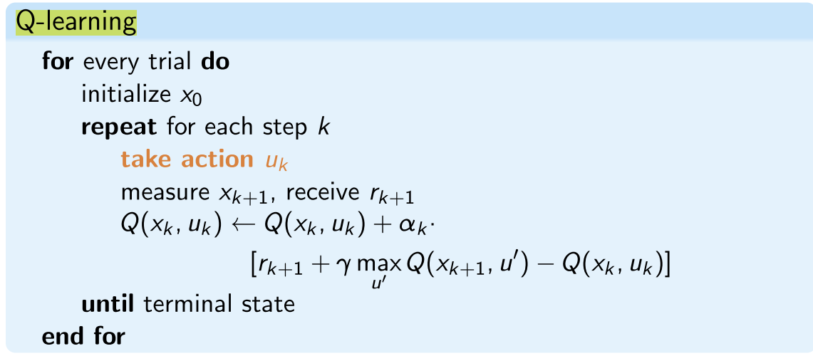
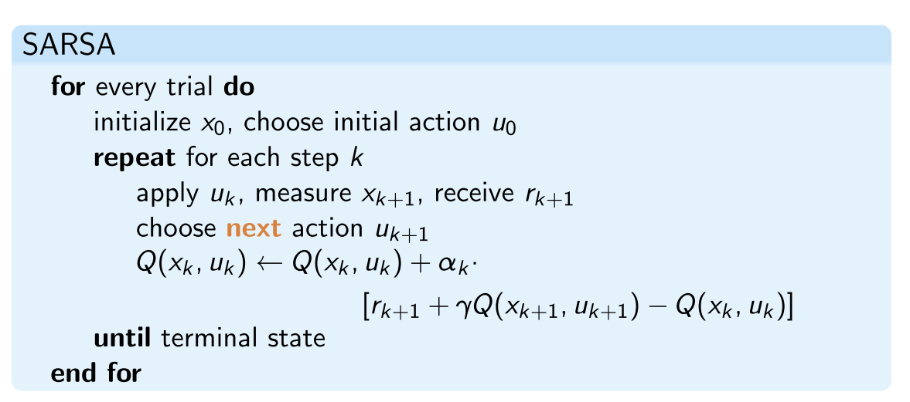
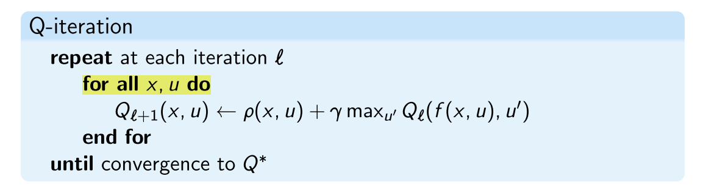
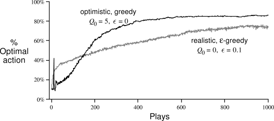

This part almost has the same content as the 6 & 7 weeks' content of Artificial intelligence.

But some important and not overlapped part is illustrated here

# 1. Off-policy and On-policy

## 1.1. Introduction

### Off-policy:

Use experience of different policies to improve $\pi$

- find $Q^*$, use it to compute $\pi^*$
- find $Q^{\pi}$, improve $\pi$, repeat

### On-policy:

Use experience of ı to improve  $\pi$

## 1.2. Q-learning

Online, off-policy

- Q-learning is called 

  off-policy

   because the updated policy is different from the behavior policy (use action take make value from $x_{k+1}$ to update the $Q(x_k,u_k)$, while does not really take this action),

  - It estimates the reward for future actions and appends a value to the new state **without actually following any greedy policy.**

## 1.3. SARSA

online on-policy

- SARSA (state-action-reward-state-action) is an 

  on-policy

   reinforcement learning algorithm that estimates the value of the policy being followed.

  - In this algorithm, if the agent grasps the optimal policy and uses the same to act.

## 1.4. Exploration-Exploitation Trade-off: $\epsilon$-greedy

$$
\begin{array}{l} u_{k}=\left\{\begin{array}{ll} \arg \max _{\bar{u}} Q\left(x_{k}, \bar{u}\right) & \text { with probability }\left(1-\varepsilon_{k}\right) \\ \text { a random action } & \text { with probability } \varepsilon_{k} \end{array}\right. \end{array}
$$

- For Q-learning, $\epsilon_k$ always decrease with time
- For SARSA, $\epsilon_k$ always decrease with time, and we always require $\lim_{k \rightarrow \infty} \varepsilon_{k}=0$

# 2. Temporal Difference & Eligibility Trace

## 2.1. Temporal Difference

$$
V\left(s_{k}\right) \leftarrow V\left(s_{k}\right)+\alpha_{k}\left[r_{k+1}+\gamma V\left(s_{k+1}\right)-V\left(s_{k}\right)\right],
$$

### Convergence

Convergence is guaranteed when $α_k$ satisfies the conditions:
$$
\begin{array}{l}\sum_{k=1}^{\infty} \alpha_{k}=\infty \\ \text{and }\sum_{k=1}^{\infty} \alpha_{k}^{2}<\infty\end{array}
$$

- The first condition is to ensure that the learning rate is large enough to overcome initial conditions or random fluctuations
- $V(s_k)$ is only updated after receiving the new reward $r_{k+1}$

## 2.2. Eligibility Trace

### Background

Because $V(s_k)$ is only updated after receiving the new reward $r_{k+1}$ in normal value iteration

- It is reasonable to say that immediate rewards should **change the values in all states that were visited** in order to get to the current state

### Introduction

An extra variable, called the **eligibility trace** is associated with each state, indicating how eligible it is for a change when a new reinforcing event comes available.
$$
\delta_{k}=r_{k+1}+\gamma V_{k}\left(s_{k+1}\right)-V_{k}\left(s_{k}\right)\\ \Delta V_{k}(s)=\alpha \delta_{k} e_{k}(s)
$$

**Accumulating Traces**
$$
e_{k}(s)=\left\{\begin{array}{ll}\gamma \lambda e_{k-1}(s) & \text { if } s \neq s_{k} \\\gamma \lambda e_{k-1}(s)+1 & \text { if } s=s_{k}\end{array}\right.
$$

**Replacing Traces**
$$
e_{k}(s)=\left\{\begin{array}{ll}\gamma \lambda e_{k-1}(s) & \text { if } s \neq s_{k} \\1 & \text { if } s=s_{k}\end{array}\right.
$$

- The method of accumulating traces is known to suffer from convergence problems, therefore **replacing traces is used almost always** in the literature to update the eligibility traces.
- Accumulating Traces update normal state with time-decreasing coefficient, while the second arrive at a state will have a larger than 1 overlapping effect,
- Replacing Traces do not has the problem in accumulatin traces

# 3. Q-iteration

## 3.1. Introduction

- Offline, Model-based solution
- Same as value iteration, but use Q-table

## 3.2. Convergence

Each update is a contraction with factor $\gamma$:
$$
\left\|Q_{\ell+1}-Q^{*}\right\|_{\infty} \leq \gamma\left\|Q_{\ell}-Q^{*}\right\|_{\infty}
$$

Q-iteration monotonically converges to $Q^∗$

# 4. Initial Value Selection

> From: http://incompleteideas.net/book/ebook/node21.html

# 2.7 Optimistic Initial Values

All the methods we have discussed so far are dependent to some extent on the initial action-value estimates,

. In the language of statistics, these methods are

biased

by their initial estimates. For the sample-average methods, the bias disappears once all actions have been selected at least once, but for methods with constant

, the bias is permanent, though decreasing over time as given by

[(2.7)](http://incompleteideas.net/book/ebook/node20.html#eq:expave)

. In practice, this kind of bias is usually not a problem, and can sometimes be very helpful. The downside is that the initial estimates become, in effect, a set of parameters that must be picked by the user, if only to set them all to zero. The upside is that they provide an easy way to supply some prior knowledge about what level of rewards can be expected.Initial action values can also be used as a simple way of encouraging exploration. Suppose that instead of setting the initial action values to zero, as we did in the 10-armed testbed, we set them all to +5. Recall that the

in this problem are selected from a normal distribution with mean 0 and variance 1. An initial estimate of +5 is thus wildly optimistic. But this optimism encourages action-value methods to explore. Whichever actions are initially selected, the reward is less than the starting estimates; the learner switches to other actions, being "disappointed" with the rewards it is receiving. The result is that all actions are tried several times before the value estimates converge. The system does a fair amount of exploration even if greedy actions are selected all the time.

Figure

[2.4](http://incompleteideas.net/book/ebook/node21.html#fig:initial-opt)

shows the performance on the 10-armed bandit testbed of a greedy method using

, for all

. For comparison, also shown is an

- greedy method with

. Both methods used a constant step-size parameter,

. Initially, the optimistic method performs worse because it explores more, but eventually it performs better because its exploration decreases with time. We call this technique for encouraging exploration

optimistic initial values

. We regard it as a simple trick that can be quite effective on stationary problems, but it is far from being a generally useful approach to encouraging exploration. For example, it is not well suited to nonstationary problems because its drive for exploration is inherently temporary. If the task changes, creating a renewed need for exploration, this method cannot help. Indeed, any method that focuses on the initial state in any special way is unlikely to help with the general nonstationary case. The beginning of time occurs only once, and thus we should not focus on it too much. This criticism applies as well to the sample-average methods, which also treat the beginning of time as a special event, averaging all subsequent rewards with equal weights. Nevertheless, all of these methods are very simple, and one of them or some simple combination of them is often adequate in practice. In the rest of this book we make frequent use of several of these simple exploration techniques.

**Exercise 2.8**

The results shown in Figure

should be quite reliable because they are averages over 2000 individual, randomly chosen 10-armed bandit tasks. Why, then, are there oscillations and spikes in the early part of the curve for the optimistic method? What might make this method perform particularly better or worse, on average, on particular early plays?