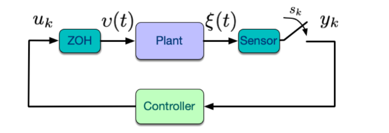
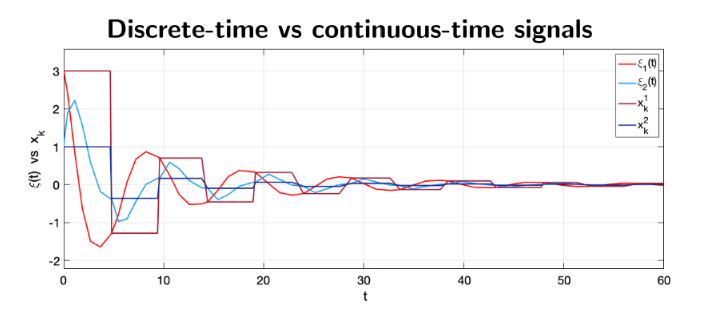
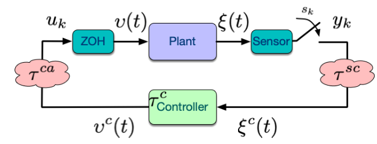
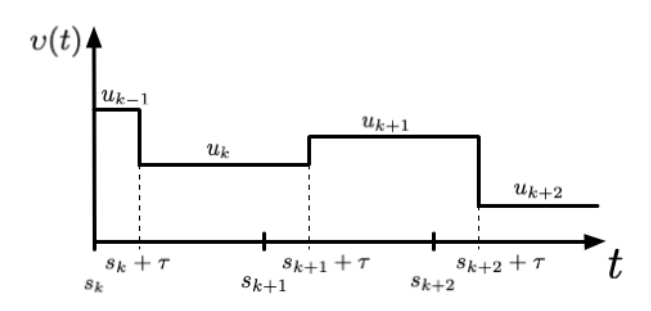
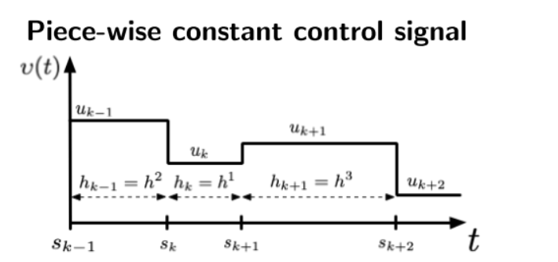
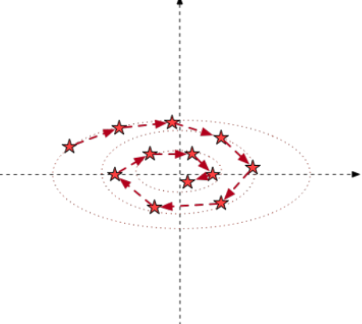
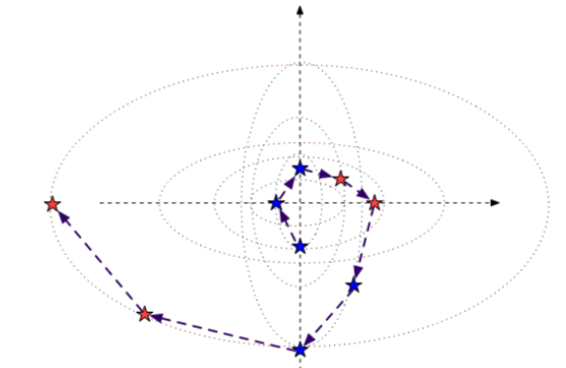
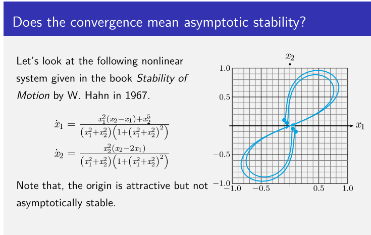
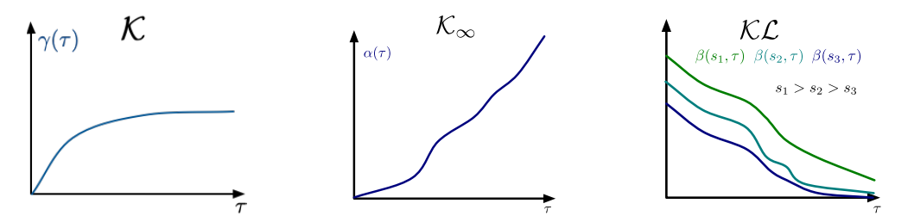

# 01_Modeling and Analysis of NCS

[toc]

# Summary

For a constant sample interval sampled-data control system, we can obtain its model:
$$
\begin{aligned}
x_{k+1} &=e^{A h} x_{k}+\int_{0}^{h} e^{A s} B d s u_{k} \\
&=: F(h) x_{k}+G(h) u_{k}
\end{aligned}
$$
Because of the property that **the inter-sample gain is bounded** we can use the GES theorem of discrete-time model: **A discrete-time system is stable iff** $\rho(\bar{A}) <1$. The stability of a sampled-data system depend on the sample interval.

# 1. Sampled-data Control Systems

## 1.1. Assumption

* constant sampling interval $h$
* full state measurement: $y(k)=x(k):=\epsilon(kh)$
* ZOH mechanism

## 1.2. Model

$$
\begin{array}{ll}
\dot{\xi}(t)=A \xi(t)+B v(t) & \forall t \in \mathbb{R}^{+} \\
v(t)=u_{k} & \text { for } t \in\left[s_{k}, s_{k+1}\right)
\end{array}
$$

where $\epsilon$ is trajectory, $x_k$ is points

so we have:
$$
\xi(t)=e^{A\left(t-t_{0}\right)} \mathcal{E}\left(t_{0}\right)+\int_{t_{0}}^{t} e^{A(t-s)} B v(s) d s
$$
and
$$
x_{k+1}:=\xi\left(s_{k+1}\right)=e^{A h} \xi\left(s_{k}\right)+\int_{s_{k}}^{s_{k+1}} e^{A\left(s_{k+1}-s\right)} B u_{k} d s
$$
It can be denoted as:
$$
\begin{aligned}
x_{k+1} &=e^{A h} x_{k}+\int_{0}^{h} e^{A s} B d s u_{k} \\
&=: F(h) x_{k}+G(h) u_{k}
\end{aligned}
$$

If A is invertible
$$
\int_{0}^{h} e^{A s} d s=\left(e^{A h}-1\right) A^{-1}
$$
If A is not invertible, we can use Jordan's Decomposition

## 1.3. Globally Exponentially Stable (GES) of Discrete Linear Systems

### 1.3.1 Definition

The **origin** of the linear discrete-time system
$$
x_{k+1}=\bar{A} x_{k}
$$
is said to be a **globally exponentially stable (GES)** fixed point if there exist $c > 0$ and $ρ ∈ (0, 1)$such that
$$
\left\|x_{k}\right\| \leq c \rho^{k-k_{0}}\left\|x_{0}\right\|
$$
That means:

> For each start point, this system will get close to the origin with exponentially speed

### 1.3.2. Theorem

The origin of the discrete-time system $x_{k+1}=\bar{A} x_{k}$ is <u>**GES**</u> **if and only if** 
$$
\rho(\bar{A})=\max \left\{\left|\lambda_{1}(\bar{A})\right|,\left|\lambda_{2}(\bar{A})\right|, \ldots,\left|\lambda_{n}(\bar{A})\right|\right\} <1
$$
that is: **the spectral radius of $\bar{A}$ is smaller than one**

## 1.4. Sampled Data System's Stability

For system
$$
x_{k+1}=F(h) x_{k}+G(h) u_{k}
$$
we consider a static state-feedback control law $u_{k}=-\bar{K} x_{k}$, then we will have
$$
\begin{array}{l}
x_{k+1}=(F(h)-G(h) \bar{K}) x_{k} \\
\text { with } \quad(F(h)-G(h) \bar{K})=e^{A h}-\int_{0}^{h} e^{A s} B \bar{K} d s
\end{array}
$$
The origin is GES iff:
$$
\rho(F(h)-G(h) \bar{K})<1
$$
That means

> For a sampled-data system, its stability depend on the sample period h

## 1.5. Sampled Data Behavior

Up to now, we ignore the inter-sample behavior. However, these behaviors is important

During each interval $t \in [s_k,s_{k+1})$
$$
\xi(t)=\xi\left(s_{k}+\Delta t\right)=\left(e^{A \Delta t}-\int_{0}^{\Delta t} e^{A s} B d s \bar{K}\right) x_{k}=: \tilde{F}_{c l}(\Delta t) x_{k}, \\
\tilde{F}_{c l}(\Delta t):=\left(e^{A \Delta t}-\int_{0}^{\Delta t} e^{A s} B d s \bar{K}\right)
$$
where $\Delta t \in [0,h)$

### Relation between discrete-time model stable and sampled-data system stable

stability of exact discrete-time model $\Rightarrow$ stability of the sampled-data system

**<u>Proof</u>**

Because $e^{A \Delta t}$, $e^{As}B$ is bounded, so we have
$$
\Delta t<\infty \Rightarrow\left\|\tilde{F}_{c l}(\Delta t)\right\| \leq M<\infty
$$
That is

> the inter-sample gain is bounded

# 2. Networked Control Systems with Delays

## 2.1. Assumptions

* Sensor-to-controller delay  $\tau^{sc}$
  $$
  \xi^{c}(t)=\xi\left(s_{k}\right), \text { for } t \in\left[s_{k}+\tau^{s c}, s_{k+1}+\tau^{s c}\right)
  $$
  
* Computational Delay $\tau^{c}$
  $$
  v^{c}(t)=\kappa\left(\xi^{c}\left(t-\tau^{c}\right)\right)
  $$
  
* Controller-to-actuator delay $\tau^{ac}$
  $$
  v(t)=v^{c}\left(t-\tau^{c a}\right)
  $$
  
* **Constant and Small total** delay: 
  $$
  \tau=\tau^{S C}+\tau^{C}+\tau^{C a} \\
  0 \le \tau \le h
  $$

## 2.2. Modelling

For time interval $t\in [s_k,s_{k+1})$
$$
\begin{aligned}
\xi\left(s_{k+1}\right) &=e^{A(h)} \xi\left(s_{k}\right)+\int_{s_{k}}^{s_{k+1}} e^{A(t-s)} B v(s) d s \\
v(t) &=u_{k-1} \quad \text { for } \quad t \in\left[s_{k}, s_{k}+\tau\right) \\
v(t) &=u_{k} \quad \text { for } \quad t \in\left[s_{k}+\tau, s_{k+1}\right)
\end{aligned}
$$
We can rewrite it as:
$$
x_{k+1}=e^{A(h)} x_{k}+\int_{h-\tau}^{h} e^{A s} B d s u_{k-1}+\int_{0}^{h-\tau} e^{A s} B d s u_{k}
$$
then rewrite as:
$$
x_{k+1}=F_{x}(h) x_{k}+F_{u}(h, \tau) u_{k-1}+G_{1}(h, \tau) u_{k}
$$
where
$$
F_{x}(h):=e^{A(h)}, F_{u}(h, \tau):=\int_{h-\tau}^{h} e^{A s} B d s, \text { and } G_{1}(h, \tau):=\int_{0}^{h-\tau} e^{A s} B d s
$$

## 2.3. State Augmentation Modelling

with **extended state vector**  $x_{k}^{e}=\left[x_{k}^{T} \quad u_{k-1}^{T}\right]$
$$
x_{k+1}^{e}=F(h, \tau) x_{k}^{e}+G(h, \tau) u_{k}
$$
where
$$
F(h, \tau):=\left[\begin{array}{cc}
F_{x}(h) & F_{u}(h, \tau) \\
0 & 0
\end{array}\right], G(h, \tau):=\left[\begin{array}{c}
G_{1}(h, \tau) \\
I
\end{array}\right]
$$

## 2.4. Stability Analysis

For a given system we have fixed h and $\tau$, so the rule for  [Discrete-Time Stability](# 1.4. Sampled Data System's Stability) is still available.

We consider a **static state-feedback control law**
$$
u_{k}=-K x_{k}^{e}=-\bar{K} x_{k}-K_{u} u_{k-1} .
$$
Then we have
$$
x_{k+1}^{e}=(F(h, \tau)-G(h, \tau) K) x_{k}^{e}
$$
The **origin** of the discrete-time closed-loop is a **GES** fixed point **iff**
$$
\rho(F(h, \tau)-G(h, \tau) K)<1
$$

> Stability depends on h and $\tau$

The controller $K = [ \bar{K} \quad K_u]$ is truly “static” iff $K_u = 0$.

# 3. NCS with varying sampling intervals

## 3.1. Assumptions

* Time varying sampling intervals: $s_{k+1}=\sum_{i=0}^{k} h_{i}$
* Non-constant sampling interval: $h_k=s_{k+1}-s_k$
* $h_{k} \in\left\{h^{1}, \ldots, h^{\prime}\right\}, \forall k$
* ZOH

> Piece-wise constant control signal

## 3.2. Modelling

Different from previous models, now we have a **<u>Linear Time-Varing Discrete Time Systems</u>**
$$
\begin{aligned}
x_{k+1} &=e^{A h_{k}} x_{k}+\int_{0}^{h_{k}} e^{A s} B d s u_{k} \\
&=: F\left(h_{k}\right) x_{k}+G\left(h_{k}\right) u_{k}
\end{aligned}
$$

> Exact discrete-time system matrices depend on varying sampling interval $h_k$

### Time-varying vs Uncertain but constant

* **Time-varying**: intervals vary but belongs to a certain set
* **Uncertain but constant**: many choice of interval but we do not know, however, after start, each interval are constant

## 3.3. Stability Analysis

### Uncertain but Constant Sampling Interval

$$
\rho\left(F\left(h^{i}\right)-G\left(h^{i}\right) \bar{K}\right)<1, \forall h^{i} \in \mathcal{H} \Rightarrow \text { origin GES. }
$$

### Time Varying interval

$$
\rho\left(F\left(h_{k}\right)-G\left(h_{k}\right) \bar{K}\right)<1, \forall k
$$

is **Neither Sufficient Nor Necessary**

**<u>Example</u>**

For a system, if with uncertain but constant sampling interval, it can be:

However, after change it to a Switching System

# 4. Stability Analysis for non-linear discrete time systems

## 4.1. Framework

a Discrete-time non-linear time-varying system:
$$
x(k+1)=f(x(k), k), \forall k
$$
with $x_k \in R^{n}$ and the origin is a fixed point, i.e.
$$
0=f(0,k), \quad  \forall k
$$

## 4.2. Stability Definitions

### Stability

The origin of system is said to be **stable** if for every  $\epsilon>0$ and $k_0 ≥ 0$ there exists a function $δ$ of  $\epsilon$ and $k_0$, i.e. $δ = \bar{δ}(\epsilon, k_0)$, such that:
$$
\left\|x_{k 0}\right\|<\bar{\delta}\left(\epsilon, k_{0}\right) \Rightarrow\left\|x_{k}\right\|<\epsilon \quad \forall k \geq k_{0}
$$

> For a given standard ($\epsilon$) and a given state, we can always find a value $\bar{\delta}(\epsilon,k_0)$ that if the given state is bounded by the value, the following trajectory is bounded by the standard
>
>  a system pass some $\delta-ball$ around the equilibrium at time step $k_0$ will not leave a $\epsilon-ball$ around the equilibrium

### Uniform Stability

The origin of system is said to be **uniformly stable** if for every  $\epsilon> 0$ and $k_0 ≥ 0$ there exists a $\delta = \bar{\delta}(\epsilon)$ such that:
$$
\left\|x_{k 0}\right\|<\bar{\delta}\left( \epsilon \right) \Rightarrow\left\|x_{k}\right\|<\epsilon \quad \forall k \geq k_{0}
$$
Uniformity $\Rightarrow$ $\delta$ is independent of the initial time $k_0$

> For a given standard ($\epsilon$), we can always find a value $\bar{\delta}(\epsilon)$ that **no matter from which point, as long as this point is bounded by the value**, the following trajectory is bounded by the standard
>
>  a system starting in some $\delta-ball$ around the equilibrium will not leave a $\epsilon-ball$ around the equilibrium

### Global Exponential Stability

The origin of system (1) is said to be said **globally uniformly asymptotically** stable if there exists an exponential function $\beta \in \mathcal{K} \mathcal{L}$, i.e. $\beta(\|x\|, k)=c \rho^{k}\|x\|$ with $c>0, \rho \in(0,1)$, such that:
$$
\left\|x_{k}\right\| \leq \beta\left(\left\|x_{k 0}\right\|, k\right), \forall k \geq k_{0}
$$

## 4.3. Attractivity Definitions

### Attractivity

The origin of system  is said to be **attractive** if for every $k_0 ≥ 0$ there exists a scalar $\eta$ function of $k_0$, i.e. $\eta=\bar{\eta}(k_0)>0$, such that
$$
\left\|x_{k 0}\right\|<\bar{\eta}\left(k_{0}\right) \Rightarrow\left\|x_{k}\right\| \rightarrow 0 ; \text { as } k \rightarrow \infty
$$

> For each start point, we can find a bound that is the point meet the bound, the trajectory will be attracted by the origin

### Uniform Attractivity

The origin of system  is said to be **uniformly attractive** if for every $k_0 ≥ 0$ there exists a scalar $\eta>0$, such that
$$
\left\|x_{k 0}\right\|<\eta \Rightarrow\left\|x_{k}\right\| \rightarrow 0 ; \text { as } k \rightarrow \infty, \text { uniformly in } k_{0}
$$
uniformity $\Rightarrow$ independent with $k_0$

> For all points, we can find a uniform bound that if the points meet this bound, the trajectory will be attracted by the origin

### Attractive but not stable

## 4.4. Asymptotic Stability

### Local Asymptotic Stability

The origin of system is said to be said **locally asymptotically stable** if it is **both stable and attractive**

### Local Uniform Asymptotic Stability

The origin of system is said to be said **locally asymptotically uniformly stable** if it is **both uniformly stable and uniformly attractive.**

### Global Uniform Asymptotic Stability

The origin of system is said to be said **globally uniformly asymptotically stable** if there exists a function $\beta \in \mathcal{K} \mathcal{L}$ such that:
$$
\left\|x_{k}\right\| \leq \beta\left(\left\|x_{k 0}\right\|, k\right), \forall k \geq k_{0}
$$

> * The trajectory should always below a $\mathcal{KL}$ function

## 4.5. Comparison Functions

### $\mathcal{K}$

A function $\gamma: \mathbb{R}_{0}^{+} \rightarrow \mathbb{R}_{0}^{+}$, is of class $\mathcal{K}$ if 

* it is continuous, 
* strictly increasing 
* $\gamma(0)=0$. 

###  $\mathcal{K}_{\infty}$ 

A function $\gamma \in \mathcal{K}$ is of class $\mathcal{K}_{\infty}$ if additionally it satisfies:

* $\gamma(s) \rightarrow \infty$ as $s \rightarrow \infty$

A continuous function $\beta: \mathbb{R}_{0}^{+} \times \mathbb{R}_{0}^{+} \rightarrow \mathbb{R}_{0}^{+}$ is of class $\mathcal{K} \mathcal{L}$ if 

* $\beta(\cdot, \tau)$ is of class $\mathcal{K}$ for each $\tau \geq 0$ 
* $\beta(s, \cdot)$ is monotonically decreasing to zero for each $s \geq 0: $ $\beta(s, \tau) \rightarrow 0$ as $\tau \rightarrow \infty$.

> For fixed $\tau$, when $s$ increase, $\beta$ increase
>
> For fixed s, when $\tau$ increase, $\beta$ decrease

### Exponential

A class $\mathcal{K} \mathcal{L}$ function $\beta$ is called **exponential** if 
$$
\beta(s, \tau) \leq \sigma s e^{-c \tau}  \text{where} \sigma>0, c>0
$$

## 4.6. Stability Characterization (For discrete-time systems)

### Theorem for Uniform Asymptotic Stability

The origin of system is **local uniformly asymptotically stable** if **there exists** a function $V: \mathbb{R}^{n} \times \mathbb{R} \rightarrow \mathbb{R}_{0}^{+}$, a scalar $r>0$, and $\mathcal{K}$ functions $\alpha_{1}, \alpha_{2}$, and $\alpha_{3}$ such that:
$$
\begin{array}{l}
 \alpha_{1}(\|x\|) \leq V(x, k) \leq \alpha_{2}(\|x\|), \forall k \geq k_{0}, \forall x \in B_{r} \\
 V\left(x_{k+1}, k+1\right)-V\left(x_{k}, k\right) \leq-\alpha_{3}\left(\left\|x_{k}\right\|\right), \forall k \geq k_{0}, \forall x \in B_{r} \\
\text { where } B_{r}=\left\{x \in \mathbb{R}^{n} \mid\|x\| \leq r\right\}
\end{array}
$$

> * Can be regarded as energy decrease
> * bounded by two $\mathcal{K}$ function
> * decrease and decrease more and more rapidly

### Theorem for Global Uniform Asymptotic Stability

The origin of system is globally uniformly asymptotically stable if there exists a function $V: \mathbb{R}^{n} \times \mathbb{R} \rightarrow \mathbb{R}_{0}^{+}$, and $\mathcal{K}$ functions $\alpha_{1}, \alpha_{2}$, and
$\alpha_{3}$ such that:
$$
\begin{array}{l}
\alpha_{1}(\|x\|) \leq V(x, k) \leq \alpha_{2}(\|x\|), \forall k \geq k_{0}, \forall x \in \mathbb{R}^{n} \\
V\left(x_{k+1}, k+1\right)-V\left(x_{k}, k\right) \leq-\alpha_{3}\left(\left\|x_{k}\right\|\right), \forall k \geq k_{0}, \forall x \in R^{n}
\\\text{ $V(x,k)$is radially unbounded, i.e. $V(x, r) \rightarrow \infty$ as $\|x\| \rightarrow \infty$ uniformly in $k$.}
\end{array}
$$

### Theorem for Global Exponential Stability

The origin of system (1) is globally exponentially stable if there exists a function $V: \mathbb{R}^{n} \times \mathbb{R} \rightarrow \mathbb{R}_{0}^{+}$, constants $\alpha_{1}, \alpha_{2}, \alpha_{3}>0$, and $p>1$ such
that:
$$
\begin{array}{l}
\alpha_{1}\|x\|^{p} \leq V(x, k) \leq \alpha_{2}\|x\|^{p}, \forall k \geq k_{0}, \forall x \in \mathbb{R}^{n} \\
V\left(x_{k+1}, k+1\right)-V\left(x_{k}, k\right) \leq-\alpha_{3}\left\|x_{k}\right\|^{p}, \forall k \geq k_{0}, \forall x \in R^{n}
\end{array}
$$

## 4.7. LTI Systems Stability

Consider now a Linear Time-Invariant (LTI) system:
$$
x_{k+1}=A x_{k}
$$
and $V(x)=x^{T} P x$, with $P=P^{T}>0$ as a Lyapunov candidate function. Observe:
$$
\begin{array}{l}
\lambda_{\min }(P)\|x\|^{2} \leq V(x) \leq \lambda_{\max }(P)\|x\|^{2} \\
V\left(x_{k+1}\right)-V\left(x_{k}\right)=x_{k}^{T}\left(A^{T} P A-P\right) x_{k} \\
\left(A^{T} P A-P\right) \leq-Q, Q>0 \Rightarrow  V\left(x_{k+1}\right)-V\left(x_{k}\right) \leq-x_{k}^{T} Q x_{k} \leq-\lambda_{\min }(Q)\|x\|^{2}, \\
\text{i.e. GES with $p=2$. }
\end{array}
$$
> Above first equation:
>
> * we can always find a Unit Orthogonal Array to transform P to a diagonal format, and because orthogonal transformation does not change the norm of the vector, so it can be easily proved.

And we can prove that: 

A Schur $^{1} \Leftrightarrow$ for each $Q>0$  $\exists ! P>0$ such that $A^{T} P A-P=-Q$

> Spectral and Lyapunov stability tests equivalence for LTI systems

# 5. NCS with varying sampling intervals. LMIs for Stability  

The origin of the system is **GES** if there **exist** a matrix $P=P^{T}>0$ such that the following LMIs hold for all $h \in \mathcal{H}$ :
$$
(F(h)-G(h) \bar{K})^{T} P(F(h)-G(h) \bar{K})-P \leq-Q
$$
for some $Q=Q^{T}>0$.

This result is based on finding a common Lyapunov function.  

