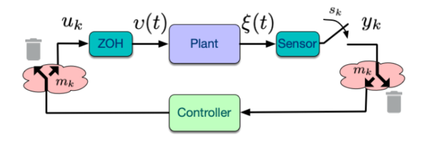
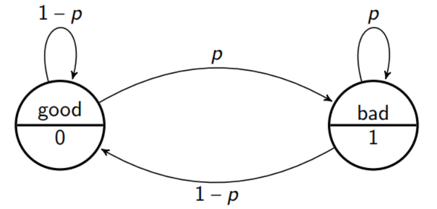
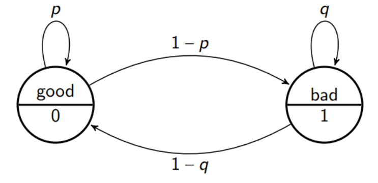

# 02_NCS with packet losses and protocols

[toc]

# 1. Modeling of NCS with packet losses

## 1.1. Assumptions

* No Delays

* Packet Losses Model:

  * $$
    m_{k}=\left\{\begin{array}{l}
    0, \text { if no packet loss at time } k \\
    1, \text { if packet is lost at time } k
    \end{array}\right.
    $$

  * Assume two sides' $m_k$ are synchronized

  

## 1.2. Controller Schemes

* Zero-order-hold:  $$v(t)=u_{k}, t \in\left[s_{k}, s_{k+1}\right)$$

### 1.2.1. To-Hold Mechanism (event-driven)

$$
u_{k}=\left\{\begin{array}{ll}
-\bar{K} x_{k}, & \text { if } m_{k}=0 \\
u_{k-1}, & \text { if } m_{k}=1
\end{array}\right.
$$

### 1.2.2. To-Zero Mechanism (time-driven)

$$
u_{k}=\left\{\begin{array}{cl}
-\bar{K} x_{k}, & \text { if } m_{k}=0 \\
0, & \text { if } m_{k}=1
\end{array}\right.
$$

## 1.3. Process Modeling

### Sampled-Data System, To-Zero Mechanism

With the controller $u_{k}=-\bar{K} x_{k}$ and the "to zero" mechanism:
$$
x_{k+1}=F_{m_{k}}^{c l}(h) x_{k}=\left\{\begin{array}{cll}
(F(h)-G(h) \bar{K}) x_{k} & =: F_{0}^{c l}(h) x_{k} & \text { if } m_{k}=0 \\
F(h) x_{k} & =: F_{1}^{c l}(h) x_{k} & \text { if } m_{k}=1
\end{array}\right.
$$

### Sampled-Data System, To-Hold mechanism

## 1.4. Models of Dropout Sequences

We need to model the **"discrete dynamics"** of the NCS:
$$
m_{k+1}=f\left(m_{k}, m_{k-1}, \ldots\right)
$$

### Deterministic m Discrete Dynamics

Here we will use $\omega$-**automation**

An automaton is a 5-tuple $M=\left(Q, \Sigma, \delta, Q_{0}, F\right)$, where

* $Q$ is a finite or countable set of discrete states,
* $\Sigma$ is a finite or countable set of discrete inputs, the input alphabet, $
* $ is the transition function,
* $Q_{0} \subseteq Q$ is the set of **start states**, and
* $F \subseteq Q$ is the set of accept states.

### Stochastic m Discrete Dynamics

## 1.5. Model of Control Systems

### Deterministic Packet Loss

We consider a **Deterministic Special Case**: max. $\delta$ consecutive losses
$$
m \vDash (0^{*} \circ(10)^{*} \circ(110)^{*} \circ(1110)^{*} \circ \cdots \circ(\overbrace{1 \cdots 1}^{\delta} 0))^{\omega}.
$$
So we can model a **closed-loop system-network** as:

* Discrete-time **switched system**

$$
x_{I+1}=\tilde{F}^{c l}\left(h, h_{l}\right) x_{I}
$$
* Packet-drops as extensions of sampling interval:

$$
h_{l} \in\{h, 2 h, \ldots,(\delta+1) h\}
$$
* State $x_{l}:=x\left(\bar{s}_{l}\right), \bar{s}_{l+1}=\bar{s}_{l}+h_{l}$

* > **So we transfer deterministic packet loss to time-varying system**

  * With the "to zero" strategy:
    $$
    x_{l+1}=\left(e^{A h_{l}}-e^{A\left(h_{1}-h\right)} \int_{0}^{h} e^{A s} B \bar{K} d s\right) x_{l}
    $$
    Here the actual process is:

    * First calculate after interval h: $x_l^{'} = \left (e^{Ah} - \int_{0}^{h} e^{A s} B \bar{K} d s\right) x_{l}$ 
    * For time interval: $[t+h, t+h_{l})$, control signal become zeros, so we have $x_{l+1}=e^{A(h_l-h)}x_{l}^{'}$ 

### Stochastic Packet Loss

Here we use **Markov Decision Process** to model it

A Markov Decision Process (MDP) is a tuple $\left(\Sigma, \Gamma, Q, q_{0}, \delta, H\right)$, where:

* $\Sigma$ is an input alphabet (finite non-empty set of symbols); $\Gamma$ is an output alphabet (possibly, and often a subset of $\mathbb{R})$
* $Q$ is a finite, non-empty, set of states;
* $q_{0} \in \mathbb{P}(Q)$ is the initial probability distribution of the states;
* $\delta: Q \times \Sigma \times Q \rightarrow[0,1]$ is the state-transition relation;
* $H: Q \times \Sigma \times Q \rightarrow \Gamma$ is the output map or reward function.

**<u>Bernoulli Model</u>**

Finite State $m_k \in \{0,1\}$
$$
\mathbb{P}\left(m_{k}=1\right)=p
$$

**<u>Gilbert-Elliot Model</u>**

Finite State $m_k \in \{0,1\}$
$$
\begin{array}{l}
\mathbb{P}\left(m_{k}=0 \mid m_{k-1}=0\right)=p_{00}=p, \mathbb{P}\left(m_{k}=1 \mid m_{k-1}=0\right)=p_{01}=1-p \\
\mathbb{P}\left(m_{k}=1 \mid m_{k-1}=1\right)=p_{11}=q, \mathbb{P}\left(m_{k}=0 \mid m_{k-1}=1\right)=p_{10}=1-q
\end{array}
$$

# 2. Stability of NCS with Packet Loss

## 2.1. Deterministic Packet Loss

### Total Model

$$
h_{l} \in\{h, 2 h, \ldots,(\delta+1) h\}
$$

$$
x_{l}:=x\left(\bar{s}_{l}\right), \bar{s}_{l+1}=\bar{s}_{l}+h_{l}
$$

* > **we transfer deterministic packet loss to time-varying system**

  * With the "to zero" strategy:
    $$
    x_{l+1}=\left(e^{A h_{l}}-e^{A\left(h_{1}-h\right)} \int_{0}^{h} e^{A s} B \bar{K} d s\right) x_{l}
    $$

  

### Stability Analysis

> Bounded Inter-sample Gain $+$ **Discrete-time system stability** $\Rightarrow$ Sampled-data stability

Because:
$$
h_{l} \in \mathcal{H} \Rightarrow h_{l}<\infty \Rightarrow​ \text{Bounded Inter-sample Gain}
$$

## 2.2. Stochastic Stability Notions

### Mean Square Stability(MSS), Exponentially MSS (EMSS), Uniformly EMSS(UEMSS)

A stochastic system is said to be **mean square stable (MSS)** if for all $x_{0}$ and all $m_{-1}$ :
$$
\lim _{k \rightarrow \infty} \mathbb{E}\left[\left\|x_{k}\right\|^{2}\right]=0
$$
If furthermore:

* $\mathbb{E}\left[\left\|x_{k}\right\|^{2}\right] \leq c \rho^{k}\left\|x_{0}\right\|^{2}$ for some $c \geq 0$ and $\rho \in[0,1)$ it is said to be **Exponentially MSS (EMSS)**, 
*  if $c, \rho$ are independent of $x_{0}$ and $m_{-1}$, it is said to be **Uniformly EMSS (UEMSS)**

> MSS: The final state's norm has a average 0
>
> EMSS: The state's norm 's average is bounded by exponential functions
>
> UEMSS: The state's norm's average is bounded by an unique exponential function

### Stochastic Stability (SS)

A stochastic system is said to be **stochastically stable (SS)** if for all $x_{0}$ and all $m_{-1}$ :
$$
\mathbb{E}\left[\sum_{k=0}^{\infty}\left\|x_{k}\right\|^{2}\right]<\infty
$$

> The average energy of the systems is finite

### Almost Surely Stable (ASS)

A stochastic system is said to be **almost surely stable (ASS)** if for all $x_{0}$ and all $m_{-1}$ :
$$
\begin{array}{c}
\mathbb{P}\left[\lim _{k \rightarrow \infty}\left\|x_{k}\right\|\right]=0 . \\
=P\left[\lim _{k \rightarrow \infty}\left\|x_{k}\right\|=0\right]=1
\end{array}
$$

### Relation

For Markovian Jump Linear Systems (MJLS) the following holds:
$$
\text { MSS } \Leftrightarrow S S \Leftrightarrow \text { EMSS } \Leftrightarrow \text { UEMSS } \Rightarrow \text { ASS }
$$

> ASS means the system has countable number of situation that may lead to a non-stable sequence (not converge to 0)
>
> MSS means the system has countable number of situation that may bead to a non-stable sequence and the non-stable sequence has a bounded deviation from fixed point.

## 2.3. Stability of NCS with Stochastic Packet Loss

### Overall Model

$$
x_{k+1}=F_{m_{k}}^{c l}(h) x_{k}, \quad \mathbb{P}\left(m_{k}=j \mid m_{k-1}=i\right)=p_{i j}
$$

**Switched system**, m controls **switching stochastically** (Markovian) : **Markovian Jump Linear System  **

### Stability Analysis (MJLS MSS)

A Markovian Jump Linear System:
$$
x_{k+1}=A_{m_{k}} x_{k}, \quad \mathbb{P}\left(m_{k}=j \mid m_{k-1}=i\right)=p_{i j}
$$
is **Mean Square Stable (MSS)** if there **exist** $P_{i}>0, i=0, \ldots, N$ that satisfy **any of** the following conditions:

*  $P_{i}-A_{i}^{T}\left(\sum_{j=0}^{N} p_{i j} P_{j}\right) A_{i}>0 \quad$ for all $i=0, \ldots, N$
*  $P_{j}-A_{j}\left(\sum_{i=0}^{N} p_{i j} P_{i}\right) A_{j}^{T}>0 \quad$ for all $j=0, \ldots, N$
*  $P_{i}-\sum_{j=0}^{N} p_{i j} A_{j}^{T} P_{j} A_{j}>0$   for all $i=0, \ldots, N$
* $P_{j}-\sum_{i=0}^{N} p_{i j} A_{i} P_{i} A_{i}^{T}>0 \quad$ for all $j=0, \ldots, N$ 

**Note**: In the case we consider $N=1$, as $m_{k} \in\{0,1\}$.

**<u>Understanding</u>**:
$$
P_{i}-\sum_{j=0}^{N} p_{i j} A_{j}^{T} P_{j} A_{j}>0 \quad \text{for all $i=0, \ldots, N$}
$$

$\Rightarrow$ The Lyapunov function $V\left(x_{k}, m_{k-1}\right)=x_{k}^{T} P_{m_{k-1}} x_{k}$ satisfies:
$$
\mathbb{E}\left[V\left(x_{k+1}, x_{k}\right) \mid x_{k}\right]<V\left(x_{k}, m_{k-1}\right), \forall x_{k} \neq 0
$$

### For Bernoulli Probabilistic Transitions

$$
x_{k+1}=A_{m_{k}}(h) x_{k}, \quad \mathbb{P}\left(m_{k}=j \mid m_{k-1}=i\right)=p_{j}
$$

there exists $P>0$ such that:
$$
\begin{array}{l}
P_{0}-(1-p) A_{0}^{T} P_{0} A_{0}-p A_{1}^{T} P_{1} A_{1}>0 \\
P_{1}-p A_{1}^{T} P_{1} A_{1}-(1-p) A_{0}^{T} P_{0} A_{0}>0
\end{array}
$$
$\Leftrightarrow$ there exists $P>0$ such that:
$$
P-(1-p) A_{0}^{T} P A_{0}-p A_{1}^{T} P A_{1}>0
$$

### For Gilbert-Elliot Model

$$
P_{i}-\sum_{j=0}^{N} p_{i j} A_{j}^{T} P_{j} A_{j}>0, \forall i, j \in\{0,1\}
$$

$\Leftrightarrow$
$$
\begin{array}{l}
P_{0}-p A_{0}^{T} P_{0} A_{0}-(1-p) A_{1}^{T} P_{1} A_{1}>0 \\
P_{1}-q A_{1}^{T} P_{1} A_{1}-(1-q) A_{0}^{T} P_{0} A_{0}>0
\end{array}
$$

### For B-Model and GE-Model with To-Zero Mechanism

MSS **if and only if** 

* (Bernoulli) there exists $P>0$ such that:

$$
P-(1-p) F_{0}^{c / T} P F_{0}^{c l}-p F_{1}^{c / T} P F_{1}^{c l}>0
$$
* (Gilbert-Elliot) there exist $P_{0}, P_{1}>0$ such that:

$$
\begin{array}{l}
P_{0}-p F_{0}^{c / T} P_{0} F_{0}^{c l}-(1-p) F_{1}^{c / T} P_{1} F_{1}^{c l}>0 \\
P_{1}-q F_{1}^{c / T} P_{1} F_{1}^{c l}-(1-q) F_{0}^{c / T} P_{0} F_{0}^{c l}>0
\end{array}
$$
where:
$$
\begin{aligned}
F(h) &:=e^{A h}, \quad G(h):=\int_{0}^{h} e^{A s} B d s \\
F_{1}^{c l} &:=F(h), \quad F_{0}^{c l}:=(F(h)-G(h) \bar{K})
\end{aligned}
$$

### Almost Sure Stability Theorem for Bernoulli Model

The system:
$$
x_{k+1}=e^{A h} x_{k}+\int_{0}^{h} e^{A s} B d s u_{k}
$$
with the controller $u_{k}=-\bar{K} x_{k}$, "to zero" mechanism, and Bernoulli packet losses is $\operatorname{ASS}\left(\mathbb{P}\left[\lim _{k \rightarrow \infty}\left\|x_{k}\right\|=0\right]=1\right)$ if there exists a$V: \mathbb{R}^{n} \rightarrow \mathbb{R}^{+}$ such that $c_{1}\|x\|^{r} \leq V(x) \leq c_{2}\|x\|^{r}$, with $r \geq 1,0<c_{1} \leq c_{2}$,
satisfying:

*  $V\left(F_{0}^{c l} x\right) \leq \lambda V(x)$ for $\lambda \in[0,1)$,
*  $V\left(F_{1}^{c l} x\right) \leq L V(x)$ for some $L \geq 0$,
*  $\lambda^{(1-p)} L^{p}<1$.

> Can be partly increase when loss happen, however, the average effect of decrease and increase should smaller than 1

# 3. NCS with communication constraints: Protocol

