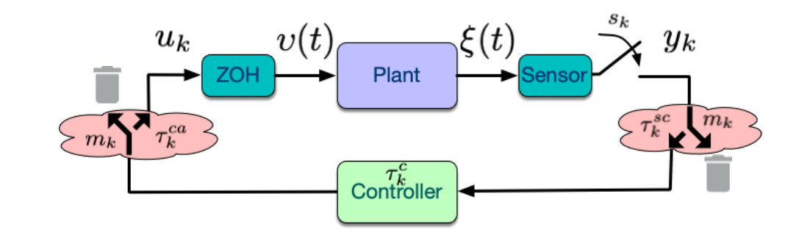
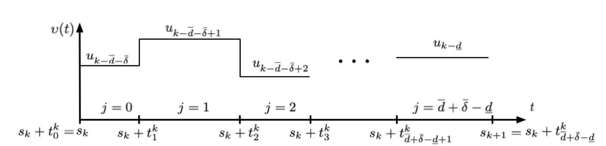
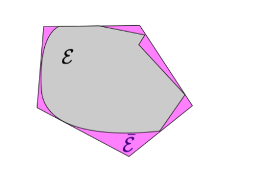
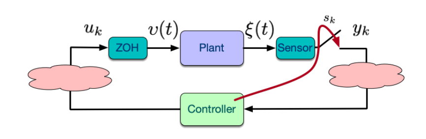
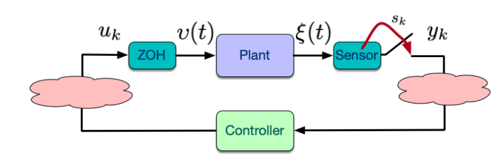
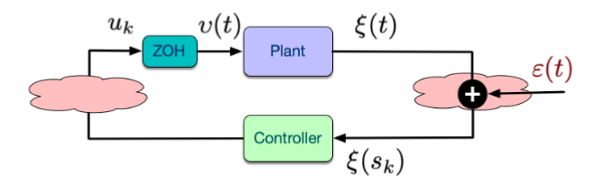
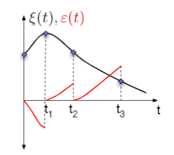
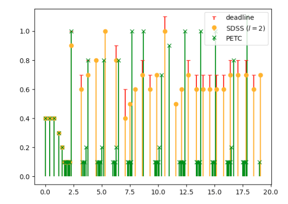

# NCS with Multiple Imperfections and ETC

[toc]

# 1. NCS with Generalized Imperfections

## 1.1. Assumptions

* Time-Varying Sampling:
  $$
  h_{k}=\left(s_{k+1}-s_{k}\right) \in\left[h_{\min }, h_{\max }\right]
  $$
  
* Time-Varying Dealys
  $$
  \tau_{k}=\left(\tau_{k}^{s c}+\tau_{k}^{c}+\tau_{k}^{c a}\right) \in\left[\tau_{\min }, \tau_{\max }\right]
  $$
  
* Packet Losses
  $$
  m_{k}=\left\{\begin{array}{c}
  0, \text { if no packet loss at time } k \\
  1, \text { if packet is lost at time } k
  \end{array}\right.
  $$
  

  * with maximum $\bar{\delta}$ consecutive dropouts: 
    $$
    \sum_{v=k-\delta}^{k} m_{c} \leq \bar{\delta}
    $$

> Continuous Uncertainty Sets

## 1.2. Modeling

$$
\underline{d}=\left\lfloor\frac{\tau_{\min }}{h_{\max }}\right\rfloor, \bar{d}=\left\lceil\frac{\tau_{\max }}{h_{\min }}\right\rceil
$$

So, we have the state space model:

$$
\begin{aligned}
\dot{\xi}(t) &=A \xi(t)+B v(t) \\
v(t) &=u_{k+j-\bar{d}-\bar{\delta}}, \quad \text { for } t \in\left[s_{k}+t_{j}^{k}, s_{k}+t_{j+1}^{k}\right) \
\end{aligned}
$$

### Deterministic

One can explicitly compute the actuation update times:
$$
t_{j}^{k}=\phi\left(h_{k}, \tau_{k}, m_{k}, h_{k-1}, \tau_{k-1}, m_{k-1}, \ldots\right) .
$$
and bounds $t_{j}^{k} \in\left[t_{j, m i n}, t_{j, \max }\right]$
$$
t_{j, \min / \max }=\phi_{\min / \max }\left(\tau_{\min }, \tau_{\max }, h_{\min }, h_{\max }, \bar{\delta}\right) .
$$

### General NCS model

$$
\begin{aligned}
x_{k+1}=& \Lambda\left(\theta_{k}\right) x_{k}+& & \text {Current state } \\
&+M_{\bar{d}+\bar{\delta}-1}\left(\theta_{k}\right) u_{k-1}+\cdots+M_{0}\left(\theta_{k}\right) u_{k-\bar{d}-\bar{\delta}^{+}} & & \text {Past Control Inputs } \\
&+M_{\bar{d}+\bar{\delta}}\left(\theta_{k}\right) u_{k}  && \text {Current Control Input }
\end{aligned}
$$

where
$$
\Lambda\left(\theta_{k}\right)=e^{A h_{k}}, M_{j}\left(\theta_{k}\right)=\left\{\begin{array}{cl}
\int_{h_{k}-t_{j+1}^{k}}^{h_{k}-t_{j}^{k}} e^{A s} d s B & \text { if } \quad 0 \leq j \leq \bar{d}+\bar{\delta}-\underline{d} \\
0 & \text { if } \bar{d}+\bar{\delta}-\underline{d}<j \leq \bar{d}+\bar{\delta}
\end{array}\right.  \\
\theta_{k}:=\left(h_{k}, t_{1}^{k}, \ldots, t_{\frac{d}{d}+\bar{\delta}-\underline{d}}^{k}\right)
$$

### Extended State Model

$$
x_{k}^{e}=\left[x_{k}^{T} u_{k-1}^{T} \ldots u_{k-\bar{d}-\bar{\delta}}^{T}\right]^{T}
$$

If  we consider a linear controller  $u_k=-\bar{K} x_k$, then we will have  $x^e_{k+1}=H(\theta_k)x_k^e$
$$
H\left(\theta_{k}\right):=\left[\begin{array}{cccccc}
\Lambda\left(\theta_{k}\right)-M_{\bar{d}+\bar{\delta}}\left(\theta_{k}\right) \bar{K} & M_{\bar{d}+\bar{\delta}-1}\left(\theta_{k}\right) & M_{\bar{d}+\bar{\delta}-2}\left(\theta_{k}\right) & \ldots & M_{1}\left(\theta_{k}\right) & M_{0}\left(\theta_{k}\right) \\
-\bar{K} & 0 & 0 & \ldots & 0 & 0 \\
0 & 1 & 0 & \ldots & 0 & 0 \\
\vdots & \ddots & \ddots & \ddots & \ddots & \vdots \\
0 & \ldots & \ldots & 1 & 0 & 0 \\
0 & 0 & 0 & 0 & 1 & 0
\end{array}\right]
$$

## 1.3. Stability (Common Lyapunov Function)

The closed-loop NCS is Globally Asymptotically Stable if there exists $P>0, \gamma \in(0,1)$ such that:
$$
H^{T}\left(\theta_{k}\right) P H\left(\theta_{k}\right)-P \leq-\gamma P, \quad \forall \theta_{k} \in \Theta
$$
However, there is a large problem: because $\theta_k$ belongs to a continuous set, so the LMIs set is a **infinite set**

# 2. Stability of General NCS model

## 2.1. From an infinite set to a finite set of LMIs

Using Approximation:

Embedding in **convex polytopic sets** $\overline{\mathcal{E}}$ the uncertain terms:
$$
\begin{array}{r}
\mathcal{E}:=\left\{\int_{0}^{h-\tau} e^{A s} d s \mid \tau \in\left[\tau_{\min }, \tau_{\max }\right], h \in\left[h_{\min }, h_{\max }\right]\right\} \subseteq \overline{\mathcal{E}} \\
\mathcal{E} \subseteq \overline{\mathcal{E}}:=\left\{\sum_{i=1}^{N} \lambda_{i} E_{i} \mid \lambda_{i} \geq 0, \sum_{i=1}^{N} \lambda_{i}=1\right\}
\end{array}
$$

## 2.2. Polytopic Dynamical Model

Consider now the case we have at hand, an LPV system:
$$
x_{k+1}^{e}=H\left(\theta_{k}\right) x_{k}^{e}
$$
with matrix uncertainty set $\mathcal{H}=\{H(\theta) \mid \theta \in \Theta\},|\Theta|=\infty$ (continuous).

By use the above method, we can use a polytopic overapproximation $\bar{\mathcal{H}}$
$$
x_{k+1}^{e}=\left(\sum_{i=1}^{N} \lambda_{i} H_{i}\right) x_{k}^{e}, \quad \lambda_{i} \geq 0, \sum_{i=1}^{N} \lambda_{i}=1
$$

## 2.3. Stability of Polytopic Model

The polytopic model:
$$
x_{k+1}^{e}=\left(\sum_{i=1}^{N} \lambda_{i} H_{i}\right) x_{k}^{e}, \quad \lambda_{i} \geq 0, \sum_{i=1}^{N} \lambda_{i}=1
$$
is globally asymptotically stable **if there exists** $P=P^{T}>0, \gamma \in(0,1)$ such that the following finite set of $\mathrm{LMls}$ are satisfied:
$$
H_{i}^{T} P H_{i}-P \leq-\gamma P, \forall i=1, \ldots, N
$$

> $H_i$ is actually the vertex of the polytopic
>
> * This theorem allows us to reduce an infinite set of LMIs to a finite set of N LMIs
> * By making the overapproximation area tighter and tighter, we will gradually have a more "iff" condition
> * And then, there will be a **precision-complexity trade-off**

## 2.4. Over-Approximate use Real-Jordan Form

### Jordan-Form

The Jordan normal form transformation of a matrix $A \in \mathbb{R}^{n \times n}$ is given
by:
$$
A=Q^{-1} J Q
$$
with $Q \in \mathbb{R}^{n \times n}$ a matrix with the generalized eigenvectors of $A$ as columns; and (assuming $p$ distinct real eigenvalues):
$$
\begin{array}{l}
J=\operatorname{diag}\left(J_{1}, \ldots, J_{p}\right), \text { with } \\
J_{i}=\lambda_{i},\left[\begin{array}{cc}
\lambda_{i} & 1 \\
0 & \lambda_{i}
\end{array}\right],\left[\begin{array}{ccc}
\lambda_{i} & 1 & 0 \\
0 & \lambda_{i} & 1 \\
0 & 0 & \lambda_{i}
\end{array}\right],\left[\begin{array}{ccccc}
\lambda_{i} & 1 & 0 & \ldots & 0 \\
0 & \lambda_{i} & 1 & \ldots & 0 \\
\vdots & & \ddots & & \vdots \\
0 & 0 & \ldots & \lambda_{i} & 1 \\
0 & 0 & \ldots & 0 & \lambda_{i}
\end{array}\right]
\end{array}
$$
And the exponential of $A=Q^{-1} J Q$ is given by:
$$
\begin{array}{l}
e^{A s}=Q^{-1} e^{J s} Q=Q^{-1} \operatorname{diag}\left(e^{J_{1}}, \ldots, e^{J_{p}}\right) Q, \text { with } \\
e^{J_{i} s}=e^{\lambda_{i} s}, e^{\lambda_{i} s}\left[\begin{array}{ll}
1 & s \\
0 & 1
\end{array}\right], e^{\lambda_{i} s}\left[\begin{array}{lll}
1 & s & \frac{s^{2}}{2 !} \\
0 & 1 & s \\
0 & 0 & 1
\end{array}\right], e^{\lambda_{i} s}\left[\begin{array}{ccccc}
1 & s & \frac{s^{2}}{2 !} & \ldots & \frac{s^{k-1}}{(k-1) !} \\
0 & 1 & s & \ldots & \frac{s^{k-2}}{(k-2) !} \\
\vdots & & \ddots & & \vdots \\
0 & 0 & \ldots & 1 & s \\
0 & 0 & \ldots & 0 & 1
\end{array}\right]
\end{array}
$$
resulting (in the case of real eigenvalues) in:
$$
e^{A s}=Q^{-1}\left(\sum_{i=1}^{p} \sum_{j=0}^{q_{i}-1} \frac{s^{j}}{j !} e^{\lambda_{i} s} S_{i, j}\right) Q
$$
with $q_{i}$ the number of time-varying parameters associated to $\lambda_{i}$.

### Application of Jordan Form

For a given system (for example with only uncertain delays):
$$
x_{k+1}^{e}=\left[\begin{array}{cc}
e^{A h} & \int_{0}^{h-\tau_{k}} e^{A s} d s B \\
0 & 0
\end{array}\right] x_{k}^{e}+\left[\begin{array}{c}
\int_{h-\tau_{k}}^{h} e^{A s} d s B \\
l
\end{array}\right] u_{k}=: F\left(\tau_{k}\right) x_{k}^{e}+G\left(\tau_{k}\right) u_{k}
$$
Use Jordan Form we will get:
$$
x_{k+1}^{e}=\left(F_{0}+\sum_{i=1}^{r} \alpha_{i}\left(\tau_{k}\right) F_{i}\right) x_{k}^{e}+\left(G_{0}+\sum_{i=1}^{r} \alpha_{i}\left(\tau_{k}\right) G_{i}\right) u_{k}
$$
where $\alpha_{i}\left(\tau_{k}\right)=\frac{\left(h-\tau_{k}\right)^{j}}{j !} e^{\lambda_{i}\left(h-\tau_{k}\right)}$ : by using Integration by parts, there are a lot of offset, then we will get this one

### Polytopic Overapproximation

For above example, we now have:
$$
\begin{aligned}
\mathcal{F} &=\left\{F_{0}+\sum_{i=1}^{r} \alpha_{i}(\tau) F_{i} \mid \tau \in\left[\tau_{\min }, \tau_{\max }\right]\right\} \\
\mathcal{G} &=\left\{G_{0}+\sum_{i=1}^{r} \alpha_{i}(\tau) G_{i} \mid \tau \in\left[\tau_{\min }, \tau_{\max }\right]\right\}
\end{aligned}
$$
Then we can obtain $\overline{\mathcal{F}} \supseteq \mathcal{F} \text { and } \overline{\mathcal{G}} \supseteq \mathcal{G}$, by using: $\bar{\alpha}_{i}=\max _{\tau \in\left[\tau_{\min }, \tau_{\max }\right]} \alpha_{i}(\tau) \text { and } \underline{\alpha}_{i}=\min _{\tau \in\left[\tau_{\min }, \tau_{\max }\right]} \alpha_{i}(\tau)$
$$
\begin{aligned}
\overline{\mathcal{F}} &=\left\{F_{0}+\sum_{i=1}^{r} \delta_{i} F_{i} \mid \delta_{i} \in\left[\underline{\alpha}_{i}, \bar{\alpha}_{i}\right], i=1,2, \ldots, r\right\} \\
\overline{\mathcal{G}} &=\left\{G_{0}+\sum_{i=1}^{r} \delta_{i} G_{i} \mid \delta_{i} \in\left[\underline{\alpha}_{i}, \bar{\alpha}_{i}\right], i=1,2, \ldots, r\right\}
\end{aligned}
$$

> It is a **convex hull of a finite set of vertices (in the space of matrices)**  
>
> Then for LMIs, we can always **test the vertice**s instead of whole space

## 2.5. Global Exponential Stability

Global exponential stability can be established if there exists
$$
\begin{array}{c}
P=P^{T}>0 \\
\left(H_{F, j}-H_{G, j} K\right)^{T} P\left(H_{F, j}-H_{G, j} K\right)-P \leq-\gamma P, \quad\left(2^{r}+1\right.
\end{array}
$$
for all $\left(H_{F, j}, H_{G, j}\right) \in \mathcal{H}_{\mathcal{F}} \times \mathcal{H}_{G}$

## 2.6. An example

# 3. Other Reflection

One should always notes one point:

For a given NCS. 

* If we proved the stability or design a stable controller, it means, under all circumstances considered by the model, the system always will accomplish the stability

* If we cannot proved the stability, that does not mean the system will definitely become unstable in one execution 

# 4. Event-Triggered Control

## 4.1. Sampling Paradigms for Control

### Time-triggered Control (TTC)

Sampling sequences **independent of plant’s state**

### Event-Triggered Control (ETC)

Sampling sequences **dependent of plant’s state**:

* Sensor Measure Periodically, but may not send each time

$$
\begin{array}{l}
s_{k}=\Phi_{\mathrm{ETC}}\left(\xi, x_{k}, x_{k-1}, \ldots, x_{0}, s_{k-1}, \ldots, s_{0}\right) \\
\text { e.g. } s_{k}=\inf \left\{t>s_{k-1}\left\|\xi(t)-x_{k-1}\right\|>\sigma\|\xi(t)\|\right\}
\end{array}
$$

### Periodic Event-Triggered Control (PETC)

Sampling sequences dependent of plant’s state.

Sampling times subset of a periodic sampling sequence
$$
\begin{array}{l}
s_{k}=\Phi_{\text {PETC }}\left(\xi, x_{k}, x_{k-1}, \ldots, x_{0}, s_{k-1}, \ldots, s_{0}\right) h, h \text { constant, } \operatorname{lm}(f) \in \mathbb{N} \\
\text { e.g. } s_{k}=\inf \left\{r h>s_{k-1} \mid\left\|\xi(r h)-x_{k-1}\right\|>\sigma\|\xi(r h)\|\right\}, r \in \mathbb{N}
\end{array}
$$

### Self-Triggered Control (STC)

* Sampling sequences **dependent of previous sampled plant’s state.** 
* Sampling times often a **conservative prediction of those from ETC**. 
* Sampling based on **information at the controller**.

$$
\begin{array}{l}
s_{k}=\Phi_{\mathrm{STC}}\left(x_{k}, x_{k-1}, \ldots, x_{0}, s_{k-1}, \ldots, s_{0}\right) \\
\text { e.g. } s_{k}=h\left(x_{k}\right)
\end{array}
$$

## 4.2. Framework and Assumptions for Event-triggered Control

We will focus on **LTI plants:**
$$
\dot{\xi}(t)=A \xi(t)+B v(t)
$$
Controller is given: $v(t)=-K \xi(t)$ , such that the continuous-time closed loop is GES.

* No delays and no quantization effects.
* Sensors measure continuously the state.

For the closed loop GES:

$\exists$ a Lyapunov function $V(x)=x^{T} P x$ with $P=P^{T}>0$ such that
$$
(A-B K)^{T} P(A-B K)=-Q
$$
for some $Q>0$.

$\frac{d}{d t} V(\xi(t))=-x^{T} Q x$ can be regarded as a performance specification: a convergence rate

## 4.3. Objective

Determine a **triggering function** $s_{k}=\Phi_{\text {ETC }}\left(\xi, x_{k}, x_{k-1}, \ldots, x_{0}, s_{k-1}, \ldots, s_{0}\right)$ 

such that:

* The resulting sampled-data closed-loop **remains GES**;
* A **minimum performance** can be specified;
* The time between events is always **lower bounded by a positive quantity**, i.e.:

$$
s_{k+1}-s_{k} \geq \tau_{\min }>0, \forall k
$$
* If possible, implementation is **simple.**
* If possible, a **reduction on transmission**s can be guaranteed w.r.t. alternative implementations (e.g. TTC);

## 4.4. Controller Design

### Minimum Performance

> By finding above **triggered-condition**, we can guarantee that the performance criterion
>
> * Based on the **continuous model,** the system can **guarantee** a performance criterion
> * Based on triggered mode, although because of information latent, the origin performance may not be met, however, for a given expected performance, **we can meet it by adjust the triggered-condition (somewhat can be regarded as worst-case frequency or worst up-to-date extent of control signal)**

it is reasonable to **assume** that some **performance may need to be sacrificed**, then we can let the desired performance be:
$$
\frac{d}{d t} V(\xi(t)) \leq-\sigma \xi(t)^{T} Q \xi(t)
$$
with $\sigma \in (0,1)$

By using state-space function, we can transform it into:
$$
\begin{array}{r}
\xi(t)^{T}\left(A^{T} P+P A\right) \xi(t)-\xi(t)^{T} P B K \xi\left(s_{k}\right)-\xi\left(s_{k}\right)^{T}(B K)^{T} P \xi(t) \leq 
-\sigma \xi(t)^{T} Q \xi(t)
\end{array}
$$
Which means, the performance can be imposed by satisifies:
$$
\begin{array}{c}
\phi\left(\xi(t), \xi\left(s_{k}\right)\right):=\left[\begin{array}{ll}
\xi(t)^{T} & \left.\xi\left(s_{k}\right)^{T}\right]\left[\begin{array}{cc}
A^{T} P+P A+\sigma Q & -P B K \\
-(B K)^{T} P & 0
\end{array}\right]\left[\begin{array}{c}
\xi(t) \\
\xi\left(s_{k}\right)
\end{array}\right] \leq 0 \\
\end{array}\right.
\end{array} \\
\Rightarrow s_{k+1}=\inf \left\{t>s_{k} \mid \phi\left(\xi(t), \xi\left(s_{k}\right)\right) \geq 0\right\}=: \Phi_{\mathrm{ETC}}\left(\xi, x_{k}\right)
$$

Here, we use an extra variable $\epsilon(t)$ to represent **difference between last timestep and current time**

$$
\begin{aligned}
\varepsilon(t) &=\xi\left(s_{k}\right)-\xi(t) \\
\dot{\xi}(t) &=(A-B K) \xi(t)-B K \varepsilon(t), \forall t \\
\dot{\varepsilon}(t) &=-(A-B K) \xi(t)+B K \varepsilon(t), \forall t \\
\varepsilon\left(s_{k}^{+}\right) &=0
\end{aligned}
$$
Then we can rewritten that:
$$
\begin{array}{r}
-\xi(t)^{T} Q \xi(t)-\xi(t)^{T} P B K \varepsilon(t)-\varepsilon(t)^{T}(B K)^{T} P \xi(t) \leq 
-\sigma \xi(t)^{T} Q \xi(t)
\end{array}
$$
So, the triggered threshold can be rewritten to:
$$
s_{k+1}=\inf \left\{t>s_{k} \mid \phi^{e}(\xi(t), \varepsilon(t)) \leq 0\right\}=: \Phi_{\mathrm{ETC}}^{e}(\xi, \varepsilon, s) \\
\phi^{e}(\xi(t), \varepsilon(t)):=\left[\begin{array}{ll}
\xi(t)^{T} & \varepsilon(t)^{T}
\end{array}\right]\left[\begin{array}{cc}
(1-\sigma) Q & P B K \\
(B K)^{T} P & 0
\end{array}\right]\left[\begin{array}{l}
\xi(t) \\
\varepsilon(t)
\end{array}\right]
$$

### Minimum Sampling Time

> With previous triggered-condition, we can also find a minimum interval time

First, we transform previous performance condition
$$
\begin{aligned}
&-\xi(t)^{T} Q \xi(t)-\xi(t)^{T} P B K \varepsilon(t)-\varepsilon(t)^{T}(B K)^{T} P \xi(t) \leq-\sigma \xi(t)^{T} Q \xi(t) \\
\Leftrightarrow &(1-\sigma) \xi(t)^{T} Q \xi(t)+2 \xi(t)^{T} P B K \varepsilon(t) \geq 0 \\
\Leftrightarrow &(1-\sigma) \xi(t)^{T} Q \xi(t) \geq-2 \xi(t)^{T} P B K \varepsilon(t)
\end{aligned}
$$
And, it can be observed that:
$$
\begin{aligned}
&(1-\sigma) \lambda_{\min }(Q)\|\xi(t)\|^{2} \geq 2\|P B K\|\|\xi(t)\|\|\varepsilon(t)\| \\
\Leftrightarrow &(1-\sigma) \lambda_{\min }(Q)\|\xi(t)\| \geq 2\|P B K\|\|\varepsilon(t)\| \\
\Leftrightarrow & \tilde{\sigma}:=\frac{(1-\sigma) \lambda_{\min }(Q)}{2\|P B K\|} \geq \frac{\|\varepsilon(t)\|}{\|\xi(t)\|} \\
\Rightarrow &(1-\sigma) \xi(t)^{T} Q \xi(t) \geq-2 \xi(t)^{T} P B K \varepsilon(t)
\end{aligned}
$$
Which means, the following triggering condition is **more conservative**

* **Conservative**: means in frequency, smaller time interval upper-bound

  

$$
\inf \left\{t>s_{k} \mid \tilde{\phi}^{e}(\xi(t), \varepsilon(t)) \leq 0\right\} \leq \inf \left\{t>s_{k} \mid \phi^{e}(\xi(t), \varepsilon(t)) \leq 0\right\}\\
\tilde{\phi}^{e}(\xi, \varepsilon):=\tilde{\sigma}\|\xi(t)\|-\|\varepsilon(t)\| \leq 0 \Leftrightarrow \frac{\|\varepsilon(t)\|}{\|\xi(t)\|} \geq \tilde{\sigma}
$$

Here, we will show that there is a minimum inter-event time $\tau_{min}$,by showing there’s a minimum time for $\varphi(t)=\frac{\|\varepsilon(t)\|}{\|\xi(t)\|}$to evolve from 0 to $\tilde{\sigma}$: 
$$
\varphi(t)=\frac{\|\varepsilon(t)\|}{\|\xi(t)\|}, \varphi(0)=0
$$
Note that $\frac{d}{d t} \varepsilon(t)=-\frac{d}{d t} \xi(t)$
$$
\begin{aligned}
\frac{d}{d t} \varphi(t) &=\frac{\sqrt{\varepsilon^{T} \varepsilon}}{\sqrt{\xi^{T} \xi}}=-\frac{\varepsilon^{T} \dot{\xi}}{\|\varepsilon\|\|\xi\|}-\frac{\xi^{T} \dot{\xi}}{\|\xi\|^{2}} \frac{\|\varepsilon\|}{\|\xi\|} \leq \frac{\|\dot{\xi}\|}{\|\xi\|}+\frac{\|\dot{\xi}\|}{\|\xi\|} \varphi \leq \\
& \leq\|A-B K\|+(\|A-B K\|+\|B K\|) \varphi+\|B K\| \varphi^{2} 
\end{aligned}
$$
where we used $\|\dot{\xi}\| \leq\|A-B K\| \xi+\|B K\| \varepsilon$

because $\phi$ is bounded, so, the derivative is bounded, so there will always be a minimum interval 

### Comparing to TTC

* Accepts a trivial answer when **comparing with Periodic TTC** with constant h
* But in general may not hold for **more sophisticated TTC strategies**
* ETC is a **greedy** approach, that means it **only see 1-step forward**
  * Sometimes sampling a bit earlier gives long term reductions

