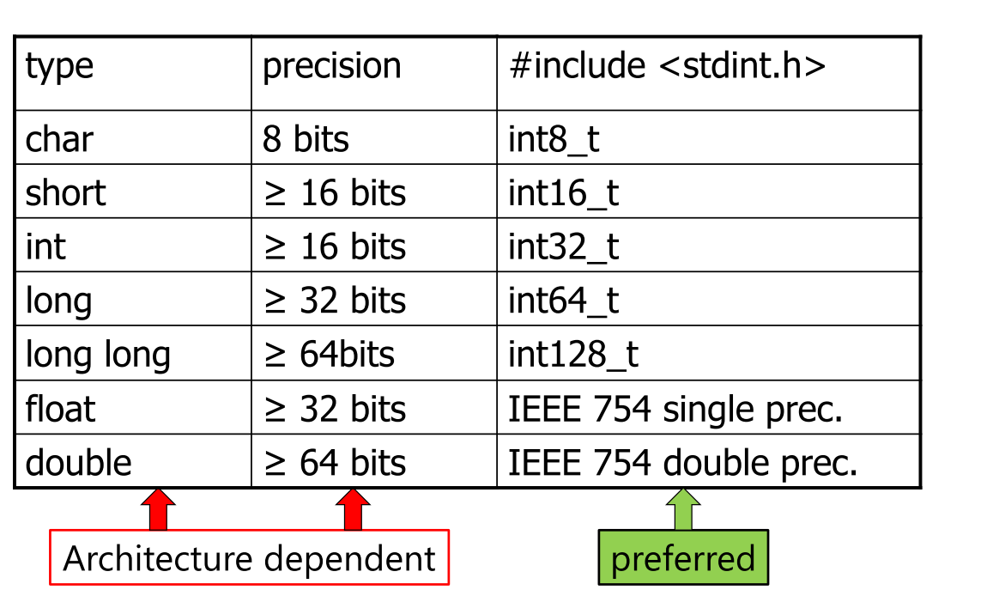

# Basic C programming

[toc]

# 1. C Program


## 1.1. Executing C program

* one function ``main()`` is the **starting function**
* running executable (default name ``a.out``) starts main function


### C vs Java vs Scripting Languages

* Scripting languages are usually **interpreted**, always **in-time** compilation
* Java is **semi-interpreted**

  * javac converts ``foo.java`` into ``foo.class``
  * ``byte codes`` are then interpreted by JVM
* C programs are normally **compiled and linked**

  * ``gcc`` converts ``foo.c`` into ``a.out``
  * ``a.out`` is executed by OS and hardware


## 1.2. C compiler (gcc)


## 1.3. C preprocessor

[c语言编译过程简介](./c语言编译过程简介.md)

### 1.3.1. Conditional Compilation

always used to deal with machine or OS-dependent code

```c
#if expression 
	code segment 1 
#else 
	code segment 2 
#endif
```

### 1.3.2. file inclusion

inserts contents of filename into file to be compiled

```c
#include "filename.h"
#include <filename.h>
```

``filename`` relative to current directory

``<filename>`` relative to ``/usr/include``


# 2. Datatype

## 2.1. Numeric Data Types




* In the ``stdint.h``, this transformation is actually done by ``typedef``, so one can understand the reason do so as (two kinds of understandings):

1. 不同的处理器对int等类型的定义不一样，通过再一层封装，表明代码撰写人所实际使用的数据长度

2. 不同的处理器有不同的``uint16_t``等的定义方式，比如一个平台``char``为16bits，那么它实际上有:

   ```c
   typedef char uint16_t
   ```

* overflow is undefined for signed ints , but wrap around for unsigned ints

```((uint8_t)0xFF) + 1 == 0x00```

## 2.2. User-Defined Types (Typedef)

``typedef`` gives names to types:

> From: https://blog.csdn.net/shanglala/article/details/108053592
>

One basic example

```C
#include<stdio.h>
typedef int A;
int main(void)
{
	A a = 10;
	printf("a = %d", a);
	return 0;
}
```

### Typedef vs #define macro

```c
int* a,b;//在这里，不符合我们的意图，它只声明了一个指向整型的指针a和一个整型变量b
typedef int* PINT;
PINT a,b ; //此时，a,b都为指向整型的指针变量
```

use ``typedef``

```c
#include <stdio.h>
typedef int INT;
typedef int* PINT;
int main()
{
	INT a = 10;
	PINT b, c;//b,c都为指向整型的指针
	b = &a;//b指向a
	c = b;//c 也指向a
	printf("addr of a = %p\n", c);//打印a的地址
	return 0;
}

```

use ``#define``

```C
#include <stdio.h>
typedef int INT;
#define PINT int*//此处不加；初学者往往容易出错
int main()
{
	INT a = 10;
	PINT b, c;//
	b = &a;
	c = b;
	printf("addr of a = %p\n", c);//打印 a 的地址
	return 0;
}
```

then the result will be an error

```c
#define PINT int*
PINT b,c;//相当于 int* b,c;只有b为指针，c为整型变量
```

so, ``#define`` is the alternative of words, ``typedef`` is the alternative name of type

## 2.4. C-no booleans

* C doesn't have booleans

* Emulate as int or char, with **values 0 (false)** and **non zero (true)**

* Assignment returns zero $\rightarrow$ false

  ```c
  if (n = 0) 
  {printf("something")}
  ```

## 2.3. Enumerated types (enum)

在实际编程中，有些数据的取值往往是有限的，只能是非常少量的整数，并且最好为每个值都取一个名字，以方便在后续代码中使用，比如一个星期只有七天，一年只有十二个月，一个班每周有六门课程等。这时我们可以使用枚举类型``enum`` 方便的进行定义

```c
enum typeName{ valueName1, valueName2, valueName3, ...... };
```

* 枚举值默认从 0 开始，往后逐个加 1（递增），除非第一个标识符被赋值，否则始终为0，并向后逐渐加1直至一个有赋值的标识符
* 枚举是一种类型，通过它可以定义枚举变量
* 枚举列表中的标识符的作用范围是全局的（严格来说是 main() 函数内部），不能再定义与它们名字相同的变量。
* 枚举列表中的标识符都是常量，不能对它们赋值，只能将它们的值赋给其他的变量
* Enumerated types can be treated like integer, that means, we can add, subtract even ``color + weather``

E.g.

```c
enum week{ Mon, Tues, Wed, Thurs, Fri, Sat, Sun }; // by defualt, Mon==0
enum week a,b,c;
```

```c
enum week{ Mon = 1, Tues, Wed, Thurs, Fri, Sat, Sun } a, b, c; //Mon==1
```

```c
enum week {Mon,Tue=3,Wed=4};
printf("Mon equal to %d",Mon); //output 0
```

## 2.4. Variables

* Variables defined in ``{}`` block are active **only in block**
* Variables defined outside a block are **global** (persist during program execution), but **may not be globally visible** (static)
* default value is (mostly) undefined ––treat as treat as random

### Static

> https://www.runoob.com/w3cnote/c-static-effect.html

``static``的作用有三条

**<u>隐藏作用</u>**

当我们同时编译多个文件时，所有未加 ``static`` 前缀的全局变量和函数都具有全局可见性。（有时候需要使用extern）

**<u>保持变量内容的持久</u>**

存储在静态数据区的变量会在程序刚开始运行时就完成初始化，也是唯一的一次初始化。共有两种变量存储在静态存储区：**全局变量**和 **static 变量**，只不过和全局变量比起来，``static`` 可以控制变量的可见范围

**<u>是默认初始化为 0</u>**

其实全局变量也具备这一属性，因为全局变量也存储在静态数据区。在静态数据区，内存中所有的字节默认值都是 ``0x00``，某些时候这一特点可以减少程序员的工作量。

### Data Objects: data, stack, heap

Unlike scripting languages and Java, all C data objects have a **fixed size over their lifetime**

size of object is determined **when object is created**:

* global data objects at compile time (data)
* local data objects at run time **(stack)**
* dynamic data objects by programmer **(heap)**

### Data, Stack and Heap


在C语言中，从变量存在的时间生命周期角度上，把变量分为**静态存储变量**和**动态存储变量**两类。静态存储变量是指在程序运行期间分配了**固定存储空间的变量**而动态存储变量是指在程序运行期间**根据实际需要进行动态地分配存储空间的变量**。在内存中供用户使用的内存空间分为三部分：

- **<u>程序存储区</u>**
- **<u>静态存储区</u>**
- **<u>动态存储区</u>**

程序中所用的数据分别存放在静态存储区和动态存储区中。

* 静态存储区数据在程序的开始就分配好内存区，在整个程序执行过程中它们**所占的存储单元是固定的，在程序结束时就释放**，因此**静态存储区数据一般为全局变量**。
* 动态存储区数据则是在程序执行过程中根据需要**动态分配和动态释放的存储单元**，动态存储区数据有三类**函数形参变量、局部变量和函数调用时的现场保护与返回地址**。由于动态存储变量可以根据函数调用的需要，动态地分配和释放存储空间，大大提高了内存的使用效率，使得动态存储变量在程序中被广泛使用。

### Malloc

C 库函数 malloc 分配所需的内存空间，并返回一个指向它的指针。``malloc`` does not initialize data, however, variables in stack are initialized

```c
void *malloc(size_t size)
```

Lifetime until memory is freed, with ``free()``

* **<u>内存泄漏（Memory Leak）</u>**是指程序中已动态分配的堆内存由于某种原因程序**未释放或无法释放**，造成系统内存的浪费，导致程序**运行速度减慢甚至系统崩溃**等严重后果。常见的内存泄露情况有：
  * 分配一个内存块并使用其中未经初始化的内容
  * 释放一个内存块，但继续引用其中的内容
  * 子函数中分配的内存空间在主函数出现异常中断时、或主函数对子函数返回的信息使用结束时，没有对分配的内存进行释放
  * 程序实现过程中分配的临时内存在程序结束时，没有释放临时内存。
* 内存错误一般是不可再现的，开发人员不易在程序调试和测试阶段发现，即使花费了很多精力和时间，也无法彻底消除。

## 2.5. Pointers

The memory address of a data object

* can have pointers to pointers: ``int **``
* If ``p`` contains the address of a data object, then ``*p`` allows you to use that object
* ``*p`` is treated just like normal data object

**<u>Generic Pointer</u>**: Unlike other pointers, can be assigned to any other pointer type:

```c
void *v =malloc (13)
char *s = v;
```


## 2.6. Structured data objects

### 2.6.1. arrays

Arrays are defined by specifying an element type and number of elements

* C **does not remember how large arrays** are (i.e., no length attribute): no out-of-bounds checking

  ```c
  int x[10];
  x[10]=5;
  ```

  may not report mistake

* In the block where array A is defined

  ```c
  sizeof(A) //gives the number of bytes in array
  sizeof(A)/sizeof(A[0]) //can be used to compute length
  ```

* When an array is passed as a parameter to a function

  * the size information **is not available inside the function**

  * array size is typically passed **as an additional parameter**

    ```c
    PrintArray (A,VECSIZE)
    ```

**<u>Strings</u>**

In C, strings are just char arrays with a NUL(``\0``) terminator, it **cannot be change by the program**

E.g.

A literal string (`` "a cat"``):

has a value which is the address of the first character

* We normally refer to a string via a pointer to its first character, 

  ```c
  char str [] = "my string";
  char *s;
  s = & str [0]; // s = str
  ```

* String library: ``#include <strings.h>``

C语言中的单引号用来表示**字符字面量**，编译为对应的ASCII码
C语言中的双引号用来表示**字符串字面量**，编译为对应的内存地址

```c
#include <stdio.h>
int main()
{
	char* p1 = 1;
	char* p2 = '1';
	char* p3 = "1";

	printf("%s,%s,%s\n", p1, p2, p3);   //出现段错误
	
	printf('\n');                       //出现段错误
	printf("\n");
	return 0;
}

```

```c
char c = "string"; //wrong
char *c="string"; //correct
```

### 2.6.2. struct

components can be any type (but not recursive), accessed using the same syntax ``struct.field``

two definition ways:

1. use ``struct``

2. use ``typedef``

   ```c
   struct complex 
   {
   	double real; 
   	double imag;
   };
   struct point 
   {
       double x; 
       double y;
   } corner;
   typedef struct {double real; double imag ;} Complex;
   struct complex a, b;
   Complex c,d;
   ```

   * a and b have the same size, structure and type
   * a and c have the same size and structure, but **different types**

Dereferencing pointers to struct elements

```c
Complex *p;
double i;
(*p).real = 42.0;
i = (*p).imag;
p->real=42.0;
i=p->img;
```

### 2.6.3. unions


## 2.7. 浅拷贝与深拷贝： struct and array

> https://blog.csdn.net/a_hang_szz/article/details/88572706


### 浅拷贝

结构体的浅拷贝是把一个结构体的**内容拷贝到另外一个结构体**，仔细看代码就可以

```c
#include <stdlib.h>
#include <string.h>
#include <windows.h>
typedef struct teacher
{
	char *name;
	int age;
}teacher;
int main()
{
	teacher t1;
	t1.name = (char*)malloc(30);//给name动态分配空间
	strcpy(t1.name, "liming");//把文字常量区的内容拷贝给t1.name
	t1.age = 22;
	teacher t2 = t1;//结构体的浅拷贝
	printf("%s %d", t2.name, t2.age);
	if (t1.name != NULL) //释放分配给t1.name 的堆区空间
	{
		free(t1.name);
		t1.name = NULL;
	}                 
	//C语言中不能存在二次释放，会导致程序崩溃，画出内存图，可以看到t1.name和t2.name指向同一内存
	//if (t2.name != NULL)         
	//{
	//	free(t2.name);
	//	t2.name = NULL;
	//}
	return 0;
}

```

### 深拷贝

```c
#include <stdio.h>
#include <stdlib.h>
typedef struct teacher
{
	char *name;
	int age;
}teacher;
int main()
{
	teacher t1;
	t1.name = (char*)malloc(30);
	strcpy(t1.name, "lily");
	t1.age = 22;
	teacher t2;
	t2 = t1;
	t2.name = (char*)malloc(30);//给t2.name重新分配空间
	strcpy(t2.name, t1.name);
	printf("%s %d", t2.name, t2.age);
	if (t1.name != NULL)//释放t1.name和t2.name的堆区空间
	{
		free(t1.name);
		t1.name = NULL;
	}
	if (t2.name != NULL)
	{
		free(t2.name);
		t2.name = NULL;
	}
	return 0;
}

```

### 数组中的两个例子

First, an invalid operations: transfer two address of array in the function (but store in formal parameter A and B), A's value is equal to B, means the "address" store in A is modified to B, they point to the same memory. However, when return, A and B are released, with no effect 

```c
void copy(int A[], int B[], int N) 
{
	A = B; 
}
```

Here is another useful way

```c
void copy(int A[], int B[], int N) 
{ for (int i = 0; i < N; i++) 
	{ A[i] = B[i];} 
}
```


# 3. Functions

## 3.1. Basic Introduction

### prototypes

If defined before use in same file, no need for prototype

* Typically, prototype defined in .h file

Functions

* static functions and variables hide them to those outside the same file

## 3.2. Function Pointers

functions can be used as values (i.e. passed by reference)

```c
int foo (); // function returning integer
int *bar(); // function returning pointer to int
int (*fp)(); // pointer to function returning int
int *(*fpp )();// pointer to func returning ptr to int
fp = foo;
fpp = bar;
int i = fp ();
int j = *( fpp());
```

Always is used to

* to install interrupt handlers (timers, etc)
* to register call back functions
* to implement polymorphism


# 4. Program with multiple files


# 5. Pointers Detailed and Further Discussion

> https://zhuanlan.zhihu.com/p/298363575
>
> 

## 5.1. Introduction

指针就是变量的地址

## 5.2. Pointers and Array

### Basic Introduction

在内存中，数组是一块**连续的内存空间**：


第 0 个元素的地址称为数组的首地址，数组名实际就是指向数组首地址，当我们通过``array[1]``或者``*(array + 1)`` 去访问数组元素的时候。

实际上可以看做 ``address[offset]``，``address`` 为起始地址，``offset`` 为偏移量，但是注意这里的偏移量``offset`` 不是直接和 ``address``相加，而是要乘以数组类型所占字节数，也就是： ``address + sizeof(int) * offset``。

**尽管数组名字有时候可以当做指针来用，但数组的名字不是指针**。

最典型的地方就是在 sizeof:

```c
int array[10] = {10, 9, 8, 7};
printf("%d\n", *array);  //  输出 10
printf("%d\n", array[0]);  // 输出 10

printf("%d\n", array[1]);  // 输出 9
printf("%d\n", *(array+1)); // 输出 9

int *pa = array;
printf("%d\n", *pa);  //  输出 10
printf("%d\n", pa[0]);  // 输出 10

printf("%d\n", pa[1]);  // 输出 9
printf("%d\n", *(pa+1)); // 输出 9

printf("%u", sizeof(array));
printf("%u", sizeof(pa));
```

第一个将会输出 40，因为 array包含有 10 个int类型的元素，而第二个在 32 位机器上将会输出 4，也就是指针的长度。

站在编译器的角度讲，**变量名、数组名都是一种符号，它们都是有类型的，它们最终都要和数据绑定起来**。

变量名用来指代一份数据，数组名用来指代一组数据（数据集合），它们都是有类型的，以便推断出所指代的数据的长度。数组的类型**由元素的类型和数组的长度**共同构成。而 sizeof 就是根据变量的类型来计算长度的，并且计算的过程是在编译期，而不会在程序运行时。

编译器在编译过程中会**创建一张专门的表格用来保存变量名及其对应的数据类型、地址、作用域等信息**。

sizeof 是一个操作符，不是函数，使用 sizeof 时可以从这张表格中查询到符号的长度。所以，这里对数组名使用sizeof可以查询到数组实际的长度。pa 仅仅是一个指向 int 类型的指针，编译器根本不知道它指向的是一个整数，还是一堆整数。

虽然在这里它指向的是一个数组，但数组也只是一块连续的内存，没有开始和结束标志，也没有额外的信息来记录数组到底多长。所以对 pa 使用 sizeof 只能求得的是指针变量本身的长度。

也就是说，**编译器并没有把 pa 和数组关联起来，pa 仅仅是一个指针变量**，不管它指向哪里，sizeof求得的永远是它本身所占用的字节数。

### 指针数组

> https://www.runoob.com/cprogramming/c-array-of-pointers.html

可能有一种情况，我们想要让数组存储指向 int 或 char 或其他数据类型的指针。下面是一个指向整数的指针数组的声明：

```c
int *ptr[MAX];
```

E.g.

```c
#include <stdio.h>
 
const int MAX = 4;
 
int main ()
{
   const char *names[] = {
                   "Zara Ali",
                   "Hina Ali",
                   "Nuha Ali",
                   "Sara Ali",
   };
   int i = 0;
 
   for ( i = 0; i < MAX; i++)
   {
      printf("Value of names[%d] = %s\n", i, names[i] );
   }
   return 0;
}
```

输出结果为：一个指向字符的指针数组来存储一个字符串列表

```c
Value of names[0] = Zara Ali
Value of names[1] = Hina Ali
Value of names[2] = Nuha Ali
Value of names[3] = Sara Ali
```

### 多级指针

```c
int a;
int *pa = &a;
int **ppa = &pa;
int ***pppa = &ppa;

```


## 5.3. 指针与函数

> https://blog.csdn.net/woshimalingyi/article/details/50980804

指针和数组（将数组的首地址传给形参）作为参数传递的时候，其实是传递的一个地址。
比如：

```c
int main(){
    int b[10];
    int* a = b;
    printf(" %d ",sizeof(b));//输出40
    printf(" %d ",sizeof(a));//输出4
    fun(a,b);
}
```

```c
void fun（int *a,int b[]）{
   printf(" %d ",sizeof(b));//输出4
   printf(" %d ",sizeof(a));//输出4
};
```


## 5.4. 指针与结构体

结构体的本质其实就是一堆的变量打包放在一起，而访问结构体中的域，就是通过结构体的起始地址，也叫基地址，然后加上域的偏移。

比如：

```c
struct fraction {
 int num; // 整数部分
 int denom; // 小数部分
};

struct fraction fp;
fp.num = 10;
fp.denom = 2;
```

这是一个定点小数结构体，它在内存占 8 个字节（这里不考虑内存对齐），两个成员域是这样存储的：


我们把 10 放在了结构体中基地址偏移为 0 的域，2 放在了偏移为 4 的域。

接下来我们做一个正常人永远不会做的操作：

```c
((fraction*)(&fp.denom))->num = 5; 
((fraction*)(&fp.denom))->denom = 12; 
printf("%d\n", fp.denom); // 输出多少？
```

接下来我分析下这个过程发生了什么：


首先，``&fp.denom``表示取结构体 ``fp`` 中 ``denom`` 域的首地址，然后以这个地址为起始地址取 8 个字节，并且将它们看做一个 fraction 结构体。

在这个新结构体中，最上面四个字节变成了 ``denom`` 域，而 ``fp`` 的 ``denom`` 域相当于新结构体的 ``num`` 域。

因此：

``((fraction*)(&fp.denom))->num = 5``

实际上改变的是 ``fp.denom``，而

``((fraction*)(&fp.denom))->denom = 12``

则是将最上面四个字节赋值为 12。

当然，往那四字节内存写入值，结果是无法预测的，可能会造成程序崩溃，因为也许那里恰好存储着函数调用栈帧的关键信息，也可能那里没有写入权限。

所以最后输出的是 5 (P.S. 亲自尝试，确实编译器未报错，输出为5)

## 5.5. 字符串、字符数组

> https://blog.csdn.net/qq_29924041/article/details/54318370

### 字符串：
C语言中字符串就是用**双引号括起来的任意字符序列**，在字符串中同时也可以包括转义字符，它是以’\0’为结尾的字符数组,  在c语言中，**将字符串作为字符数组来处理。**（c++中不是）
### 字符数组：
用来存放字符的数组，字符数组中每个元素存放一个字符，数组元素的类型为``char``类型,初始化字符数组的时候最好以``\0``结尾，``\0``是结束符号

#include<stdio.h>
#include<stdlib.h>
#include<string.h>

char global_array[5];//全局变量会初始化
int main(int argc,char *argv[]){
    char local_array[5];//局部变量是不会进行初始化的
    char array1[] = {'h','e','l','l','o',' ','w','o','r','l','d','\0'};
    char array2[] = "hello world";
    char array3[] = {"hello world"};

```c
char array4[5] = "helloworld";  
char array5[20] = "helloworld";

//char  array[6] = {'\0'};初始化类型
//char array6[10];
//memset(array6,0,sizeof(array6));//使用memset来对字符数组进行初始化

//字节的长度比字符串的长度要多1
printf("array1:%s sizeof array1:%d,strlen array1:%d\n",array1,sizeof(array1),strlen(array1));
printf("array2:%s sizeof array2:%d,strlen array2:%d\n",array2,sizeof(array2),strlen(array2));
printf("array3:%s sizeof array3:%d,strlen array3:%d\n",array3,sizeof(array3),strlen(array3));
printf("array4:%s sizeof array4:%d,strlen array4:%d\n",array4,sizeof(array4),strlen(array4));
printf("array5:%s sizeof array5:%d,strlen array5:%d\n",array5,sizeof(array5),strlen(array5));

return 0;
}

```
输出结果为:

```c
array1:hello world sizeof array1:12,strlen array1:11
array2:hello world sizeof array2:12,strlen array2:11
array3:hello world sizeof array3:12,strlen array3:11
array4:hello sizeof array4:5,strlen array4:5
array5:helloworld sizeof array5:20,strlen array5:10

```

从上面的array4和array5我们可以看出，如果制定数组的长度，那么此时我们输出的字符串是按照数组的长度来进行输出的

1. 如果数组长度大于字符串的长度的时候 ，这个时候，输出是完整的，数组长度为定义的长度，字符串长度是数组中字符的长度
2. 如果数组长度小于字符串长度的时候，输出是不完整的 ，数组长度这个时候是定义的长度，处处的字符长度也为定义的长度，字符串的长度同样也是定义的长度