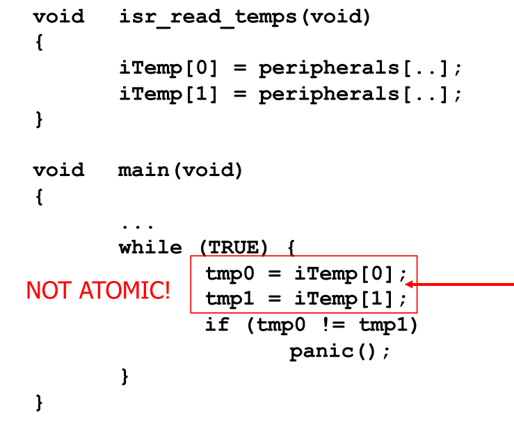
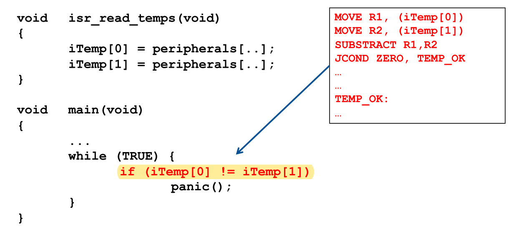
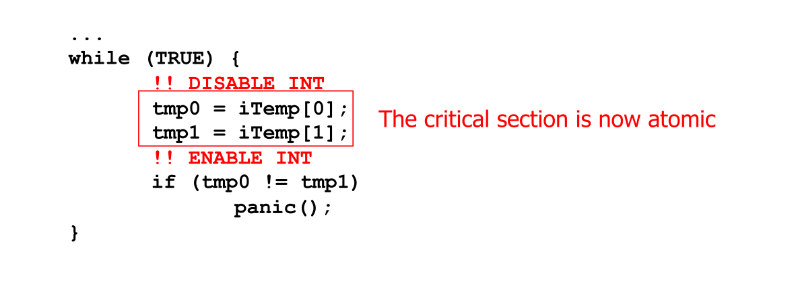
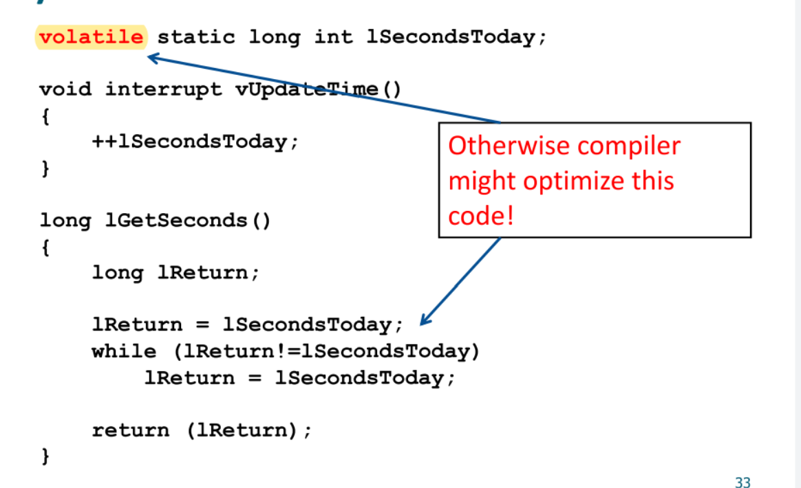
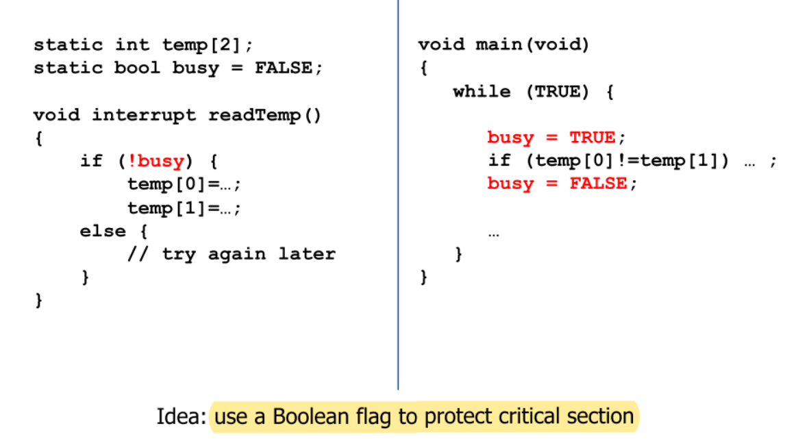
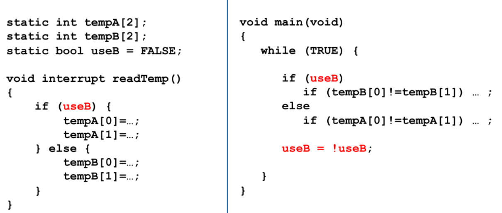
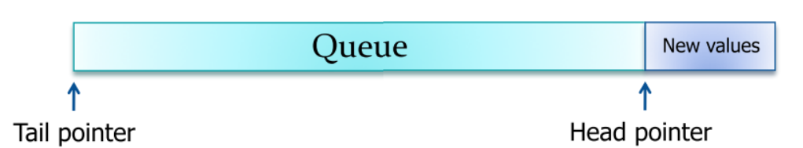

# Interrupt Handling

[toc]

# Background

In this article, we will mainly focus on how to handle conflict without RTOS on embedded systems

## Shared-Data Problem

For non-atomic operation, context switch may happen:

* main to interrupt
* interrupt 1 to interrupt 2

they may use the same data/memory, when interrupt happen:

* 首先，将断点处的**PC值**（即下一条应执行指令的地址）推入堆栈保留下来，这称为**保护断点**，由硬件自动执行。
* 然后，将有关的**寄存器内容和标志位状态推入堆栈**保留下来，这称为**保护现场**，由用户自己编程完成。

However, the memory is not always be protected, so there may be conflict

# Solutions

## 1. Change to Atomic Operations

Notice: The **atomic** should be atomic at least on assembly code layer, which means, a single C words may not be atomic

## 2. Disable interrupts (transform it into atomic)

Disable interrupts for the ISRs that share the data, two general rules:

* keep the critical sections SHORT
* keep the ISRs SHORT (to minimize latency)

### Volatile

> https://blog.csdn.net/yanbober/article/details/8275341

volatile的本意是“易变的” 由于访问寄存器的速度要快过RAM,所以编译器一般都会作减少存取外部RAM的优化，但有可能会读脏数据。当要求使用volatile 声明的变量的值的时候，系统**总是重新从它所在的内存读取数据**，即使它前面的指令刚刚从该处读取过数据。而且**读取的数据立刻被保存**。

Classical Scenarios：

1. 并行设备的硬件寄存器（如：状态寄存器）
2. 一个中断服务子程序中会访问到的非自动变量(Non-automatic variables)
3. 线程应用中被几个任务共享的变量

# 3. Alternative to disable()

## 3.1. Artificial Mutex and Semaphore

## 3.2. By alternating data buffers

## 3.3. By using queues

Operation 

* Interrupt adds **readings to the queue** (modifies the head pointer)
* Main code **extracts readings** from the queue (modifies the tail pointer)

## 