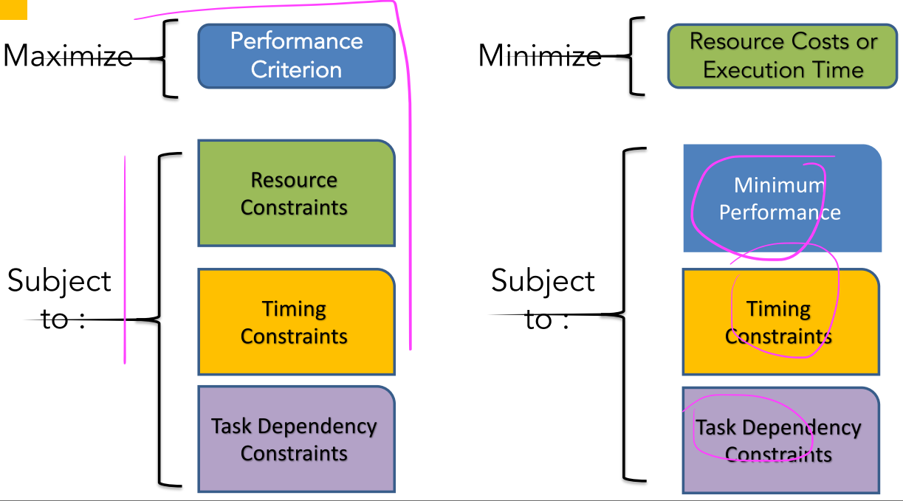

# 01_Introduction

[toc]

# 1. Real-Time system Introduction

## 1.1. What is Real-Time system

A **computing system**, the operation of which depends on (both of them)

* its input 
* the time in which the results are produced 

## 1.2. Requirements

* perform computations **within given timing constraints**
* provide **bounded response times** to tasks with bounded execution, in **all possible scenarios** (personal understanding: each task should finally be finished in finite time)
* The response times and performance should be **predictable** for **all possible combination of events.**

## 1.3. Misunderstanding of design RT Systems

* It is not a software testing problem.
  * Using low-level programming might sound like a good solution, but it is not a principled approach
  * Testing cannot (usually) offer guarantees
* It is not a resource availability problem. 
  * Brute force & overprovisioning does not always solve the problem; 
* Fast computing & Fast systems are not enough

## 1.4. How to design RT Systems

* time and deadlines
* predictability
* we focus on worst-case analysis

## 1.5. Classes of RT-Tasks and Systems

### Hard Real-time

imperative to respond before the deadline

### Soft Real-time

deadlines are “nice-to-have”;

### Firm Real-time

tasks which are “soft” but there is no utility (benefit) when deadlines are missed

## 1.6. Properties of RTS

* System **resources** are most often **scarce**
  * should have high efficiency in resource management

* Operation involves **concurrency & resource sharing**
  * **Temporal isolation** to limit cross-task interference

* Interaction with the environment.
  * **High predictability** in outcome and response timing.

* **High variability** of task arrivals (workload).
  * Adaptive/Robust behavior in order to handle overloads

## 1.7. Trade-off in RT Systems

## 1.8. Windows of Scarcity

# 2. Taxonomy of RT Systems

## 2.1. Static and Dynamic RT Systems

### Static

Task arrival times can be **predicted**.

* Static (compile-time) analysis is **possible**:
  * Worst Case Execution Time (WCET) can be found

* Allows good resource usage

### Dynamic

Arrival times are **unpredictable**.

* Processor utilization decreases dramatically
* Must **avoid over-simplifying assumptions**

## 2.2. Soft & Firm & Hard Systems

### Soft Systems

Allow **more slack** in the implementation

* Scheduling can be very complicated: Too many options yield **a large feasible solution space**
* Common ways of handling non-trivial soft real-time system requirements
  * **Set somewhat loose hard timing constraints**
  * Informal design and extensive testing

### Hard Systems

Creates difficult problems 

* Some timing constraints are inflexible

But, it simplifies the problem formulation!

## 2.3. Periodic and Aperiodic Systems

### Periodic Systems

Each (group of) tasks is recurrent with a certain period.

* single rate periodic
* multi rate periodic

### Aperiodic Systems (Sporadic)

Creates a dynamic situation

* **Bounded arrival time intervals** are easier to handle. 
  * Can be “reduced” to **worst-case periodic tasks.** (set the period to the shortest possible arrival period, so it will be the worst-case)
* Unbounded inter-arrival times are challenging to handle with resource-constrained systems

# 3. Modeling of RT Systems

A model is a representation of a real "thing"

A delicate exercise between:

- **Expressiveness** (capture all details) vs. 
- **Tractability**, (amenable to math analysis)

## 3.1. The Optimization Perspective

