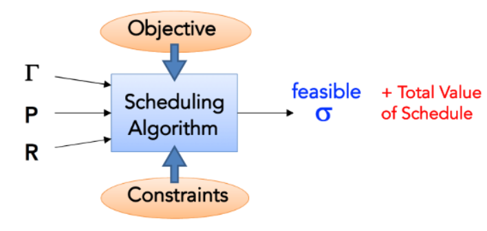
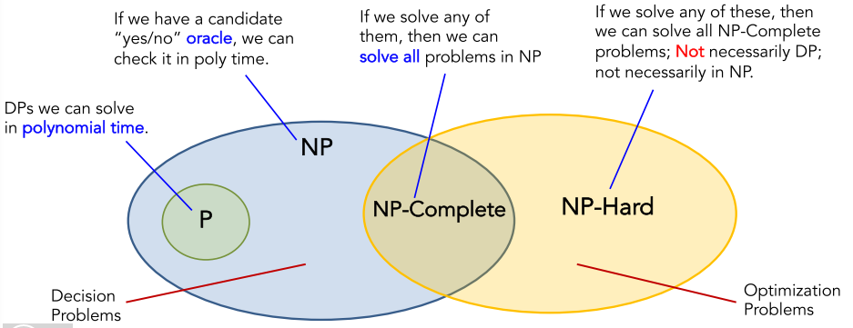
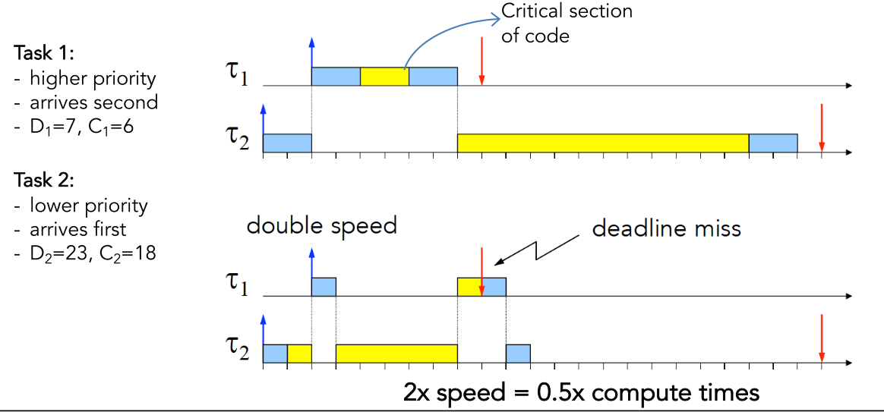

# 02_Modeling of RTS & Schedule Introduction

[toc]

# 1. Basic Modeling Concepts and Definitions

## 1.1. Tasks and Jobs

### Task

- **sequence of instructions** that, in the absence of other activities, is **continuously executed by the processor until completion**.
- a.k.a. “process” or “thread”

**Always:**

- **Upper-capital**  for relative
- **Lower-capital** for absolute

### Jobs

obs are **“instances”** of Tasks, i.e., a Task **“releases”** Jobs.

### Possible Task States

**<u>Blocked</u>**: always means waiting for resources

**<u>Running</u>**: after being dispatched 

**<u>Ready</u>**: Exist job that can be executed, just not his turn

**<u>IDLE</u>**: after running, wait for job release

### Real-Time Task

characterized by a timing constraint on its  response time, called deadline

### Feasible & Scheduable

**<u>Single Task Feasible</u>**

 an RT task $τ_i$ is called **feasible**, if it completes  before its absolute deadline, i.e., if: 
$$
f_{i} \leq d_{i} \text { or, equivalently } R_{i} \leq D_{i}
$$

**<u>A Schedule Feasible</u>**

a schedule is **feasible** if all tasks can be completed while satisfying certain predetermined constraints

**<u>Task Set Schedulable</u>**

 a set of tasks is **schedulable** if there **exists an algorithm** that produces a feasible schedule.

## 1.2. Ready Queue & Scheduling Policy

In a concurrent system with one server (processor) :

- Several tasks can be simultaneously active; but
- only one can be in execution (running).

## 1.3. Preemption

Preemption is a **Kernel mechanism**, that enables us to:

- Suspend the execution of the running task;
- Place it back in the ready queue;
- And execute instead another more important task.

## 1.4. Schedule

given the tasks $Γ={τ_1, …, τ_n}$, a schedule is a function:
$$
σ: R^+ \mapsto k ∈ N
$$

which associates an integer k to each time slice such that:

- if k=0, then CPU is idle in that time slice (or, slot);
- else, CPU executes task τk in that time slice

## 1.5. Slack and Lateness

**<u>Lateness</u>**: $f_i-d_i$

**<u>Tardiness(Exceeding time)</u>**: $max (0,f_i-d_i)$

**<u>Laxity(Slack Time)</u>**: $(d_i-a_i)-C_i$

# 2. Types of Tasks

## 2.1. Time Driven: Periodic

Tasks that are automatically activated (e.g., by the operating system) at predefined regular time instants.

$$
\begin{array}{c}
a_{i, k}=\Phi_{i}+(k-1) T_{i} \\
d_{i, k}=a_{i, k}+D_{i}
\end{array}
$$

### Single-Rate

 all tasks in the system have **the same period**

### Multi-Rate

 tasks have **different periods**

### Phase

 the release time of its first instance

### Utilization Factor

$$
U_i=\frac{C_i}{T_i}
$$

## 2.2. Event Driven: Aperiodic

Tasks that are activated due to an external event, an interruption, or as result of the output of another Task, e.g., by an explicit system call.

### Aperiodic Tasks

**Unbounded arrival time**, or event-based triggering

### Sporadic Tasks

 Arrival times vary, but there is a **minimum gap (inter-arrival time)**

# 3. Estimatin the Computation Time

**<u>Computation Time</u>**

Computation time (or, Execution time) is the time the CPU needs to execute the task, **without considering any possible suspension time intervals.**

## 3.1. By Measurement

run the task with different input data, analyze the statistics.

**<u>BOET</u>**： best observed execution time

**<u>AOET</u>**: average observed execution time

**<u>WOET</u>**: wors observed execution time

**<u>WCET</u>**: worst-case execution time

## 3.2. Analytical Methods

 model the system and explicitly calculate the times.

* **upper-bound** the loop cycles
* **compute** the longest path
* **upper-bound** the cache misses
* **Upper-bound** the I/O interruptions
* **Compute** the execution time for each instruction

## 3.3. Jitter

 Measures the **time variation** of a **periodic event**

### Absolute Jitter

$$
\max _{k}\left\{t_{k}-a_{k}\right\}-\min _{k}\left\{t_{k}-a_{k}\right\}
$$

### Relative Jitter

$$
\max _{k}\left|\left(t_{k}-a_{k}\right)-\left(t_{k-1}-a_{k-1}\right)\right|
$$

# 4. Task Constraints

## 4.1. Timing Constraints

### Explicit Timing Constraints

included in the specs.

### Implicit Timing Constraints

 Not included in specs

### Example 1

## 4.2. Precedence Constraints

tasks need to be executed with a certain order

### Directed Acyclic Graph

**<u>Predecessor</u>**
$$
\tau_{1} \prec \tau_{4}
$$
**<u>Immediate Predecessor</u>**
$$
\tau_{1} \rightarrow \tau_{2}
$$

## 4.3. Resource Constraints

### Concurrency

Sequential Execution, Parallel execution, Concurrent Execution

### Mutual Exclusion

 Inconsistent access of shared memory, we can use mutual exclusion to solve this problem

# 5. Introduction of Scheduling Problem

## 5.1. Definition of of Scheduling Problem

Given a **set Γ of n tasks**, a s**et P of p processors**, and a **set R of r resources**, find an **assignment** of P and R to Γ that produces a feasible schedule under a set of constraints

## 5.2. Feasibility and Schedulable

**Feasibility of a Schedule**

A schedule σ is **feasible** it if satisfies a predetermined set of constraints.

**Feasibility of a set of tasks**

A set Γ of tasks is said to be **feasible** if there exists an algorithm that generates a feasible schedule for these tasks.

**Schedulable set of tasks**

A set Γ of tasks is said to be **schedulable with an algorithm Α** if Α generates a feasible schedule.

## 5.3. Computational Complexity

### Big-O Notation

$$
f(x)=O(g(x)) \Rightarrow|f(x)| \leq M g(x), \forall x \geq x_{0}
$$

### Computational Complexity

- Amount of time the algorithm needs to finish (and do its job).
- We are interested in the **worst-case execution** of large problem instances – hence, we use Big-O notation.

- the first situation, the complexity is independent of  it input
- **the forth situation, we use the $2^x$ as part of the upperbound because actully, here the x is the input bit number of W, it is the largest number of computation, W can take in**

### Polynomial vs Pseudo-polynomial

- **Polynomial** in the number of **bits** we need to represent/store the input

- **Pseudo-polynomial** if it is polynomial in the value of input (here: n) but not on number of bits

## 5.4. NP-hard Problems

### NP problem

The complexity class NP can be defined in terms of [NTIME](https://en.wikipedia.org/wiki/NTIME) as follows:
$$
\mathrm{NP}=\bigcup_{k \in \mathbb{N}} \mathrm{NTIME}\left(n^{k}\right)
$$

where is the set of decision problems that can be solved by a [non-deterministic Turing machine](https://en.wikipedia.org/wiki/Non-deterministic_Turing_machine) in time $\mathcal{O} (n^k)$.

- NP is the set of decision problems for which the problem instances, where the answer is "yes", **have proofs verifiable in polynomial time by a deterministic Turing machine**.

### NP-complete

In [computational complexity theory](https://en.wikipedia.org/wiki/Computational_complexity_theory), a problem is **NP-complete** when:

1. A [nondeterministic Turing machine](https://en.wikipedia.org/wiki/Nondeterministic_Turing_machine) can solve it in [polynomial-time](https://en.wikipedia.org/wiki/Polynomial-time).
2. A [deterministic Turing machine](https://en.wikipedia.org/wiki/Deterministic_Turing_machine) can solve it in large [time complexity](https://en.wikipedia.org/wiki/Time_complexity) [classes](https://en.wikipedia.org/wiki/Complexity_class) (e.g., [EXPTIME](https://en.wikipedia.org/wiki/EXPTIME), as is the case with [brute force search](https://en.wikipedia.org/wiki/Brute_force_search) algorithms) and can verify its solutions in polynomial time.
3. It can be used to simulate any other problem with similar solvability.

### NP-Hard

In computational complexity theory, **NP-hardness** (non-deterministic polynomial-time hardness) is the defining property of a class of problems that are informally "**at least as hard as the hardest problems in NP**"

### Relations

- The general scheduling problem is NP-Hard, because it is similiar to:
  - Knapsack problem
  - Travelling Salesman problem

# 6. Scheduling Algorithms

## 6.1. Taxonomy

**Preemptive vs. Non-Preemptive**

- Based on whether tasks can be **interrupted** or not.

**Static vs. dynamic**

- Scheduling is based on **fixed parameters**, assigned to tasks before their activation (like given priority); or on **dynamic parameters** that might change in runtime (deadline in a dynamic system).
- A randomized assignment policy can be static or dynamic
  - if total random, dynamic
  - if not, for example based on prior knolwedge, like "if C>5, 0.6 probability...", it based on static

* The key point is: the parameter is known before or during runtime:
  * For example, FCFS, the "first come" always is known when task arrive

**Online vs. Offline**

- The schedule is devised in the **beginning**; or **upon arrival** of each task.
- **The key point is: whether the "mapping" is established in the beginning** 

**Optimal vs. Heuristic**

- Maximizes (or not) the value of the adopted performance criterion.

**Guarantee-based vs Best-effort based**

Need to decide, in advance, if a certain task set is feasible or not

## 6.2. Optimality Criteria

- Ensure Feasibility
  - Find a feasible schedule if there exists one.
- Minimize maximum lateness, or deadline misses
  - min-max formulation;
  - lexicographic optimization if there are different criteria
- Maximize the cumulative value of admitted tasks
  - Utility maximization approach; - can be used to achieve fairness, load-balancing, etc

# 7. Scheduling Anomalies

## 7.1. Graham Theorem

If a task set is optimally scheduled on a multiprocessor with:

- some priority assignment; a fixed number of processors; fixed execution times; and some precedence constraints,

Then:

- increasing the number of processors; reducing execution times; or weakening the precedence constraints

Can increase the schedule length!

### Personal Understanding

We can divide the planner into 3 parts to explain Graham Theorem:

1. Optimizer:

   - If the optimizer try to maximum an objective function combining with several different criterions:

     It is easy to get Graham Theorem, beacuse the length will may not be the dominant factor

   - If the optimizer only try to optimize the schedule length, then there will definitely no deterioration

2. Fixed Strategy:

   * Totally can deteriorate

## 7.2. Generalized Schedule Problem

**Maximize:** Performance Criterion

**Subject to:**

- Resource Constraints
- Timing Constraints
- Task Dependency Constraints

## 7.3. Anomalies: An example

For example: without dependency, we always want to first deploy task with small number (highest priority)

## 7.4. Two important Anomalies Condition

### Faster Process

- Anomalies in uniprocessor systems.
- Doubling CPU speed induces deadline miss

### Delay： Dangerous System Call

- Anomalies in uniprocessor systems.
- A delay(Δ) may cause a delay longer than Δ.
- A delay in a task may also increase the response of other tasks

## 7.5. How to achieve Predictability

- **Tests are not enough** for real-time systems
- Concurrency control must be enforced by:
  - appropriate scheduling algorithms;
  - appropriate synchronization protocols;
  - efficient communication mechanisms;
  - predictable interrupt handling

# 8. Fundamental Algorithms

In this Section we will introduce some scheduling policies **that do not work for Real-time Systems**

## 8.1. Graham’s Notation

$$
\alpha | \beta | \gamma 
$$

$$
\\ \alpha : \text{Number of Servers} \\ \beta : \text{Constraints on the Tasks} \\ \gamma : \text{Optimality Criterion}
$$

## 8.2. First Come First Served (FCFS)

**Rule:** serve tasks in the order of their arrival.

**Property:**

- very unpredictable result
- the response times depend on the arrivals

## 8.3. Shortest Job First

**Rule:**

serve the ready task with shortest compute time

**Property:**

- A **static policy**

- Can be **offline or online**

- Can be preemptive or non-preemptive

- minimize the average response time

  

- Not good in achieving **feasibility**, because it **ignores key parameters such as deadline**

## 8.4. Priority Scheduling

**Rules:**

serve the task with the highest priority

- Each task is assigned a priority number $P_i$ ;
- Apply FCFS for tasks with same priority;
- Preemptive; Online; Static or dynamic

**Property:**

- May have **Starvation**
  - Low priority tasks might stay in the queue forever.
  - Can be partially solved with aging counters (make it dynamic)

## 8.5. Round Robin

**Rules:**

FCFS + rotational assignment of time slices Q

- The ready queue is served with FCFS;
- but, each task is executed for up to Q slots;
- and then placed back in the beginning of queue

**Property:**

- If Q is larger than the computation time of any task, then we are **back to FCFS**
- the cost of **context swichting overhead**