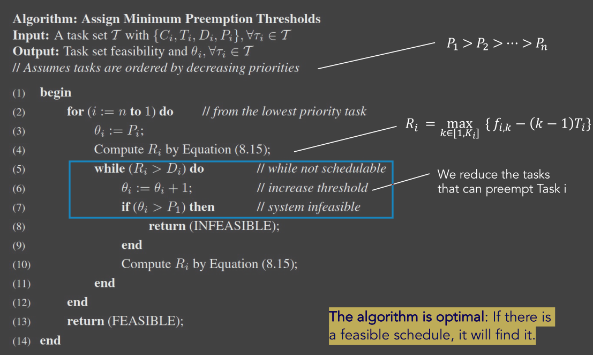

# 03_Non-Preemptive Scheduler

[toc]

# 1. Preemption vs Non-Preemption

## 1.1. Disadvantages of Preemption

* introduces **context switching cost**
* One preemption might induce **more preemptions**
* ntroduce**s cache-related preemption delays** (CPRD).
* increase the WCET (Due to the catche-related preemption delays)

## 1.2. Advantages of Non-preemption

* Reduce contex-swiching overhead
* Simplifies the access to shared resources
* Reduces the required stack size
* Allows achieving small I/O jitter
* in some cases, improves schedulability in fixed-priority systems

## 1.3. Disadvantages of Non-preemption

* Might reduce  schedulability due to blocking
  * A task with higher priority needs to wait lower-priority tasks
* Give rise to scheduling anomalies
  * Unexpected and counter-intuitive system behaviour. (e.g. processor speed up)

# 2. Non-Preemptive (NP) scheduling

## 2.1. Assumtptions

* consider a set of **hard RT periodic tasks**

* Constrained deadline model:
  $$
  D_{i} \leq T_{i}, \forall i
  $$

* Tasks are assigned **fixed priorities** (RM,DM), and we always use
  $$
  P_{1}>P_{2}>\cdots>P_{n}
  $$
  

## 2.2. Hybrid NP Solutions

### Preemption Thresholds

Only tasks of **very high priority** can preempt low priority tasks.
For each task define a **different minimum priority threshold** that can preempt it.

### Deferred Preemptions

Define for each task **the longest no-preemption time interval** for its execution.

### Task Splitting Approach

Split the task to **non-preemptable code chunks**;
Preemption can take place only at specified points between those chunks.

## 2.3. Overal Property of NP-Scheduling Policies

* Different Critical Case:
  * Critiacal instant start in syn with higher priority jobs
* Self-pushing phenomenon
* The largest reponse time is not in the first execution after the critical instant
  * Response time analysis for Task i must be done for multiple periods

## 2.4. Analysis of NP Scheduling Policies

### Level-i active period

The time interval in which the CPU is **busy executing Task i or other tasks with higher priority,** including also blocking times from lower priority tasks.

Formally, it's a timer interval $\Delta=[t_s,t_e)$, such that
$$
P_{i}\left(t_{s}\right)=0 ; \quad P_{i}\left(t_{e}\right)=0 ; \quad P_{i}(t)>0 \text { for all } t \text { in } \Delta
$$
$P_i(t)$ is the **Processing load** that is pending at t, from all tasks with priority higher than i, including task i. 

* no lower priority task is taken into consideration (because a higher priority pending means after blocked (if exist), no time for lower priority execute)

### Calculate Level-i active period

 Estimate the **worst-case blocking time** of Task i from lower-priority jobs.
$$
B_{i}=\max _{j: P_{j}<P_{i}}\left\{C_{j}-1\right\}
$$
The busy period is **at least as large as** $B_i$  plus the WCET of Task i:
$$
L_{i}^{(0)}=B_{i}+C_{i}
$$
Find how many higher-priority jobs run in this interval
$$
L_{i}^{(s)}=B_{i}+\sum_{h: P_{h} \geq P_{i}}\lceil \frac{L_{i}^{(s-1)}}{T_{h}}\rceil C_{h} \quad \text { until: } \quad L_{i}^{(s)}=L_{i}^{(s-1)}
$$
the response time of Task i must be computed for k jobs:
$$
k=1,2, \ldots, K=\lceil \frac{L_{i}}{T_{i}}\rceil
$$

### Analylsis of Schedulability

$$
\begin{array}{l}
s_{i, k}^{(0)}=B_{i}+\sum_{h: P_{h}>P_{i}} C_{h} \\
s_{i, k}^{(l)}=B_{i}+(k-1) C_{i}+\sum_{h: P_{h}>P_{i}}\left( \left \lfloor\frac{s_{i, k}^{(l-1)}}{T_{h}}\right\rfloor+1\right) C_{h}
\end{array}
$$
$B_i$ is the blocking

$(k-1)C_i$ is preceding jobs of the same task

$\sum_{h: P_{h}>P_{i}}\left( \left \lfloor\frac{s_{i, k}^{(l-1)}}{T_{h}}\right\rfloor+1\right) C_{h}$ is the interference from higher priority tasks
$$
\begin{array}{l}
f_{i, k}=s_{i, k}+C_{i} \\
R_{i}=\max _{k \in\left[1, K_{i}\right]}\left\{f_{i, k}-(k-1) T_{i}\right\}
\end{array}
$$
The set is **schedulable** if and only if
$$
R_{i} \leq D_{i}, i=1,2, \ldots, n
$$

### Special Case

It is sufficient to **consider only the first job** **if and only if** the task set is **feasible under preemptive scheduling** and all **deadlines are less (or equal) to the periods.**
$$
\begin{array}{l}
s_{i, 1}=S_{i}=B_{i}+\sum_{h: P_{h}>P_{i}}\left(\left \lfloor \frac{S_{i}}{T_{h}}\right \rfloor+1\right) C_{h} \\
R_{i}=S_{i}+C_{i}
\end{array}
$$

# 3. Hybrid NP Solutions

## 3.1. Preemption Thresholds

Each task i has two priorities:

* **<u>Nominal Priority</u>** $P_i$ : used as long as the task is in the queue. Based on this value it **preempts (or not) other** tasks.
* **<u>Threshold Priority</u>** $\theta_i$ : used when the task runs. Only tasks with priority higher than this threshold can preempt task i.

In general $\theta_i > P_i $ (personal understanding)

### Feasibility Analysis

Blocking time
$$
B_{i}=\max _{j: P_{j}<P_{i}}\left\{C_{j}-1 \mid P_{j}<P_{i} \leq \theta_{j}\right\}
$$
Level-i active period and K
$$
\begin{align}
L_{i}^{(s)} &=B_{i}+\sum_{h: P_{h} \geq P_{i}} \left \lceil \frac{L_{i}^{(s-1)}}{T_{h}}\right \rceil C_{h} \\
K &= \left \lceil \frac{L_{i}}{T_{i}}\right \rceil
\end{align}
$$
Start time of job k
$$
s_{i, k}^{(l)}=B_{i}+(k-1) C_{i}+\sum_{h: P_{h}>P_{i}}\left( \left \lfloor \frac{s_{i, k}^{(l-1)}}{T_{h}}\right\rfloor+1\right) C_{h}
$$
Finish time Analysis
$$
\begin{align}
&f_{i, k}^{(0)}=s_{i, k}+C_{i}\\
&f_{i, k}^{(l)}=s_{i, k}+C_{i}+\sum_{h: P_{h}>\theta_{i}}\left(\left \lceil\frac{f_{i, k}^{(l-1)}}{T_{h}}\right\rceil-\left(\left\lfloor\frac{S_{i, k}}{T_{h}}\right \rfloor+1\right)\right) C_{h}
\end{align}F
$$
Feasibility Check
$$
R_{i}=\max _{k \in\left[1, K_{i}\right]}\left\{f_{i, k}-(k-1) T_{i}\right\}\\
R_{i} \leq D_{i}, i=1,2, \ldots, n
$$
Notes:

For equation 13,14,15, use $P_h \ge P_i$ is because, these equations consider the situation that our task is not running. So when all in the queue, they are sorted by P not $\theta$

### Threshold Assign

Try from $\theta_i=P_i$, if not feasible, add one.

* The algorithm is **optimal**: If there is a feasible schedule, it will find it.

## 3.2. Deferred Preemptions

we define for each task an interval of time qi during which 
it cannot be preempted

### Modes

**<u>Floating Model</u>**

The non-preemption interval is explicitly defined in the code by the programmer.

**<u>Activation-triggered</u>**

The non-preemption interval is **triggered by the arrival of a higher priority task** --which normally would preempt the current job -- and is enforced for $q_i$ time slots

### Analysis of DP scheduling

Blocking

Each Task i can be blocked by the non-preemptive subjobs of any lower-priority task.

* If floating model:
  $$
  B_{i}=\max _{j: P_{j}<P_{i}}\left\{q_{j}-1\right\}
  $$
  
* if activation-triggered model:
  $$
  B_{i}=\max _{j: P_{j}<P_{i}}\left\{q_{j}\right\}
  $$
  

Others are the same with **NP scheduling**

### Open-Discussions

Given a set of periodic tasks that is feasible under preemptive scheduling, what is the longest  non-preemptive interval Qi for each task i, so that it can continue to execute for Qi time in non-preemptive mode, without violating the schedulability of the original task set?

## 3.3. Fixed Preemption Points

 Each task i is split into $m_i$ **chunks**.

* During those chunks (or, subjobs), the task cannot be preempted;
* Preemption can only happen in between these subjobs.

Assuming known WCET for each chunk, we can calculate:
$$
C_{i}=\sum_{k=1}^{m_{i}} q_{i k}
$$

### Two important parameters

$$
q_{i}^{\max }=\max _{k \in\left[1, m_{i}\right]}\left\{q_{i k}\right\}
$$

Affects the feasibility of higher priority tasks (those that this subjob can preempt)
$$
q_{i}^{\text {last }}=q_{i, m_{i}}
$$
Affects the response time of Task i

### Analylsis of TS scheduling

Blocking time:
$$
B_{i}=\max _{j: P_{j}<P_{i}}\left\{q_{j}^{\max }-1\right\} \quad q_{i}^{\text {last }}=q_{i, m_{i}}
$$
Level-i active period
$$
L_{i}^{(0)}=B_{i}+C_{i} \\
L_{i}^{(s)}=B_{i}+\sum_{n: P_{h} \geq P_{i}}\left \lceil \frac{L_{i}^{(s-1)}}{T_{h}}\right \rceil C_{h}\\
k=1, \ldots, K=\left \lceil \frac{L_{i}}{T_{i}}\right \rceil
$$
the starting times of the **last subjob of each job of each task** are:
$$
s_{i, k}^{(0)}=B_{i}+C_{i}-q_{i}^{l a s t}+\sum_{h: P_{h}>P_{i}} C_{h} \\
s_{i, k}^{(l)}=B_{i}+k C_{i}-q_{i}^{l a s t}+\sum_{n: P_{h}>P_{i}}\left(\left\lfloor\frac{s_{i, k}^{(l-1)}}{T_{h}}\right\rfloor+1\right) C_{h}
$$
Finish time and response time
$$
f_{i, k}=s_{i, k}+q_{i}^{\text {last }} \\
R_{i}=\max _{k \in\left[1, K_{i}\right]}\left\{f_{i, k}-(k-1) T_{i}\right\}
$$
Feasibility Check
$$
R_{i} \leq D_{i}, \quad i=1,2, \ldots, n
$$

### Special Case

If the task set is feasible under preemptive execution, then the analysis can be done by using only the first job of each task