# 04_Aperiodic Task Scheduling

[toc]

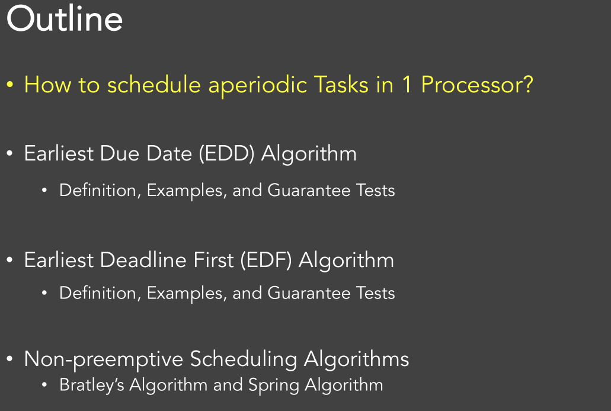

# 1. Earliest Due Date (EDD) Algorithm

$$
1 \mid \text { sync } \mid \mathrm{L}_{\max }
$$

## 1.1. Rules

**Rules:**

select the task with the earliest **relative deadline**

**Assumptions:**

- All tasks are activated **simultaneously** (like a "**batch**")
- Preemption is not used (since tasks arrive simultaneously);
- Static policy

## 1.2. Performance

### Lateness

- If $L_{max}$ is non-positive, then no task misses its deadline.

- **EDD minimizes** $L_{max}$ (has the maximum slack time)

  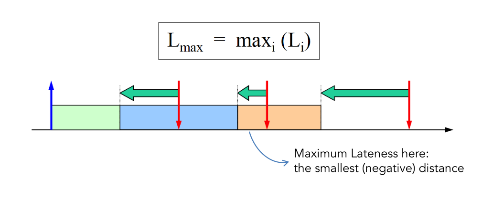

### Jackson's Theorem

Given a set of n independent tasks, any algorithm that executes the tasks in order of increasing deadlines **is optimal w.r.t. minimizing** $L_{max}$

### Proof:

Proof with two steps:

- optimal in one step

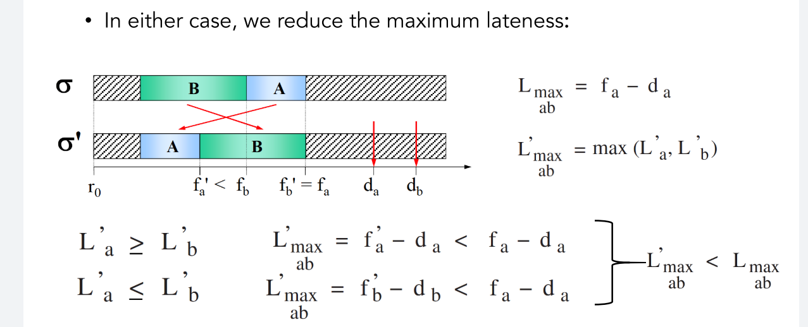

- recursively optimizing (like bubble sort)

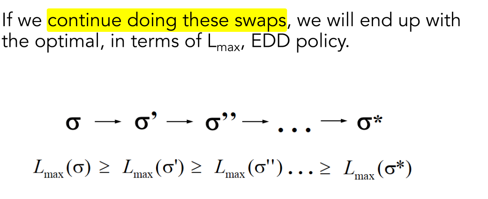

## 1.3. Feasibility Check

Feasibility must be **checked offline**

- for each task should hold:

$$
\forall i=1, \ldots, n \quad f_{i} \leq d_{i}
$$

- Assume task indices are ordered in increasing deadlines, then, worst-case finishing time of each task is
  $$
   f_{i}=\sum_{k=1}^{i} C_{k}
  $$
  
- feasibility requires to satisfy the following constraints

$$
\forall i=1, \ldots, n \quad \sum_{k=1}^{i} C_{k} \leq d_{i}
$$

## 1.4. Complexity

$$
O(nlog(n))
$$

# 2. Earliest Deadline First (EDF) Algorithm

$$
1 \mid \text { preem. } \mid \mathrm{L}_{\max }
$$

## 2.1. Rules

execute the task with the earliest **absolute deadline**

**Assumption**

- tasks may arrive at any time **(asynchronous)**;
- **Preemption** is used;
- **Dynamic** priority; ($d_i$ depends on arrival)

## 2.2. Performance (M.Dertouzos Theorem)

Given a set of n independent tasks **with arbitrary arrival times**, any algorithm that at any instant executes the task with the earliest absolute deadline among all ready tasks **is optimal w.r.t. minimizing the maximum lateness** $L_{max}$

### Proof

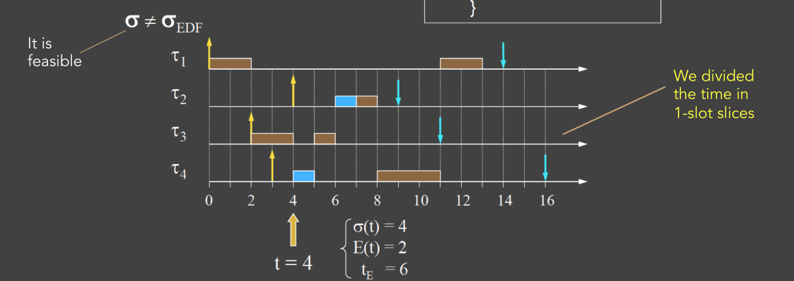

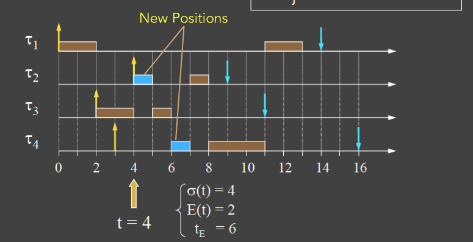

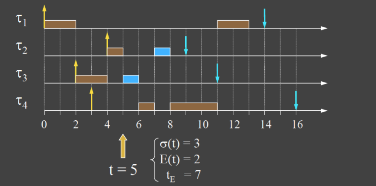

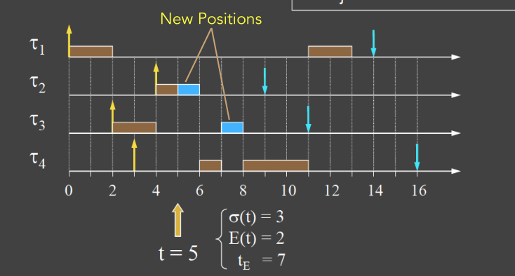

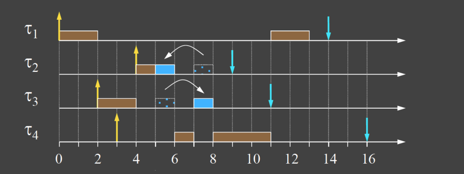

Feasibility is also guarantee, and the lateness is improve

* If the later deadline one's finish time is not change $\rightarrow$ absolutely hold
* If the later deadline one's finish time change (swap):
  * It can be easily prove the earlier deadline one is the $L_{max}$ if the swap happen

### Property

So, EDF is also optimal in the sense of feasibility. i.e. **If there exists a feasible schedule for this set of tasks, EDF will find it**

## 2.3. Feasibility Check

- The test runs upon arrival of every new task
- we perform **admission control** by checking if the new task set is schedulable
- check if **under worst-case scenario** the tasks can meet their deadlines.
- Tasks are preemptable, with $C_i$ being the initial computation time and $c_i(t)$ the remaining comp time at $t$

$$
f_{i}=\sum_{k=1}^{i} c_{k}(t) \\ \forall i=1, \ldots, n \quad \sum_{k=1}^{i} c_{k}(t) \leq d_{i}
$$

## 2.4. Complexity

$$
O(n)
$$

# 3. Non-preemptive Scheduling Algorithms

* EDF is **no longer optimal** under no preemption (with idle choice)
  * Results can be improved if we know the future, we can first let the CPU be idle for 1 slot until task 2 come

* EDF is still optimal if we focus on **non-idle** algorithms 
  * Two algorithms in this secion consider **with-idle** situation

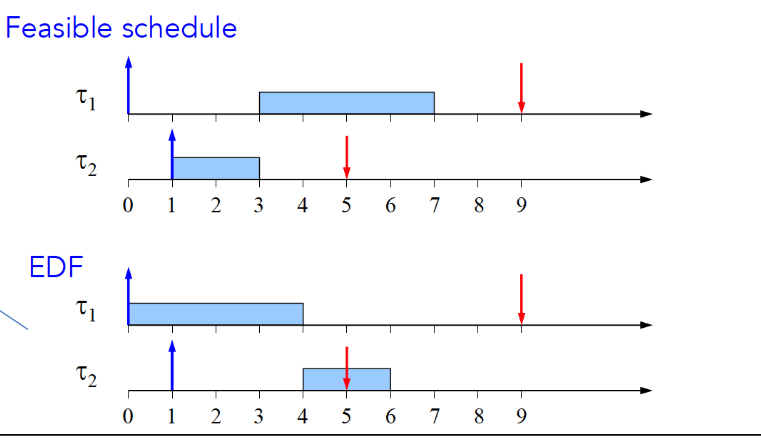

## 3.1. Model

Even if task arrivals are known, we must **search a tree** with $n!$ leaves and $n$ depth; hence $𝑂(𝑛𝑛!)$ worst-case complexity

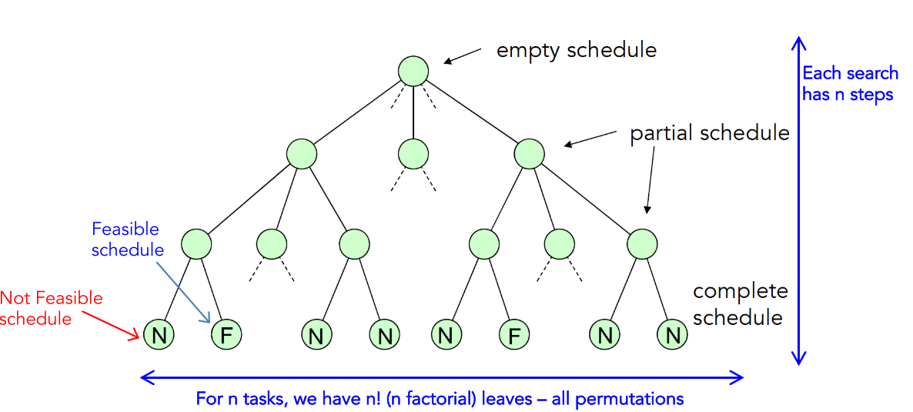

## 3.2. Bratley's Algorithm

$$
1|\text{no-preem}|L_{max}
$$

### Pruning Rule

Stop searching a path:

- If a feasible schedule is **already found**; or
- If the addition of **any node** to current path causes a missed deadline

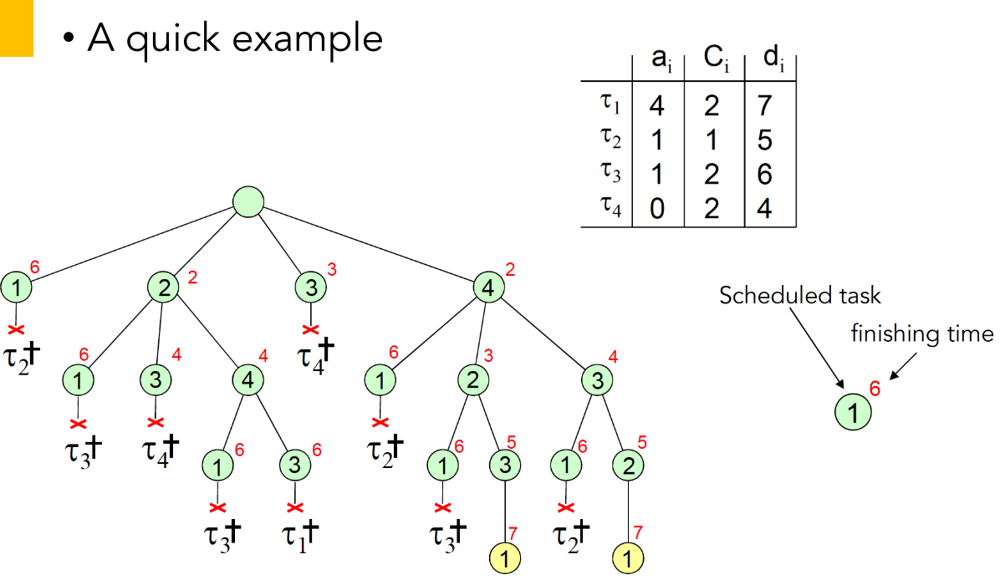

## 3.3. Spring Algorithm

Reduce complexity by sacrificing optimality: **Heuristics**

At each step select the task **minimizing a heuristic function H** (n steps)

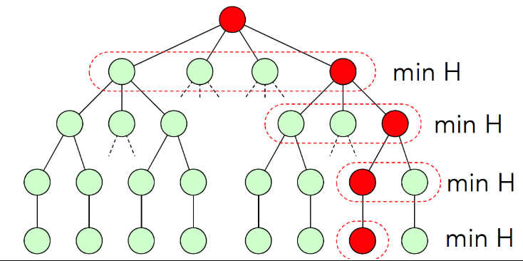

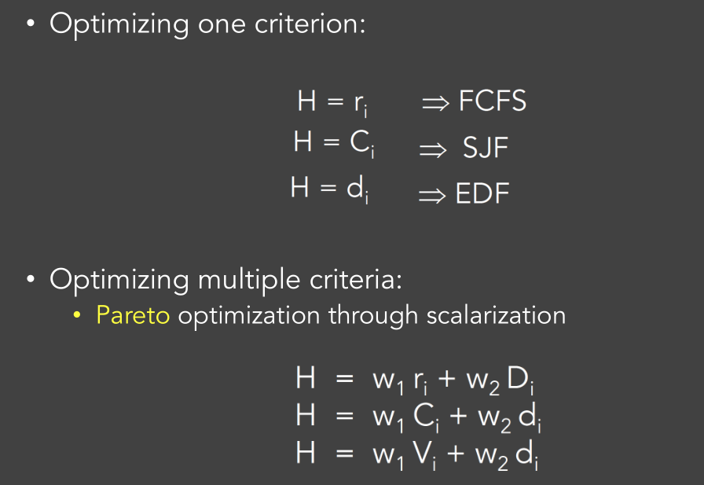

### Precedence Constraints

Use "Flag" parameter

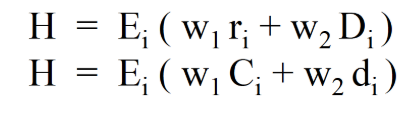

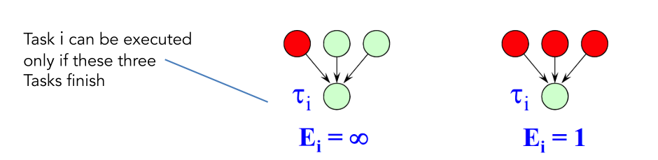

# 4.  Scheduling  with Precedence Constraints

## 4.1. Latest Deadline First (LDF) Scheduling (1|Prec,Sync| $L_{max}$)

### Assumptions

**Synchronous Activation** of Tasks

### Rules

- Take as **input** the set of tasks and their **precedence graph (DAG)**;
- Add task from the end of the queue:
  - Construct the schedule starting **from the tail of the DAG**;
  - **Among tasks with no successors (or, already-selected successors), pick the task with the latest deadline to execute last**.
  - At runtime, select first tasks from the head of queue.

### Examples:

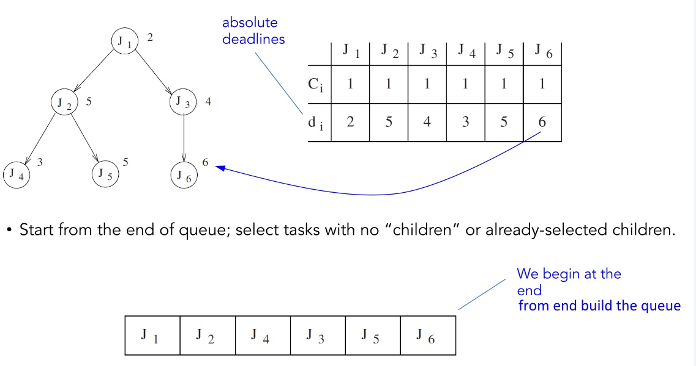

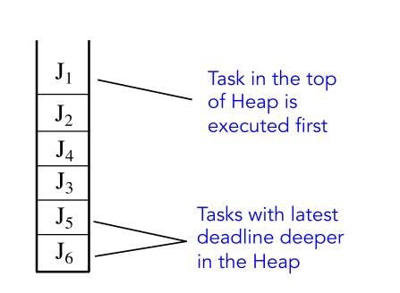

**Notice:**

**EDF** would have produced an **infeasible** schedule: select the task with the **earliest deadline** among all **currently-eligible tasks**

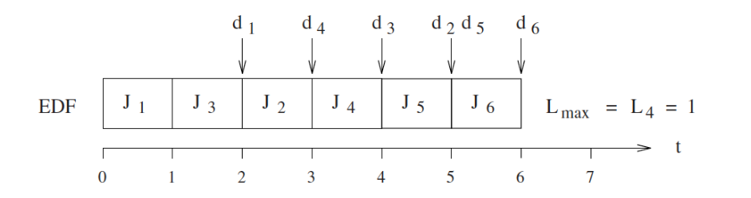

### Property

- polynomial on number of tasks n
- **Optimal in terms of minimum $L_{max}$**

### Optimal Proof

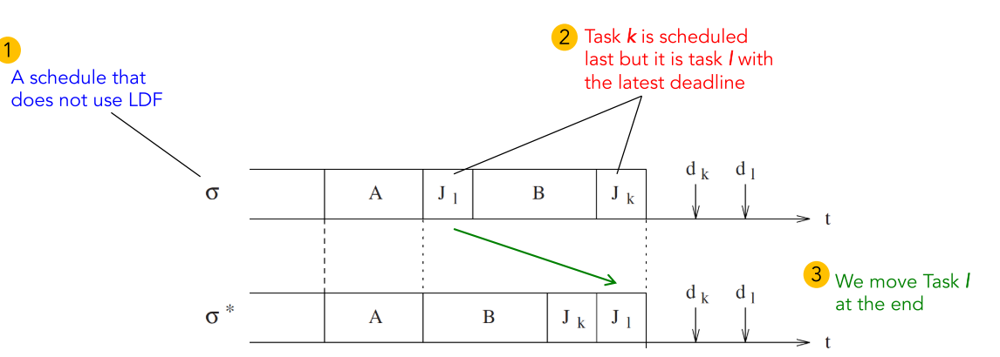

Lmax of the new schedule is reduced:

- For Tasks in set A, we do not have any change in L= {finish – deadline} times;
- For Tasks in set B, we have, actually, reduced (improve) the Lateness;
- For Task k we have reduced the Lateness;
- For Task l the lateness is no worse than the $$L_{max}$$ of schedule σ since $f-d_l < f-d_k$

So for three of the part, they have better L, for one part, it has better L than one part of the original schedule
$$
a>a';b>b';c>c';c>d'; \\
\max(a,b,c,d)\ge c; \\
\max(a',b',c',d') < c
$$

## 4.2. EDF* Methods (1|Prec,Preem| $L_{max}$ )

### Assumptions

Arrival times must be known in advance

### Basic Ideas

- Transform task set Γ to an equivalent set Γ with no Prec. constraints;

  - Postpone the release time of a successor;

  - Advance the deadline of a predecessor

  - E.G. Task A is a predecessor and in the new schedule Γ* should finish:

    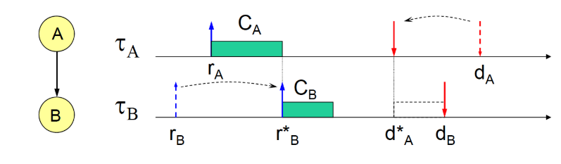

    - Before its original deadline: $d_A$
  - Before the maximum start time of Task B: $d_B - C_B$
  
- Apply EDF to the new task set Γ*

### Rules

- Arrival Time Modification:  (downward)
  1. For all root nodes, set:  $r_i^*=r_i$
  2. Select a task i that:
     - its release time has not been modified;
     - the release times of all its immediate predecessors have been modified;
  3. Set:  $r_{i}^{*}=\max \left\{r_{i}, \max_{\tau_{k} \rightarrow \tau_{i}}\left(r_{k}^{\star}+C_{k}\right)\right\}$
  4. GoTo b.
- Deadline Modification:  (upward)
  1. For all Leaf nodes, set:  $d^*_i=d_i$
  2. Select a task i that:
     - its deadline has not been modified;
     - the deadlines of all its immediate successors have been modified
  3. Set:  $\mathrm{d}^*_{\mathrm{i}}=\min \left\{\mathrm{d}_{\mathrm{i}}, \min_{\tau_{\mathrm{i}} \rightarrow \tau_{\mathrm{k}}}\left(\mathrm{d}_{\mathrm{k}}^{*}-\mathrm{C}_{\mathrm{k}}\right)\right\}$
  4. GoTo b.

### Property

- If Γ* is schedulable with EDF, then Γ is also schedulable with EDF
  - because in $\Gamma^*$, we have  $r_{i}^{*} \geq r_{i} \quad d_{i}^{*} \leq d_{i}$
- The precedence constraints of Γ are satisfied in Γ*
  - $\text { if } \tau_{i} \rightarrow \tau_{j} \text { then } d_{i}^{*}<d_{j}^{*} \text { and } r_{i}^{*}<r_{j}^{*}$

# Overview of Aperiodic Scheduling

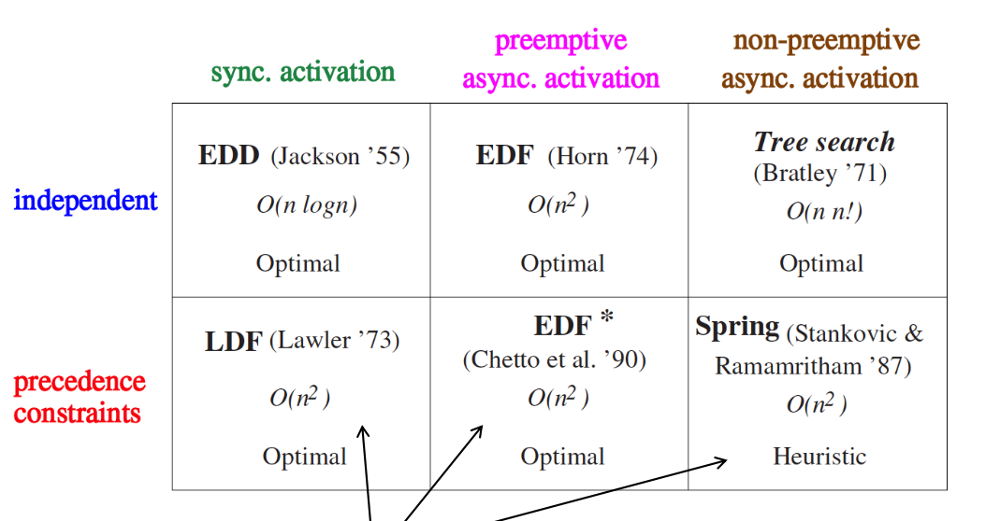