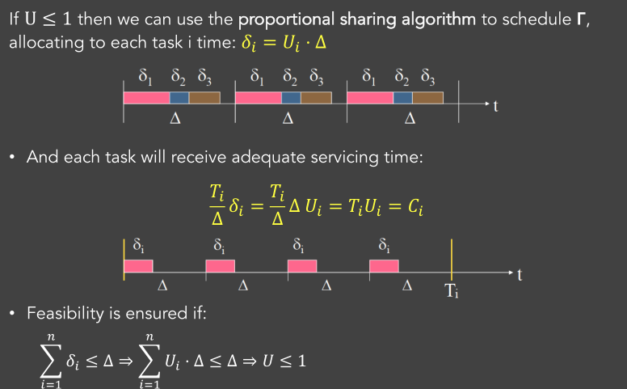

# 05_Scheduling of Periodic Tasks

[toc]

# 1. Basic Concepts

## 1.1. Task Model

Consider a computing system that needs to execute a set Γ of n periodic real-time tasks:
$$
\Gamma=\left\{\tau_{1}, \tau_{2}, \ldots \tau_{n}\right\}
$$

Each task $\tau_i$ is characterized by:
$$
\mathrm{C}_{\mathrm{i}} :\text{worst-case computation time}\\ \mathrm{T}_{\mathrm{i}}:\text{ activation period}\\ \mathrm{D}_{\mathrm{i}}:\text{relative deadline}\\ \Phi_{i}:\text{initial arrival time (phase)}
$$

## 1.2. Target

We want to ensure that for each task i:

- Each job k will be activated at:
  $$
  a_{i k}=\Phi_{i}+(k-1) T_{i}
  $$
  
- Each job k will be completed before its deadline

$$
\mathrm{d}_{\mathrm{ik}}=\mathrm{a}_{\mathrm{ik}}+\mathrm{D}_{\mathrm{i}}
$$

## 1.3. Hyperperiod

- The minimum time interval after which the schedule repeats

- If the tasks are activated at t=0, then it is given by the least common multiple (lcm) of their periods
  $$
  H=\operatorname{lcm}\left(T_{1}, T_{2}, \ldots, T_{n}\right)
  $$
  

# 2. Schedulability Tests

## 2.1. Introduction

A task set Γ is **feasible** if each task i=1,…,n in Γ can be executed for $C_i$ time units in every interval $[a_{ik}, d_{ik}]$, k=1, 2,….

### Necessary Test:

If the task set **does not pass** the test, then it is **certainly not schedulable** by this algorithm.

### Sufficient Test：

If the task set **passes the test**, then it is **certainly schedulable** by this algorithm.

### Exact

Both Necessary and Sufficient

- If the task set passes the test, then it is certainly schedulable by this algorithm.
- If the task set does not pass the test, then it is certainly not schedulable

## 2.2. Utilization

### Definition

The **task utilization** factor $U_i$ is the fraction of processor time spent in the execution of task i:
$$
U_{i}=\frac{C_{i}}{T_{i}}
$$

The **processor utilization** factor U is the fraction of processor time spent in the execution of the given task set:
$$
U=\sum_{i} U_{i}
$$

### Important Bounds

Utilization depends on task set Γ and the algorithm Α:
$$
U_{ub}(\Gamma,A)
$$

**Upper bound** of processor utilization for task set Γ under a given algorithm A

- if we increase further the computation time of any task, it becomes infeasible

$$
U_{l u b}(A)=\min _{\Gamma} U_{u b}(\Gamma, A)
$$

For a given algorithm A, it is the **minimum of the utilization factors** over **all** task sets that fully utilize the processor

- any task set whose utilization is less than or equal to this bound, is schedulable by A

### Judgement

- U > 1: no algorithm can schedule the task set: (H for hyperperiod)
  $$
  \mathrm{U}>1 \Rightarrow \mathrm{HU}>\mathrm{H} \Rightarrow \sum_{i=1}^{n} \frac{C_{i}}{T_{i}} H=\sum_{i=1}^{n} \frac{H}{T_{i}} C_{i}=\sum_{i=1}^{n} m_{i} C_{i}>H
  $$
  
- $\mathrm{U}(\Gamma, \mathrm{A}) \leq \mathrm{U}_{\mathrm{lub}}(\mathrm{A})$:  set Γ can be scheduled with Algorithm A

- $\mathrm{U}_{\mathrm{lub}}(\mathrm{A})<\mathrm{U}(\Gamma, \mathrm{A}) \leq 1$:  cannot really tell! Depends on the relation of the task periods, computation times, etc

## 2.3. Critical Instant

- **Critical instant** of a task = arrival time inducing the **largest response time** R.
- This occurs when the task arrives concurrently with all higher priority tasks

# 3. Some intuitive yet not efficient Algorithms

## 3.1. Proportional Share Algorithm

**Rules:**

- Divide the time into slots of length: $Δ=G.C.D. ( T_1 ,T_2,… T_n )$

- In each slot serve each task for time proportional to its utilization
  $$
  \delta_{i}=U_{i} \cdot \Delta
  $$
  

**Property：**

- If  $\sum_{i} U_{i} \leq 1$, then it will be feasible
- But if $\Delta$ is very small**, overhead can be very high** (too many context switch)
- If switching indueces delay, it may infeasible

## 3.2. Work-and-Sleep Algorithm

**Rules:**

- A task is executed for $C_i$ units and suspends for $T_i – C_i$ units
- **Preemption** is used when a higher-priority task wakes

**Property:**

- easy to implement
- **starves** the low priority tasks.

# 4. Timeline Scheduling (Smart Round Robin)

### Main Idea

- Time is divided into slots of equal length. for the task set Γ, we define:
  - the small cycle (Δ) : $\Delta=GCD(Periods)$
  - the large cycle (T): $T=LCM(Periods)$
- Each task is statically allocated to a slot, the algorithm does not care about how to map the tasks to slots

The schedule is feasible if: $C_{A}+C_{B} \leq \Delta \quad C_{A}+C_{C} \leq \Delta$

### Property:

- Advantages:
  - Simple to implement
  - consistently low jitter
- Disadvantages:
  - Difficulties handling overloading
  - Sensitivity to application changes

### Important Issues

1. If any task does not finish on time, then we

   - either terminate it, endangering inconsistent system state
   - wait for it to finish, endangering a **domino effect**

2. If the compute time of a task changes, we need to reschedule

3. If the frequency of a task changes, the impact is even worse

   

### Implementation

- program a timer to interrupt with period equal to minor cycle
- call the tasks in the order given in the major cycle by inserting a synch point at the start of each minor cycle

# 5. Priority-based Scheduling

## 5.1. Basic Idea

1. **Assign priorities** to tasks based on their timing constraints
2. **Verify** the schedule feasibility using analytical techniques.
3. **Execute** tasks on a priority-based kernel.

## 5.2. Rate Monotonic

**<u>Assumption</u>**

- $C_i$ and $T_i$ **are constant** for every task i.
- **The relative deadline is equal to task period**: $D_i$= $T_i$
- Tasks **are preemptable**;
- Context switching and preemption induce zero overheads;
- Tasks are independent:
  - No precedence relations, no resource constraints or blocking on I/O.

**<u>Rule</u>:**

Each task is assigned a fixed priority proportional to its rate (=inverse of period)

**<u>Properties</u>**

RM is **optimal** among **all fixed priority** algorithms (w.r.t. feasibility):

- If there is a fixed priority assignment which leads to a feasible schedule, then the RM schedule is also feasible.
- If a task set is not schedulable by RM, then it cannot be scheduled by any fixed priority assignment

**RM <u>Optimality</u>**

We try to prove: If a set is schedulable by some priority assignment, then it is also schedulable by RM

Consider this example where priorities are: Task 1 > Task 2

- In this scenario, the schedule is feasible if and only $𝐶_1 + 𝐶_2 ≤ 𝑇_1$
- We will show that this condition is sufficient for the feasibility with RM

One point to be explained here: in general, it should be $FC_1+C_2< \min(..,..)$, However, it can be easily proved that (by the relations between $C_1$ and $T_2-FT_1$):

* when case 1: $T_2-C_1>FT_1$, 
* when case 2: $T_2-C_1<FT_1$

- Case 1 means in the less in T1 part, can complete 1 more C1
- Case 2 means in the less in T1 part, can not complete 1 more C1
- Then we can from the graph found right two inequation, then we need to prove it

## 5.3. Deadline Monotonic

**<u>Assumption</u>**

- Extension to Tasks with D<T
- We drop the assumption that D = T

**<u>Rule</u>**

Similar with Rate Monotonic, but for relative deadlines smaller than tasks period

* At any time-instant, execute the task with **the shortest relative deadline**.

It is a **preemptive** algorithm.

**<u>Property</u>**

- **Static** method
-  DM is **optimal (wrt feasibility)** among all **fixed priority algorithms**.

## 5.4. Earliest Deadline First

**<u>Rule</u>**

* Each new job k of each task i, gets priority inversely proportional  to its absolute deadline (so it is dynamic)
  $$
  P_{i k}=\frac{1}{d_{i k}} \quad d_{i k}=r_{i k}+D_{i}
  $$
  
* A **preemptive** policy, where at each time we execute the task with the smaller absolute deadline (sooner-to-expire)

* Works equally well for aperiodic and for periodic tasks.
* EDF assigns priorities to each job as it is generated.

**<u>Optimality of EDF</u>**

* EDF is **optimal among all** scheduling algorithms.
  * If there exists a feasible schedule for a task set Γ, then EDF will generate a feasible schedule.
  * If Γ is not schedulable by EDF, then it cannot be scheduled by any algorithm.

# 6. Guarantee Tests

## 6.1. LUB

- Different task set yields a different upper bound: if we increase any C, we will have an infeasible schedule

$U_{lub}$ is a value on **"all" Test sets**. But we cannot enumerate all test sets, we will introduce some methods to calculate $U_{lub}$ with some analyze ways.

## 6.2. Guarantee Tests for RM

### 6.2.1. Test 1 (sufficient)

$$
U_{l u b}^{R M}=n\left(2^{\frac{1}{n}}-1\right), \quad n \rightarrow \infty \Rightarrow U_{l u b}^{R M} \rightarrow \ln 2=0.69
$$

The task set is schedulable if
$$
U_{p}=\sum_{n=1}^{n} \frac{C_{i}}{T_{i}} \leq U_{l u b}^{R M}=n\left(2^{\frac{1}{n}}-1\right)
$$

### 6.2.2. Proof of Test 1

- Assume the **worst-case scenario** for the task set; simultaneous arrivals, critical instants of tasks;
- **Increase all C values** to fully utilize the processor;
- Compute the upper bound $U_{ub}$;
- Minimize $U_{ub}$ with respect to all remaining variables (yields Least $U_{ub}$).

* In the first line, the second equation meet the "max utility", the first equation meet "min bound"

Above case is an special case for:

### 6.2.3. RM Test with Hyperbolic Bound

If Γ is a set of n periodic tasks, where each task $\tau_i$, induces processor utilization $U_i$, Γ is schedulable with RM if:
$$
\Pi_{i=1}^{\mathrm{n}}\left(\mathrm{U}_{i}+1\right) \leq 2
$$

### 6.2.4. Properties

All these two methods are pessimistic, that means, they are **sufficient test**. If some test set not pass, it does not mean it is not schedullable.

### 6.2.5. RM for Harmonic Periods

RM is optimal if the task periods are harmonic (i.e., each period divides exactly the larger ones).

 e.g. Harmonic set: $\{T_1=4,T_2=8,T_3=16\}$

In this case the condition $U\le1$ is an exact test

## 6.3. Guarantee Check of DM

### A **too pessimistic**  method

$$
U_{p}=\sum_{n=1}^{n} \frac{C_{i}}{D_{i}} \leq U_{l u b}^{R M}=n\left(2^{\frac{1}{n}}-1\right)
$$

* The opportunity to use the  T– D time is ignored

### Response Time Analysis (RTA)

**Main Idea**

Focus on the critical instances (synchronous arrivals) 

* Assume, w.l.o.g., that task **indexes are ordered by increasing relative deadlines**. 
* **Compute the longest response time** for each task i, as

**WCRT**: the maximum response time among all jobs of the task

**Process**

- Interference on $\tau_i$ by high priority tasks

  

$$
I_{i}=\sum_{k=1}^{i-1} \lceil {\frac{R_{i}}{T_{k}}} \rceil C_{k}
$$

But: But when scheduling, we would not know $R_i$ at the first time

- So we will use recursion way "fixed point iteration"

$$
R_i=C_i+I_I=C_i+\sum_{k=1}^{i-1} \lceil {\frac{R_{i}}{T_{k}}} \rceil C_{k}
$$

1. Define as X, the WCRT of Task i, which of course i**s larger than $C_i$;**

2. Calculate the interference Y that Task i will experience in X;

3. If X is smaller than Y+ $C_i$, then our estimation was wrong, and we replace X with Y+ $C_i$. And we return to Step 2.

4. If X is larger than Y+ $C_i$, then our fixed iteration terminates.

   It is because, when X is larger than $Y+C_i$, in the next iteration, the value will have no change, so we can directly use $Y+C_i$ as next X

Note: I think, if we start directly from $D_i$, we can get result after only 1 iteration

**Property**

RTA is an **exact** test: **sufficient and necessary**

## 6.4. Guarantee Tests for EDF 

### An exact test (for $D_i=T_i$)

A set of periodic tasks, with $D_i=T_i$, for every i, is schedulable **if and only if** it holds:
$$
U ≤ U_{lub}^{EDF}=1
$$
**<u>Proof</u>**

**Necessity (only if)**

 that $U_Γ>1$ means no algorithm can schedule task set Γ

**Sufficiency (if)**

With the condition that the EDF is the optimal wrt feasibility

If schedulable with proportional sharing (which is true if U≤1), then it is also schedulable with EDF (since EDF is optimal)

### Test for $D_i<T_i$

In any interval $[t_1, t_2]$ the **computational demand** $g(t_1, t_2)$ of  the task set must be no greater than the available time:
$$
g\left(t_{1}, t_{2}\right) \leq\left(t_{2}-t_{1}\right), \quad \forall t_{1}, t_{2}>0
$$
When tasks are activated **simultaneously**, we can rewrite this as
$$
g(0, L) \leq L, \quad \forall L>0
$$
**<u>Calculation</u>**
$$
g\left(t_{1}, t_{2}\right)=\sum_{i=1}^{n} g_{i}\left(t_{1}, t_{2}\right)=\sum_{i=1}^{n} \eta_{i}\left(t_{1}, t_{2}\right) C_{i} \leq\left(t_{2}-t_{1}\right)
$$

When cocurrent activations:
$$
\eta_{i}(0, L)=\left\lfloor\frac{L+T_{i}-D_{i}}{T_{i}}\right\rfloor
$$

**<u>Fasten Calculation</u>**

1. Check only when we have a task deadline (g is a step function, i.e., **remains constant between task deadlines**.)
   $$
   g\left(0, d_{k}\right)<d_{k} \Rightarrow g(0, L)<L, \quad \forall L: d_{k} \leq L<d_{k+1}
   $$
   
2. If all tasks are activated at t=0, we need only to check for $L \le H $ (Hyperperiod)

3. We can further limit the checkpoints by using a refined function that <u>**upper-bounds G**</u>

**<u>Upper-bounds G</u>**
$$
\begin{array}{l}
g(0, L)=\sum_{i=1}^{n} \left \lfloor \frac{L+T_{i}-D_{i}}{T_{i}}\right\rfloor C_{i} \leq \sum_{i=1}^{n}\left(\frac{L+T_{i}-D_{i}}{T_{i}}\right) C_{i} \Rightarrow \\
g(0, L) \leq \sum_{i=1}^{n}\left(T_{i}-D_{i}\right) U_{i}+L \cdot U \triangleq G(0, L)
\end{array}
$$
If we know that G(0,L) is smaller than L (for some values of L), then we know that g(0,L) is also smaller than L.

However, G(0,L) is not always smaller than L. We can find an $L^{*}$

**<u>Synchronous Periodic Case Theorem</u>**: 

A set of synchronous periodic tasks with relative deadlines less than or equal to periods can be scheduled by EDF if and only if
$$
g(0, L) \leq L, \quad \forall L \in D=\left\{d_{k} \mid d_{k} \leq \min \left\{H, \max \left\{D_{\max }, L^{*}\right\}\right\}\right.
$$
where
$$
H: \text{Hyperperiod} \\
D_{max}: \text{the maximum relative deadline in the task set} \\
L^{*}: \text{the parameter related to function G}
$$

# 7. Summary

## 7.1. Summary For Tests

## 7.2. RM VS EDF

### When Permanent Overload Happens

Permanent Overload: When the total utilization value increases (and stays there)

**<u>RM under permanent overload</u>**

*  High priority tasks are executed at the necessary rate;
* Low priority tasks **are blocked**.

**<u>EDF under permanent overload</u>**

* All tasks are executed **at a slower rate;**
* No task is blocked.