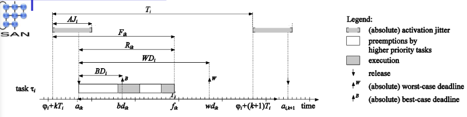

# 06_Jitter Analysis

[toc]

# 1. Background

## 1.1. An Example Multiprocessor Scenario

## 1.2. Goal Jitter Analysis

- Determine schedulability in the context of jitter, hence, response times
- Determine **end-to-end response times**

## 1.3. How to understand Jitter

一个系统里面因为各个环节的因素，所产生的一个可以大概的判断上界的每次随机的额外时延

- **Latency** = Delay between an event happening in the real world and code responding to the event.
- **Jitter** = Differences in **Latencies** between two or more events.

# 2. Preliminary

## 2.1. Fixed-Priority Preemptive Scheduling (FPPS)

Nothing to explain, just as the name

## 2.2. Finalization Jitter

variation in finalization times

## 2.3. Activation Jitter

variation in activation times (e.g. output of one task triggers a next task)

# 3. Response Time

## 3.1. Schedulability Condition

$$
 \underset{i, k, \varphi}{\forall} B D_{i} \leq R_{i, k}(\varphi) \leq W D_{i} 
$$

## 3.2. Worst Case Response Time

### Assumption

Based on RM algorithm

### Condition

Worst Case happens when under the **Critical Instant **(maximum number of higher priority preemptions)

### Calculation

**Recursive Equation**
$$
x=C_{i}+\sum_{j<i}\left\lceil\frac{x}{T_{j}}\right\rceil C_{j}
$$

- $\lceil\frac{x}{T_{j}}\rceil$ denotes the **maximum number of pre-emptions of task $\tau_i$ in an interval $[0, x)$ by task $\tau_j$**
- LHS: amount of time available (or provided) in $[0, x)$
- RHS: max. amount of time requested by higher priority tasks in $[0,x)$

## 3.3. Best Case Response Time

### Formalization

- Best-case Response time $BR_i$ of a periodic task $\tau_i$
  $$
  B R_{i}=\inf _{\varphi, k} R_{i, k}(\varphi)\\
  \text{where} \phi \text{ is the phasing of the task set}
  $$

- Hence
  $$
  \underset{i, k, \varphi}{\forall} B R_{i} \leq R_{i, k}(\varphi) \\ \underset{i}{\forall B D_{i}} \leq B R_{i}
  $$
  

### Optimal Instant

- Optimal Instant incurs **the lowest amount of pre-emption** by higher priority tasks
- An optimal instant (not only one)
  - Job $\tau_{i,k}$ **ends simultaneously with the release of all tasks with a higher priority**, and $\tau_{i,k’}$s release time is equal to its start time
  - Specific for each task

### Timeline Caculation

### Calculation

$$
x=C_{i}+\sum_{j<i}\left(\lceil\frac{x}{T_{j}}\rceil-1\right) C_{j}
$$

- $\lceil\frac{x}{T_{j}}\rceil-1$ denotes **the minimal number of pre-emptions of** task $\tau_i$ in an interval $[0, x)$ by task $\tau_j$
- LHS: amount of time available (or provided) in $[0, x)$
- RHS: min. amount of time requested by higher priority tasks in $[0,x)$
- stopped when
  - the same value is found for two successive iterations
  - the deadline $BD_i$ is exceeded (hence not schedulable)
- All intermediate values are at least equal to $BR_i$
- We always start

### Notes

Why $\lceil\frac{x}{T_{j}} \rceil-1$

- if it  $\lceil\frac{x}{T_{j}} \rceil$ is an integer. That means, if it is a integer, then because preemptive, we can start later,
  - For example in above picture, if count task 3 we initially set x to  20, then an integer appear, we can move the release of task 3 after the finish of task 1.

Many Fixed Points

- **There maybe many fixed point**, the smallest positive one always equal to computation time.
- In order to get correct fixed point, **we always start from $WR$ or $T_i$**

# 4. Jitter Analysis

## Assumption

The analysis **does not hold** for deadlines plus jitter larger than periods, i.e. for $WD_i + AJ_i > T_i$

## 4.1. Types of Jitter

### Activation (release) jitter $AJ$

variation in activation times (e.g. output of one task triggers a next task)

### Response jitter $RJ$

variations in response times

### Finalization (or end) jitter $FJ$

variation in finalization times

## 4.2. Activation Jitter

$$
\varphi_{i}+k T_{i} \leq a_{i, k} \leq \varphi_{i}+k  T_{i}+A J_{i} \\ \text{where} \varphi_i \text{ denotes the start of the jitter interval}
$$

- We can regard Activation Jitter is **decided by "outside"**, than it leads to jitter of response jitter and finalization jitter, given the fixed computation time

## 4.3. Response Jitter

$$
R J_{i}=\sup _{\varphi, k, l}\left(R_{i, k}(\varphi)-R_{i, l}(\varphi)\right)
$$

- Note when consider jitter, the Response time is finish time - actual release time
- A bound on response jitter

$$
R J_{i} \leq W R_{i}-B R_{i}
$$

$\leq$  because $WR_i$ and $BR_i$ **are not necessarily assumed for the same phasing**

### 4.3.1. Worst Case Response Time

**Condition**

Critical Instant:

- Task $\tau_i$ is released simultaneously with all tasks with a higher priority and

- all tasks with a higher priority experience
  - a **maximal release delay** at that **simultaneous release,** and
  - a **minimal release delay** at **subsequent releases**

**Calculation**
$$
x=C_{i}+\sum_{j<i} \lceil \frac{x+A J_{j}}{T_{j}} \rceil C_{j}.
$$

- $WR_i$ is the **smallest positive solution** of the equation
- From point 1, we know we can start from $ C_i$

### 4.3.2. Best-case Response Time

**Condition**

Optimal instant

- Job $\tau_{i,k}$ ends simultaneously with the release of all tasks with a higher priority, and $\tau_{i,k’}$ release time is equal to its start time, and

- all tasks with a higher priority experience
  - a **maximal release delay** at that **simultaneous release**, and
  - a **minimal release delay** at **previous releases**
- $BR_i$ is independen of $AJ_i$

**Calculation**
$$
x=C_{i}+\sum_{j<i}\left(\lceil\frac{x-A J_{j}}{T_{j}}\rceil-1\right)^{+} C_{j} \\=C_{i}+\sum_{j<i}\max \left(\lceil\frac{x-A J_{j}}{T_{j}}\rceil-1,0\right) C_{j}
$$

## 4.4. Finalzation Jitter

**Relative Finalization Time**
$$
F_{i, k} \stackrel{\text { def }}{=} f_{i, k}-\left(\varphi_{i}+k T_{i}\right)
$$

- absolute finish time - absolute **release time without jitter** (actual release time)

**Finalization Jitter**
$$
F J_{i}=\sup _{\varphi, k, l}\left(F_{i, k}(\varphi)-F_{i, l}(\varphi)\right)
$$

**Relation**
$$
\begin{array}{l}W F_{i}=A J_{i}+W R_{i} \\B F_{i}=B R_{i} \\W F_{i}-B F_{i}=A J_{i}+W R_{i}-B R_{i} \\F J_{i} \leq A J_{i}+W R_{i}-B R_{i}\end{array}
$$

### 4.4.1. Worst-case Finalization Times

$$
W F_{i}=A J_{i}+W R_{i}
$$

### 4.4.2. Best-case Finalization Times

$$
BF_i=BR_i
$$

## 4.5. Example

# 5. An Multi-Processor Scenario

## 5.1. The actual process from external event to task activation

1. Extent event occurs
2. Detection by sensor
3. Interrupt generated by sensor
4. may **take some time** before the bus is free
5. Interrupt arrival at CPU
6. may **take some time** before the interrupt is handled
7. Immediate Interrupt Service
8. may be **pre-empted** by higher priority interrupts
9. Activation of the scheduler
10. may be delayed to the next clock-tick
11. Activation of the task

- hence, both a **latency** and **potential jitter** between the arrival of the external event and activation of the task
- Jitter can be **reduced by using buffers** (i.e. by changing precedence constraints into data dependency constraints). This may increase the latency, however

如果直接访问硬件，或者直接等待另一个处理器触发本处理器所属的任务，由于总线/硬件等各种东西的状态未知（可能被占用），以及硬件速度本身的不确定性，会导致有一个比较大的variation。那么，所做的方式就是，外设硬件，在总线空闲的时候，放到内存的一个queue里面，然后task以一个较高的频率/处理器以一个较高的detect这个queue，如果有数据，就执行，如果没有就跳过。这样的话，因为CPU+内存的访问jitter要小，而且速度快，相当于克服了总线速度慢+硬件variation大的问题