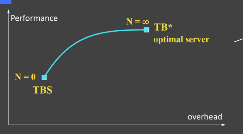

# 0_Hybrid Task Scheduling

[toc]

# 1. Introduction

## 1.1. Background 

Real-time systems often need to handle both periodic and aperiodic tasks

## 1.2. Hybrid Tasks Set

$$
\Gamma=\left\{\tau_{1}, \tau_{2}, \ldots \tau_{n}\right\} \text { and } J_{a}, J_{b}, J_{c}, \ldots
$$

 Solution can be found if they are sporadic tasks. (i.e., tasks with a priori known minimum interval times between their 
successive arrivals.)

## 1.3. Goal

* **Minimize the response time of aperiodic tasks**.
  * Start processing them as soon as they arrive.
* Execute the periodic tasks **before their deadlines.**
  * Do not miss deadlines because the CPU serves aperiodic tasks.

## 1.4. The concept of Server

A **server** is a process that controls the execution of aperiodic tasks.

* It is a **periodic task itself** that, when active, handles the ready aperiodic tasks.
  * It has period $T_s$
  * It has capacity $C_s$ (budget, or computation time).

# 2. Fixed-Priority Server

## Assumption

* The **periodic tasks arrive synchronously,** and are scheduled using RM (i.e., we assume $D_i=T_i$).
* Aperiodic tasks have **soft deadlines but unknown arrivals**.
* All tasks are **preemptable**.
* Priority ties are broken in favor of the job server.

## 2.1. Polling Server

### Rule

* It has period $$T_s$$ and computation budget $$C_s$$.
* At the beginning of each period, the budget is **initialized to** $C_s$.
* The budget is consumed as aperiodic tasks are executed; and the execution of jobs ends when $C_s$ becomes zero (consumed).
* **If there are no aperiodic tasks at some iteration; $C_s$ is set equal to zero and the token returns to periodic tasks.**

### Example

### Schedulability Analysis

 In worst case, the PS **behaves as a periodic task** with $\{ T_s, C_s \}$:
$$
U_{p}+U_{s} \leq U_{l u b}(n+1)
$$

$$
U_{p}=\sum_{i \in \Gamma} \frac{C_{i}}{T_{i}}\quad U_{S}=\frac{C_{S}}{T_{S}}
$$

n+1 because n periodic tasks + the PS

**<u>LL bound (neccessary)</u>**
$$
U_{p}+U_{S} \leq(n+1)\left(2^{\frac{1}{n+1}}-1\right)
$$

**<u>Hyperbolic Bound (neccessary)</u>**
$$
\prod_{i=1}^{n}\left(U_{i}+1\right) \leq \frac{2}{U_{S}+1}
$$

**<u>Response Time Calculate</u>**

the response time of a periodic task i is the smallest integer satisfying the recurrence
$$
R_{i}=C_{i}+\left\lceil\frac{R_{i}}{T_{S}}\right\rceil C_{S}+\sum_{j=1}^{i-1}\left\lceil\frac{R_{i}}{T_{j}}\right\rceil C_{j}
$$

### Dimension a Polling Server

By using Hyperbolic bound
$$
\prod_{i=1}^{n}\left(U_{i}+1\right) \leq \frac{2}{U_{S}+1} \Rightarrow U_{S} \leq \frac{2-\Pi_{i=1}^{n}\left(U_{i}+1\right)}{\Pi_{i=1}^{n}\left(U_{i}+1\right)}
$$

We can select any $C_s, T_s$ that satisfy this bound, e.g.
$$
T_{s}=\min \left\{T_{1}, T_{2}, \ldots, T_{n}\right\}, \quad C_{S}=U_{S}^{\max } T_{S}
$$

### Online Gurarntee for Aperiodic Tasks (Admission test)

**<u>A Exact Test</u>**

**Assume PS has the highest priority**

initial delay:
$$
\Delta_{\mathrm{a}}=\left\lceil\frac{r_{a}}{T_{s}}\right\rceil T_{s}-r_{a}
$$
full service periods
$$
F_{a}=\left\lceil\frac{C_{a}}{C_{s}}\right\rceil-1
$$
final chunk
$$
\delta_{a}=C_{a}-F_{a} C_{s}
$$

Response Time
$$
\mathrm{R}_{\mathrm{a}}=\Delta_{\mathrm{a}}+\mathrm{F}_{\mathrm{a}} \mathrm{T}_{\mathrm{s}}+\boldsymbol{\delta}
$$

**<u>Sufficient-only Test (PS does not have the highest priority)</u>**
$$
T_{s}+\left\lceil\frac{C_{a}}{C_{s}}\right\rceil T_{s} \leq D_{a}
$$

when $C_a<C_s$
$$
2 T_{s} \leq D_{a}
$$

## 2.2. Deferrable Server

Same as PS, but the computation budget is **not discharged if there are no pending job requests.**

* This improves the responsiveness of aperiodic tasks (**no initial delay**).
*  It benefits the response of jobs, but **induces task deadline misses**

### Schedulability Check

 Due to this possibility of deferring the computation capacity, treating DS as a periodic task is not valid.

**<u>LUB</u>**
$$
U_{l u b}=U_{s}+n \cdot\left[\left(\frac{U_{s}+2}{2 U_{s}+1}\right)^{\frac{1}{n}}-1\right]
$$
**<u>Hyperbolic Bound</u>**
$$
\prod_{i=1}^{n}\left(U_{i}+1\right) \leq \frac{U_{s}+2}{2 U_{s}+1}
$$

### Dimensioning the DS

Using the Hyperbolic bound
$$
\prod_{i=1}^{n}\left(U_{i}+1\right) \leq \frac{U_{S}+2}{2 U_{S}+1} \Rightarrow U_{S} \leq \frac{2-\Pi_{i=1}^{n}\left(U_{i}+1\right)}{2 \Pi_{i=1}^{n}\left(U_{i}+1\right)-1}
$$
We can select any $C_s, T_s$ that satisfy this bound, e.g.,
$$
T_{s}=\min \left\{T_{1}, T_{2}, \ldots, T_{n}\right\}, \quad C_{S}=U_{S}^{\max } T_{S}
$$

### Online Guarantee for Aperiodic Tasks (Admission Tasks)

**<u>Sufficient Test (DS has the highest priority)</u>**

**Assume DS has the highest priority**

initial delay:
$$
\Delta_{\mathrm{a}}=\left\lceil\frac{r_{a}}{T_{s}}\right\rceil T_{s}-r_{a}
$$
full service periods
$$
F_{a}=\left\lceil\frac{C_{a}^{rem}}{C_{s}}\right\rceil-1
$$
final chunk
$$
\delta_{a}=C_{a}^{rem}-F_{a} C_{s}
$$

Response Time
$$
\mathrm{R}_{\mathrm{a}}=\Delta_{\mathrm{a}}+\mathrm{F}_{\mathrm{a}} \mathrm{T}_{\mathrm{s}}+\boldsymbol{\delta}
$$

Discussion of $C^{rem}_a$
$$
C_a^{rem}=C_a-\delta_{in} \\
\delta_{in}=\min(\Delta_a,q_s)
$$

### PS VS DS

DS improves job responsiveness but shrinks the schedulability region

* For each task set, DS may has the lower $U_{ub}$, means the smaller region to high up utility for a given task set

$$
\begin{aligned}
U_{l u b}^{R M+P S}(n \rightarrow \infty) &=U_{S}+\ln \left(\frac{2}{U_{s}+1}\right) \\
U_{l u b}^{R M+D S}(n \rightarrow \infty) &=U_{S}+\ln \left(\frac{U_{S}+2}{2 U_{S}+1}\right)
\end{aligned}
$$

## 2.3. Slack Stealer

Not based on the concept of server.

A passive task (slack stealer) attempts to create a time budget by “stealing” time from the periodic tasks.

* there is no benefit when a periodic task finishes before  its deadline (remember: $D_i=T_i$).

$$
\operatorname{Slack}_{i}(t)=d_{i}-t-c_{i}(t)
$$

### Find the earlies possible slack

No involved

### Schedulability Analysis

**<u>Model</u>**

 Assume there is a job $J_a$ arriving at $r_a$ with load $C_a$ units, What is the earliest time t that at least $C_a$ slack exists in $[ra, t]$

**<u>Solution</u>**

The answer is given by the slack function $A(s,t)$

### Property

Slack Stealer is not Optimal

**<u>Therorem 1</u>**

For any set of **periodic tasks** ordered on some **fixed-priority scheme** and **aperiodic** requests ordered according to a **given queueing rule**, **no valid algorithm exists** that minimizes the response time of **every soft aperiodic job**.

**<u>Theorem 2</u>**

For any set of **periodic tasks** ordered on some **fixed-priority scheme** and **aperiodic** requests ordered according to a **given queueing rule**, **there does exist any online valid algorithm** that minimizes the **average response time of all soft aperiodic jobs.**

# 3. Dynamic Priority Servers

## 3.1. Total Bandwidth Server

Designed to be used with **EDF**.

Each aperiodic request is assigned a deadline.

* TBS load should not exceed a given utilization $U_s$ (or, **bandwidth**)
* Since we use EDF and $D_i=T_i$, the set  $\{ Tasks+Jobs \}$ is schedulable **iff** $U_p+U_s \le 1$

 Aperiodic jobs are inserted in the Ready queue.

* The Ready queue is served with EDF.

### Deadline Assignment

We know the required computation time $C_s$ ;

We know the maximum possible $U_s$  of TBS 
$$
U_{s}=\frac{C_{k}}{T_{k}} \Rightarrow T_{k}=\frac{C_{k}}{U_{s}}=d_{k}-r_{k} \Rightarrow d_{k}=r_{k}+\frac{C_{k}}{U_{s}}
$$
For multiple task comes when the first is not finished:
$$
d_{2}=\max \left\{r_{2}, d_{1}\right\}+\frac{c_{J_{2}}}{U_{S}^{\max }}
$$
**This ensures that at any time-interval the arrived jobs with deadlines in that interval do not impose utilization greater than $U_s$**

### Schedulability Analysis

Given a set of **n periodic tasks** with processor utilization $U_P$ and a **TBS** with processor utilization $U_s$, the whole set is schedulable by EDF **if and only if:**
$$
U_p+U_s \le1
$$
**<u>Proof</u>**

**Lemma **

In each time interval $[t_1, t_2]$, if $C_{job}$ is the total execution time requested by jobs arrived later than $t_1$ with deadlines sooner than $t_2$, then:
$$
C_{j o b}=\sum_{k: r_{k} \geq t_{1} \atop d_{k} \leq t_{2}} C_{k} \leq\left(t_{2}-t_{1}\right) U_{s}
$$

### Improving TBS

The deadline can be improved

$$
\begin{array}{l}
d_{k}^{0}=\max \left(r_{k}, d_{k-1}^{0}\right)+\frac{\mathrm{C}_{k}}{U_{s}} \\
d_{k}^{s+1}=f_{k}^{s}=f_{k}\left(d_{k}^{s}\right)
\end{array}
$$

$$
f_{k}^{s}=r_{k}+C_{k}+I_{p}\left(r_{k}, d_{k}^{s}\right)
$$

$$
I_{p}\left(t, d_{k}^{s}\right)=I_{a}\left(t, d_{k}^{s}\right)+I_{f}\left(t, d_{k}^{s}\right)
$$

$$
I_{a}\left(t, d_{k}^{s}\right)=\sum_{\tau_{i} \text { active } \atop d_{i}<d_{k}^{s}} c_{i}(t)=\sum_{\tau_{i} \text { active }}\left[C_{i}-e_{i}(t)\right]
$$

$$
I_{f}\left(t, d_{k}^{s}\right)=\sum_{i=1}^{n}\left(\left\lceil\frac{d_{k}^{s}-n \operatorname{ext}_{i}(t)}{T_{i}}\right\rceil-1\right) C_{i}
$$

$$
\operatorname{next}_{i}(t)=\left(\left\lfloor\frac{t}{T_{i}}\right\rfloor+1\right) T_{i}
$$

* $I_a$ is the Interference due to the **active periodic instances** with deadlines less than $d_k$
* $I_f$ Interference due to periodic tasks that will **start after t and need to end before** $d_k$

Improving TBS

* The more “shortening” iterations we do, the better is the response time.
* The more computing overheaad we need

### Drawbacks

**Job Overrun** may happen, we could use **Task Isolation** to improve (CBS method):

* Each task should not consume more time than its utilization, $Ui=\frac{C_i}{T_i}$ ;
* If a task overruns, its priority should be decreased, or its deadline postponed; 

## 3.2. Constant Bandwidth Server

It assigns deadlines to tasks as TBS does; but keeps track of job execution through a **budget mechanism**

* When a job arrives, it is assigned a deadline and enters the **EDF queue.**
* If the job overruns (exceeds C), its **deadline is postponed**, and we reapply EDF.

### Parameters

**<u>Fixed Parameters</u>**

- Maximum Budget $\mathrm{Q}_{\mathrm{s}}$ 
- Server Period $\mathrm{T}_{\mathrm{s}}$
- Server Bandwidth $U_{s}=\mathrm{Q}_{s} / T_{s}$

**<u>Changing Parameters</u>**

- Current Budget $\mathrm{q}_{\mathrm{s}}$ ( initialized to 0 )
- Server Deadline $\mathrm{d}_{\mathrm{s}}$ ( initialized to 0 )
  Fixed Parameters

### Rule

When a job $J_k$ **arrives** at time $r_k$ we assign it a proper deadline

When the budget is **exhausted**, we replenish it and push the deadline:
$$
\begin{array}{l}
q_{s} \leftarrow Q_{s} \\
d_{s} \leftarrow d_{s}+T_{s}
\end{array}
$$

### Examples

### Properties

The processor utilization of a CBS with parameters $(Q_s, T_s)$ is $U_s = Q_s/T_s$ **independently of the computation times and arrival pattern of the aperiodic jobs.**

### Schedulability Analysis

**<u>Lemma 1</u>**

Given a set $Γ$ of n periodic tasks with total utilization $U_P$ and a set of m CBSs with utilization $U_1, … U_m$ , the whole set is schedulable with EDF **iff**:
$$
U_{P}+\sum_{i=1}^{m} U_{i} \leq 1
$$
**<u>Lemma 2</u>**

 A hard task i with parameters $(C_i, T_i)$ is schedulable by a CBS with parameters $Q_s$ larger than $C_i$ and $T_s=T_i$, iff 

Task i is **schedulable with EDF**.

### Multiple CBSs

# 4. Comparison of Servers

Although It seems that TBS is pareto optimal than CBS, CBS has isolation property, which TBS does not have