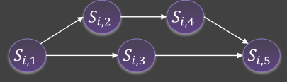

# 08_Multiprocessor Real-Time systems

[toc]

# 1. Multiprocessor vs Single-processor

## 1.1. Shared Cache problems

In single core systems, tasks are **sequentially executed**

* access to shared resources is serialized
* 

In multicore core systems tasks may execute in parallel

* Tasks **compete for shared resources**
* 

According to above two points:

The main assumption of real-time systems that the  WCET is known, does not hold anymore for multicore systems

In single core systems cache related preemption delays (CRPD)  increase the WCET of each task

In multicore systems tasks executing in parallel can trash each others cache content

* Can cause significant WCET increase

One solution is: partition caches between cores

**Reduces conflicts** $\rightarrow$ less variability on the WCET
But **reduced cache size per core** $\rightarrow$ increased WCET

## 1.2. Inference on Memory banks, I/Os and more

If all cores try to access  the **main memory** at the same time, it may **overload the memory controller** and 
generate long delays for serving memory requests

### Possible Solution

Assign **different memory banks to different cores** to avoid inter-core interference

Reduces conflicts on memory accesses $\rightarrow$ less variability on the WCET
But also reduces intra-task memory access parallelism $\rightarrow$ increased WCET

# 2. Model Parallel tasks

## 2.1. Directed-acyclic graph (DAG)

## 2.2. Fork-Join graphs

* After a **fork node**, all immediate successors must be executed (the order does not matter).
* A **join node** is executed only after all immediate predecessors are completed.

## 2.3. Precedence Constraints

## Intra-task

Precedence constraint **between segments** of a task (they all share the same timing constraints)

## Inter-task

Precedence constraint **between tasks**

# 3. Platform Models

## 3.1. Identical

Processors are of the same type and have the same speed. Each task **has the same WCET on each processor.**

## 3.2. Uniform

Processors are of the same type but may have different speeds. Task **WCETs are smaller on faster processors.**

## 3.3. Unrelated

Processors can be of different types. The WCET of a task **depends on the processor type and the task itself.**

# 4. Multicore real-time scheduling schemes

## 4.1. Classification

### Global

The system manages a **single queue** of ready tasks

* The processor (to execute the task) is **determined at runtime**
* During execution, a task can **migrate to another processor**

It can also has multi-level queues

* Use a set of priority queues for each processor
* In each priority queue, tasks are served by FCFS (FIFO)

### Clustered Scheduling

A task can only **migrate within a predefined subset** of processors (cluster).

### Partitioned Scheduling

* Each processor manages its **own ready queue**
* The processor for each task type is determined offline
* The processor cannot be changed at runtime

## 4.2. Global EDF

## 4.3. Partitioned Scheduling

It can be reduce to:

* First a Bin-packing problem (NP-hard)
* Uniprocessor Scheduling problem (well-understood )

### Partition problem

Given a set of tasks $\tau = \tau_𝟏, \tau_𝟐, … , \tau_𝒏$ and a multiprocessor platform with 𝒎 processors, 
find an **assignment from tasks to processors** such that each task is assigned to one and only one processor

### Possible Partitioning choices

* Partition by information-sharing requirements
* Partition by functionality
* Partition to increase schedulability

### Classical Parition solutions

**<u>First Fit (FF)</u>**

Find the smallest index that is able to put

**<u>Best Fit(BF)</u>**

Find the used one with most close remaining

**<u>Worst Fit (WF)</u>**

Find the used one with least close remaining

**<u>Random Fit(RF)</u>**

Random choose

**<u>Next Fit (NF)</u>**

Find the smallest but larger than latest put index that is able to put 

The performance of each algorithm strongly  depends on the input sequence

* **<u>NextFit</u>** has a **poor performance** since it does not exploit the empty space in the previous bins
* **<u>FirstFit</u>** **improves the performance** by exploiting the empty space available in all the used bins.
* **<u>BestFit</u>** tends to **fill the used bins as much as possible.**
* **<u>WorstFit</u>** tends to **balance the load** among the **used bins.**

# 5. Schedulability Test

## 5.1. Partitioned EDF+FF 1

The **lower bound** on the utilization of a task set that is **not schedulable** by **partitioned EDF with FirstFit** partitioning on a multicore platform with 𝑚 identical cores is
$$
U^{E D F+F F} \leq \frac{1}{2} \cdot(m+1)
$$
every lower than the boundary is feasible, however, larger than need extra judgement

### Proof

## 5.2. Partitioned EDF+FF 2

If $n > \beta m$, then the task set is schedulable by  $U^{EDF+FF}$ if
$$
U^{E D F+F F} \leq \frac{\beta \cdot m+1}{\beta+1}
$$

where $\beta=\left\lfloor\frac{1}{U_{\max }} \right\rfloor$, the maximum number of tasks with utilization $U_{max}$ that fit into one processor.

## 5.3. Bound for Global EDF

The lower bound on the utilization of a task set that is **not schedulable** by global EDF scheduling on a multiprocessor system with 𝑚 cores is **1.**

* regardless of the number of cores in the system, we may not be able to find a  feasible schedule for the tasks even if the utilization is just about 1.
* Any smaller than 1 is feasible, equal or larger to 1 may not find and may find

### Dhall's effect (proof)

## 5.4. Global vs Partitioned

Global and partitioned scheduling are **incomparable.**

* There are task sets that are schedulable only with a global scheduler
* There are task sets that are schedulable only with a partitioned scheduler

Global scheduling uses **more efficiently platform resources** and allows for more responsive systems