# 09_Overload Analysis

[toc]

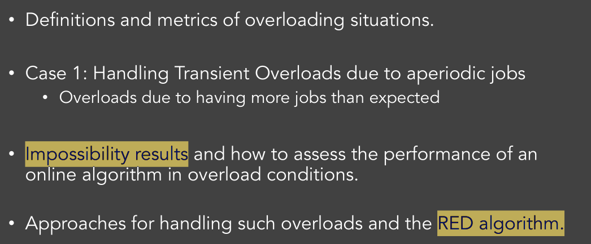

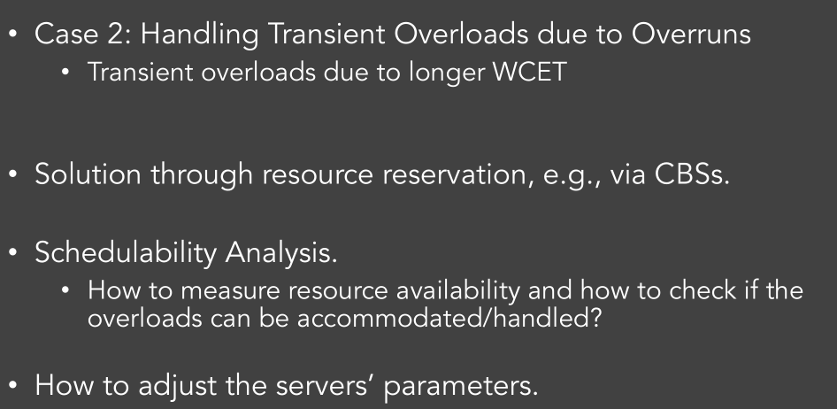

# 1. Introduction

## 1.1. Reasons for Overloading

1. The system designer was **too optimistic.**
2. The designer was pragmatic but the **problem changed drastically.**
3.  System **malfunctions and exceptions** occurred.

## 1.2. Wasy to measer overloads

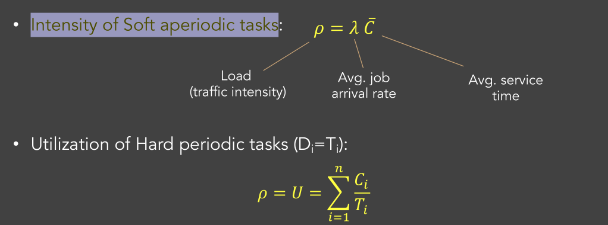

### Instantaneous Load for Hard Periodic Tasks

 Compute the load in all intervals from current time t and each deadline $(d_n)$ of all active jobs.

Partial load in $[t, d_n]$ due to first n jobs
$$
\rho_{n}(t)=\sum_{d_{k} \leq d_{n}} \frac{c_{k}(t)}{d_{n}-t} \ \quad \rho(t)=\max _{n} \rho_{n}(t)
$$
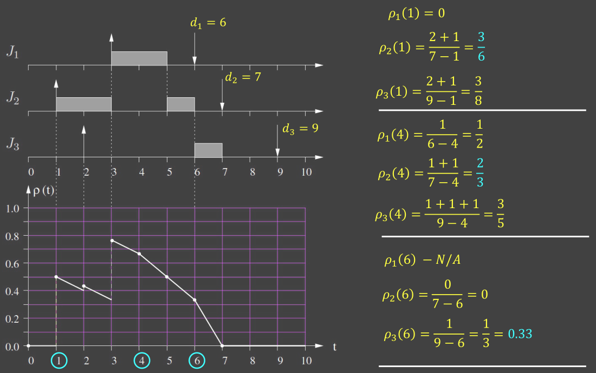

## 1.3. Overload Types

System designed under **worst-case assumptions**: Overloading is **avoided**

System designed under **average-case assumptions**: Overloading $\rho(t) > 1$

### Transient Overload

$$
\rho_{max}>1 \quad \rho_{avg}<1
$$

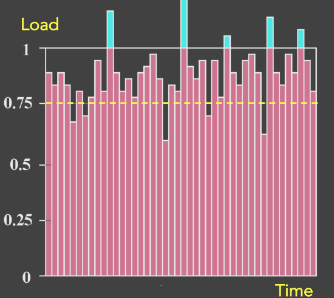

### Permanent Overload

$$
\rho_{avg}>1
$$

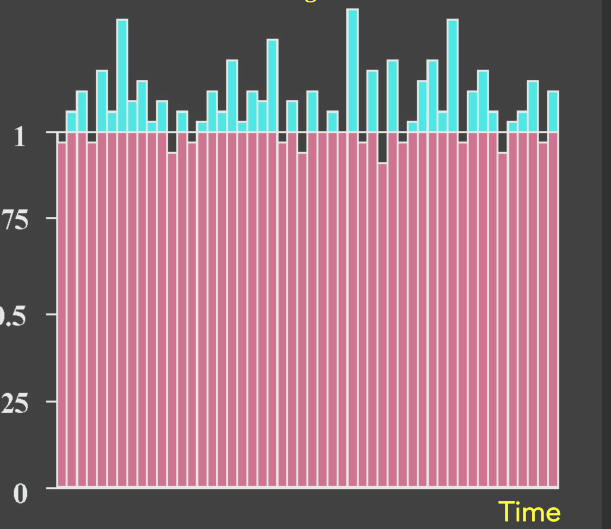

## 1.4. Predictability vs Efficiency

Designing with **pessimistic assumptions**:

- **Highly predictable** but less efficient systems

Designing with **optimistic assumptions**:

* **Highly efficient** but less predictable systems.

## 1.5. Classes of Overloads

* Transient overloads due to aperiodic jobs
* Transient overloads due to task overruns.
* Permanent overloads in periodic task systems.

# 2. Handling Aperiodic Overloads

If we have more tasks than we can serve… there is no solution

So, we need to reject some tasks, the importnat thing is **How to decide which ones**

We should use **Value-based Scheduling**, in order to maximize the total system utility

e.g. 

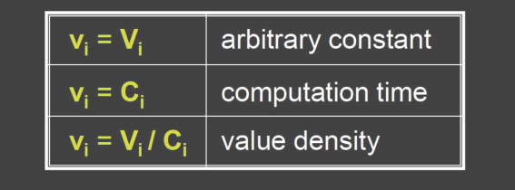

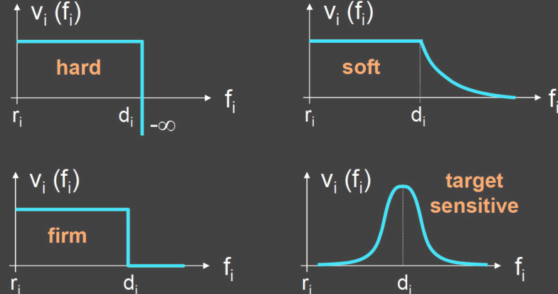

## 2.1. Performance Evaluation

### Aggregate Utility

$$
\Gamma_{\mathrm{A}}(\mathrm{T})=\sum_{i=1}^{n} v_{i}\left(f_{i}\right)
$$

### Optimal Aggregate Utility

$$
\Gamma^{*}(\mathrm{~T})=\max _{\mathrm{A}} \Gamma_{\mathrm{A}}(\mathrm{T})
$$

It is the optimal value among all algorithm on the given set T

### Impossibility Result Theorem 1

 There is **no online algorithm** that can achieve, in  a **guaranteed fashion**, the optimal solution $Γ^{*}$

* $Γ^{A}$ can only be maximized if we know the future.

### Competitive Factor

 An algorithm A has a **<u>competitive factor</u>** $\phi(A)$:, if it is **guaranteed**  that, for any task set, it achieves:
$$
\Gamma_{A} \geq \varphi_{A} \Gamma^{*}
$$

$$
\varphi_{A}=\min _{\mathbb{T}} \frac{\Gamma_{A}(T)}{\Gamma^{*}(T)} \quad \varphi_{A} \in[0,1]
$$

For $\Gamma^*$, different T may has different different Algorithm, but they are all compared to algorithm A

### Competitive Factor of EDF

$$
\phi_{EDF}=0
$$

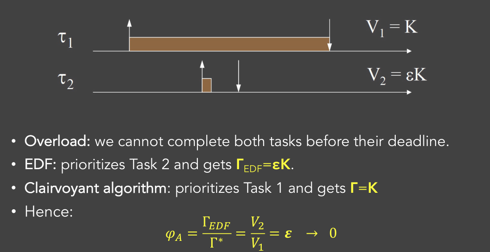

### Impossibility results Theorem 2

 If $\rho \ge2$ and $ V_i=C_i, \quad \forall i$, then there **does not exist an online a lgorithm** that can achieve a competitive factor **greater than 0.25**

**<u>Proof</u>**: Adversary argument

assume that the algorithm “plays” against a sophisticated  **adversary (clairvoyant scheduler)** which **creates the worst-case conditions** in  terms of tasks sequence.

 The adversary generates two types of tasks:

* Major taskss: $C_i=D_i$ and $r_{i+1}=d_i-\epsilon$
* Associated tasks: $C_i=\epsilon$  and $r_{i+1}=d_i$

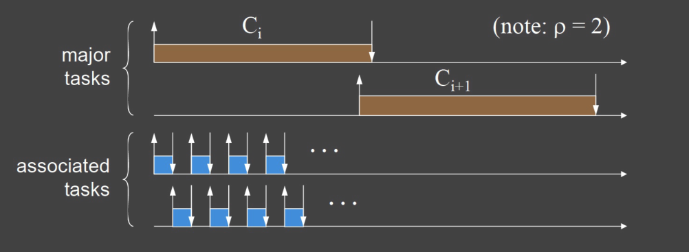

* If the player **aborts a major task** in favor of an associated task, the adversary **interrupts** the sequence of associated tasks.
  * because $C_i=D_i$, even finish associated tasks, it cannot resume $C_i$, because it will miss deadline
  * $\Gamma_{on}=\epsilon$

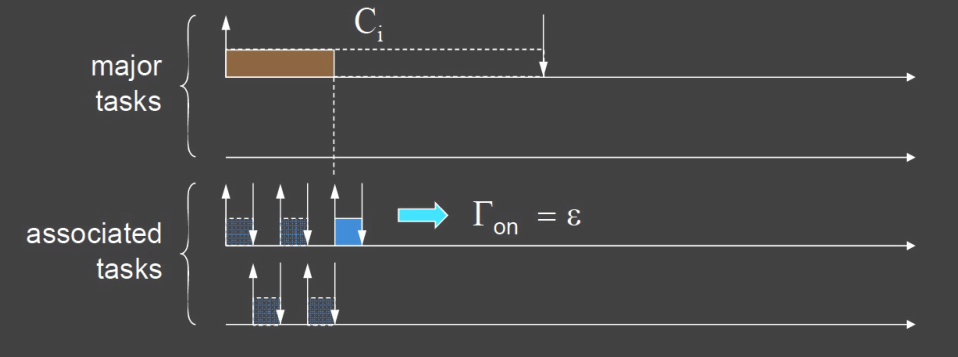

* If the player decides to complete Task i, the game terminates with the generation of Task i+1.
  * $\Gamma_{on}=C_i$
  * even if in the second part, it change to 

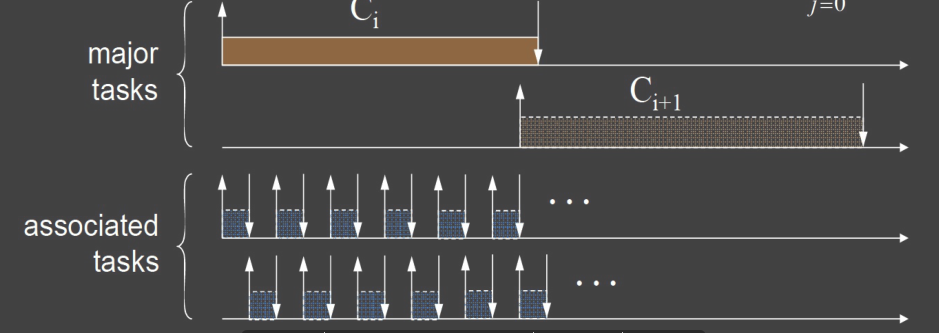

### A general Theorem

If $1\le \rho \ge 2$, then $\phi_{on} \le p$, where p satisfies:
$$
4[1-(\rho-1) p]^{3}=27 p^{2}
$$
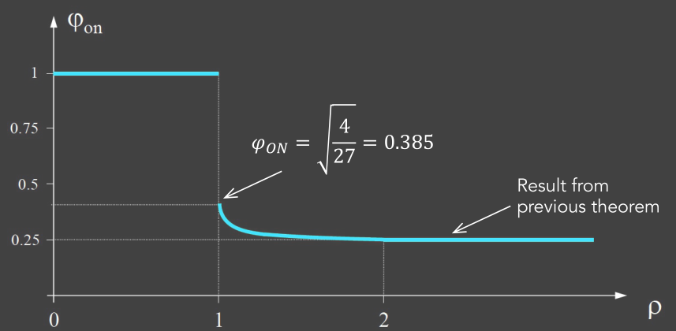

## 2.2. Solution 1: Best-effort Scheduling

* **Admit all** incoming tasks/jobs;
* System operation is controlled by the scheduling (possibly, value-
  based) policy
* May cose **Domino Effect**

## 2.3. Solution 2: Admission-based Scheduling

* When a task is generated, we run a **schedulability test** and decide whether to admit it or not.
* This keeps the load below 1 and avoids domino effects.
* Low effieciency since we decide based on WCET

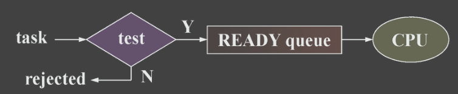

## 2.4. Solution 3: Robust Scheduling

* Tasks are scheduled by deadline and are rejected based on their value.
* In case of early completions, rejected tasks can be recovered by a reclaiming mechanism.

  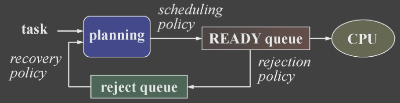

## 2.5. Example Solution 3: Robust EDF

<u>**Scheduling Policy**</u>: EDF

**<u>Rejection Policy</u>**: When an overload situation is detected, **reject the least value task** which can 
bring the load below 1.

**<u>Recovery Policy</u>**: When there is enough spare time, re-accept the highest value task which 
keeps the schedule still feasible.

### Model of Robust EDF

$$
J_{i}\left(C_{i}, D_{i}, M_{i}, V_{i}\right)
$$

$C_i$ : WCET

$D_i$: Relative Deadline

$M_i$: Flexible 2nd deadline (relative to $D_i$)

$V_i$: Task Value

### Computation

using the Laxity values:
$$
L_{i}=d_{i}-f_{i} \quad L_{i}=L_{i-1}+\left(d_{i}-d_{i-1}\right)-c_{i}(t)
$$
$c_i(t)$: remaining computation time

Caculating the exceeding times
$$
E_{i}=\max \left(0,-\left(L_{i}+M_{i}\right)\right) \quad E_{\max }=\max _{\mathrm{i}} \mathrm{E}_{\mathrm{i}}
$$

* always we suppose $M=0$, then $E_i=0$ means $L_i$ is positive, not exceed deadline

Rejection:

 reject the least-value task that can remove the overload.

*  We can reject **1 or more tasks**; in the latter case, we need a more elaborate 
  search to find the subset of tasks with the minimum value.

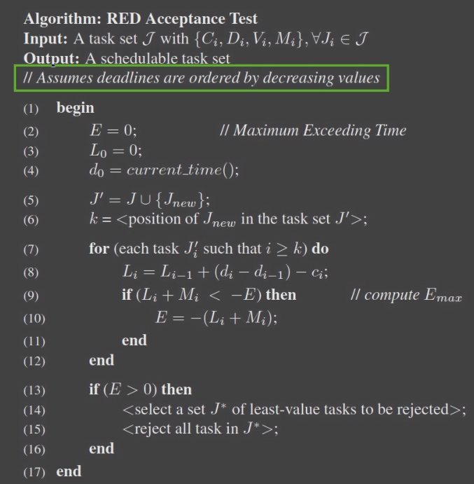

### Example

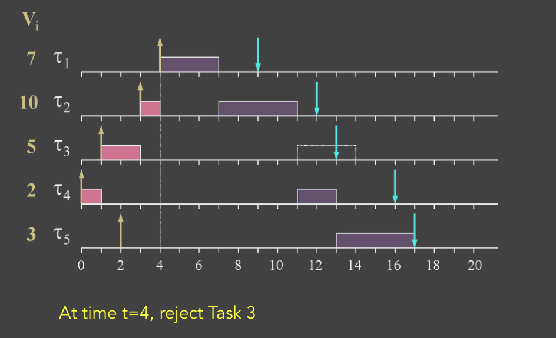

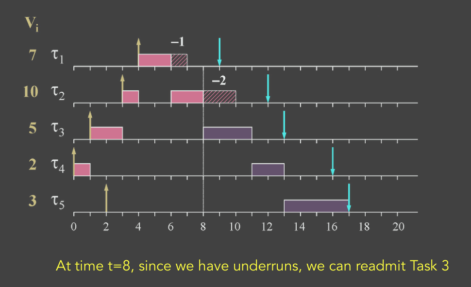

# 3. Handeling Transient Overloads

Focus on: Overloads due to task overruns (even longer then WCET)

## 3.1. Solution: Resouce Reservation (RR)

Reserve a fraction of the CPU for a set of tasks and prevent them from using more than that.

**<u>Main Idea</u>** 

* For each task i, dedicate $Q_i$ computation time every $P_i$ time units.
* Thus, it is as if this is a **nice-behaving task with parameters** $(Q_i, P_i)$.

**<u>Possible Implementation</u>**

RR can be enforced via a Constant Bandwidth Server (CBS)

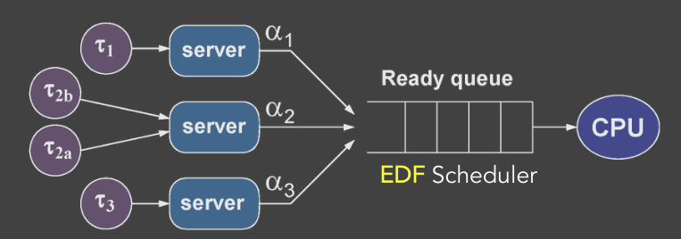

### Dimension RR Server and Schedulability Analysis

Want to know the **<u>bandwidth</u>** $a_k$ for each task k

the **<u>maximum delay</u>** $Δ_k$ that this resource is not available.

**<u>Supply Function</u>**

Given a reservation, the **<u>supply function</u>** $Z_k(t)$ is the **minimum amount of time provided by reservation k** in every time  interval of length t ≥ 0

**<u>Example for Static Time Partition</u>**

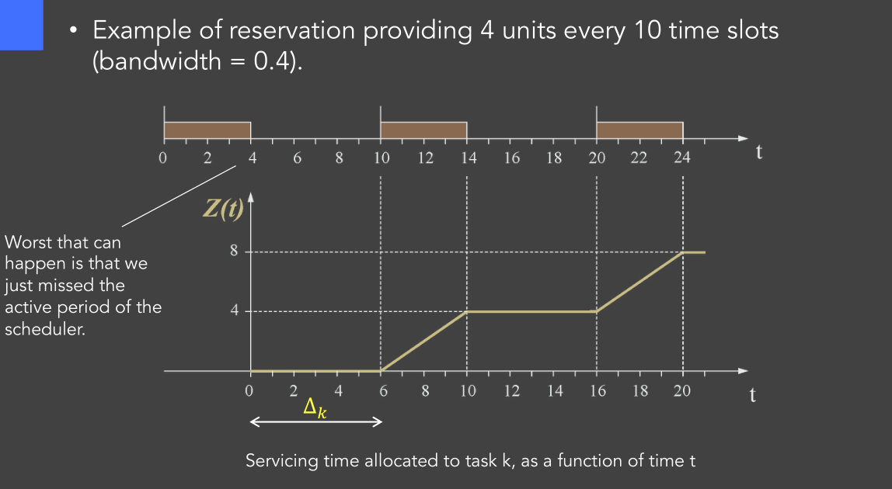

**<u>Exact Test</u>**

The **<u>processor demand criterion</u>** (Sec. 4.6.1) can be reformulated  as an exact test using the **<u>demand bound function</u>** (dbf):
$$
\forall t>0, \quad dbf(t) \le Z(t)
$$

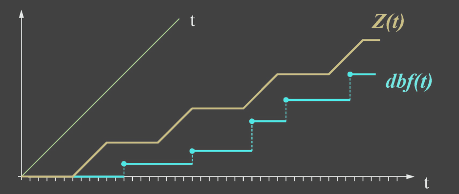

**<u>Sufficient Test</u>**

 simpler (sufficient) test can be derived using **a lower bound of**  $Z(t)$, namely the **<u>supply bound function</u>**:
$$
\forall t>0, \quad dbf(t)\le sbf(t)
$$
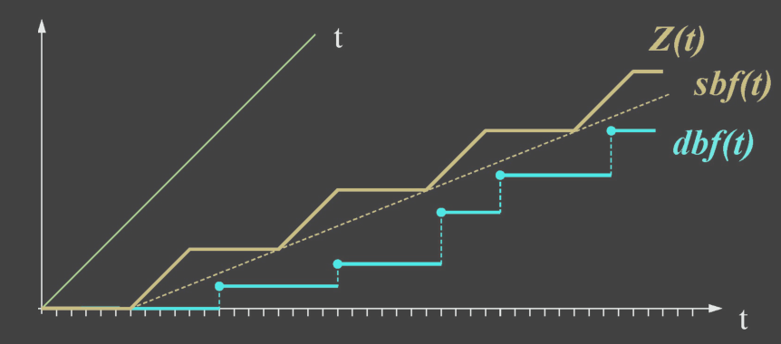

* Once the **bandwidth** and the delay are computed, a supply  bound function can be expressed as follows

$$
sb f(t)=\max \{0, a(t-\Delta)\}
$$

$a$: bandwidth: the gradient

$\Delta$: service delay

* For a given $Z(t)$, we can compute bandwidth and delay as:

$$
a=\lim _{t \rightarrow \infty} \frac{Z(t)}{t} \quad \Delta=\sup _{t \geq 0}\left\{t-\frac{Z(t)}{a}\right\}
$$

**<u>Examples for a Periodic Server</u>**:

For a periodic server with budget $Q_s$ and period $P_s$ running at **the highest priority**, we get:
$$
a=\frac{Q_{S}}{T_{S}} \quad \Delta=P_{S}-Q_{S}
$$
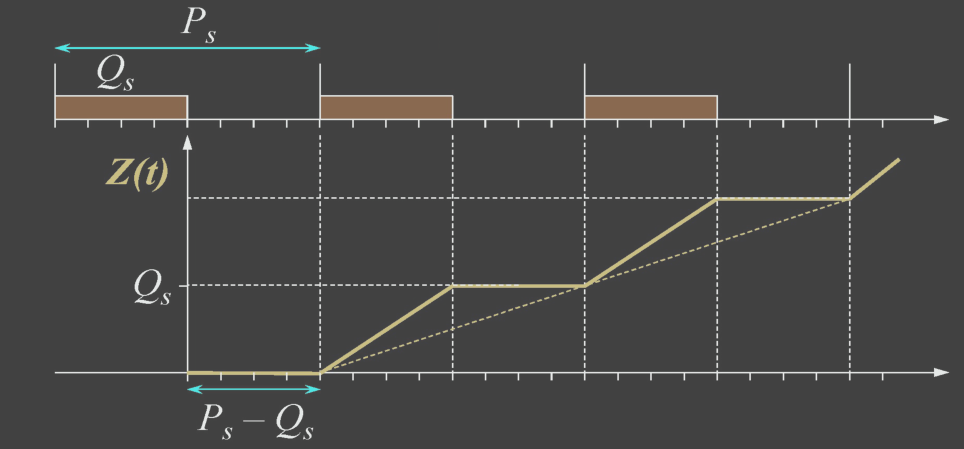

For a periodic server with budget $Q_s$ and period $P_s$ running at **unkown priority**, we get:
$$
a=\frac{Q_{S}}{T_{S}} \quad \Delta=2\left(P_{S}-Q_{S}\right)
$$
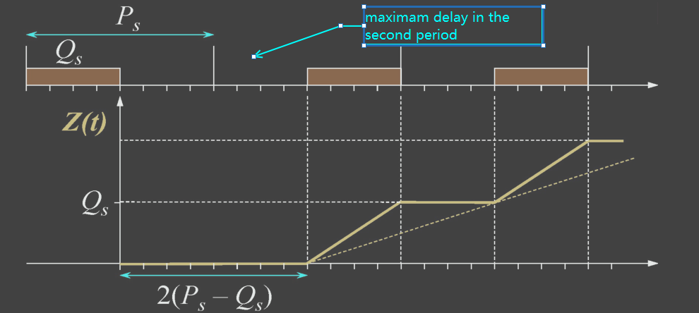

**Another Exact Test Scenarios**

A set of **preemptive periodic tasks** with relative deadlines **less than  or equal to periods**, can be scheduled by **EDF**, under a reservation characterized by a supply function $Z_k(t)$, **if and only if** $U_k < α_k$ and:
$$
\forall t>0, \quad d b f(t) \leq Z_{k}(t)
$$

## 3.2. Adjust the RR Server Parameters

haven’t dimensioned properly each CBS?

* If $Q_s$ is smaller than needed, the tasks will progress very slowly;
* If it is larger, then we will waste resources.

### Solution 1:

**transfer unused budgets** across the servers.

### Solution 2:

measure the actual task needs and **adjust their WCET**.
$$
C_{i}^{\prime}=\max _{k: J o b \text { of } \tau_{i}}\left\{e_{i, k}\right\} \quad U_{i}^{\prime}=C_{i}^{\prime} / T_{i}
$$
