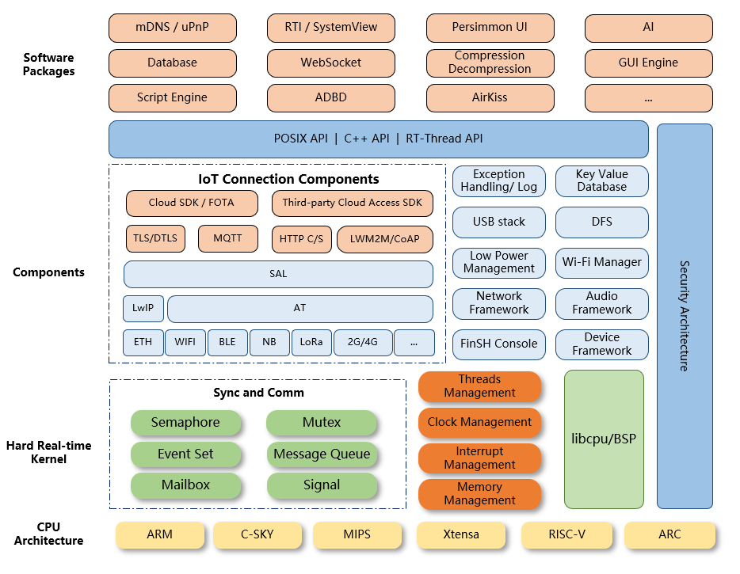

# Introduction & Kernel Architecture

[toc]

# 1. Introduction

RT-Thread was born in 2006, built by Puxiang Xiong. RT-Thread is an open-source, neutral, and community-based real-time operating system (RTOS). RT-Thread is mainly written in the C language. It is mainly built for the Internet of Things (IoT) Terminals.

There are mainly two versions of RT-Thread: Standard Version and Nano Version. Nano version is suitable for resource-constrained microcontroller systems, which only requires 3KB Flash and 1.2KB RAM memory. The standard version is for resource-rich IoT devices. In this survey, we mainly focus on the standard version.

RT-Thread also developed on-line software package management tools and system configuration tools.

# 2. Kernel Architecture

## 2.1. Kernel Layer

The kernel layer is the kernel of RT-Thread. It includes four basic management modules: Thread management, clock management, interrupts management, and memory management. It also includes a preemptive multi-task real-time scheduler. Infrastructure for threads synchronization and communication, such as semaphore, mutex, mailbox, message queue, signal, event set, is also in the kernel layer. The kernel layer also includes libcp/BSP (file related to chip transplantation/board support package).

## 2.2. Components and Service Layer

Components and Service Layer is higher than kernel layer but lower and provides varieties of services for the upper layer. Basically, it provides services like low power management, audio framework, network framework, Wi-Fi management. Besides, RT-Thread is currently widely used in many IoT companies (in China). It also provides many services for IoT connection, such as MQTT, Cloud Acess SDK, etc. By calling different APIs, users can easily use these services.

## 2.3. Software Package

RT-Thread Software Package is a middle-ware running on RT-Thread and facing different application fields RT-Thread has developed for a long time. It is open-source and widely used in IoT companies. A lot of third-party developers has developed a lot of software package on RT-Thread for different fields. These packages make it easy for different developers to build the system they want conveniently.

# 3. Object Management

One important structure of the RT-Thread kernel is its object management structure: object container. **The object container keeps information and maintains a linked list for each type of object.**