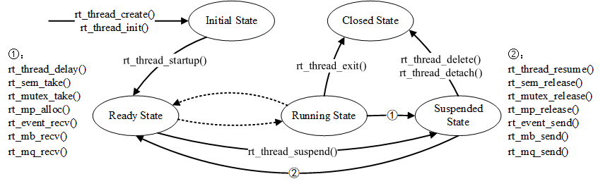

# Task Creation

[toc]

Thread is the smallest scheduling unit in the RT-Thread Operating system. A Thread can be regarded as a task. The thread scheduling algorithm is a priority-based full preemptive multi-thread scheduling algorithm. The thread can have priority from 0 to 256; the smaller value, the higher priority. Tasks with higher priority always get permission to execute, while tasks with the same priority will use the Round-Robin method to execute.

RT-Thread uses data structure ``rt_thread`` to manage threads. There are two types of threads in the system: system thread and user thread. There are five kinds of thread state: initial state, ready state, running state, suspended state, and closed state. Only threads in Ready state and running state participate in scheduling. Threads in RT-Thread can also be divided into dynamic threads and static threads. The difference between a dynamic thread and a static thread is that the thread control block and the running thread stack of a static thread are generally set to global variables.

RT-Thread provides four kinds of operations to a thread: create/initiate, startup, operate, delete/detach.



```cpp
rt_thread_create() /**< create a dynamic thread */
rt_thread_delete() /**< delete a dynamic thread */
rt_thread_init() /**< create a static thread */
rt_thread_detach() /**< delete a dynamic thread */
rt_thread_startup() /**< turn thread to ready state */
rt_thread_yield() /**< relinquish processor and put current thread at the end of the priority queue list */
rt_thread_sleep(), rt_thread_delay(), rt_thread_mdelay() /**< suspend a specified period of time */
rt_thread_control() /**< change thread's parameters */
```