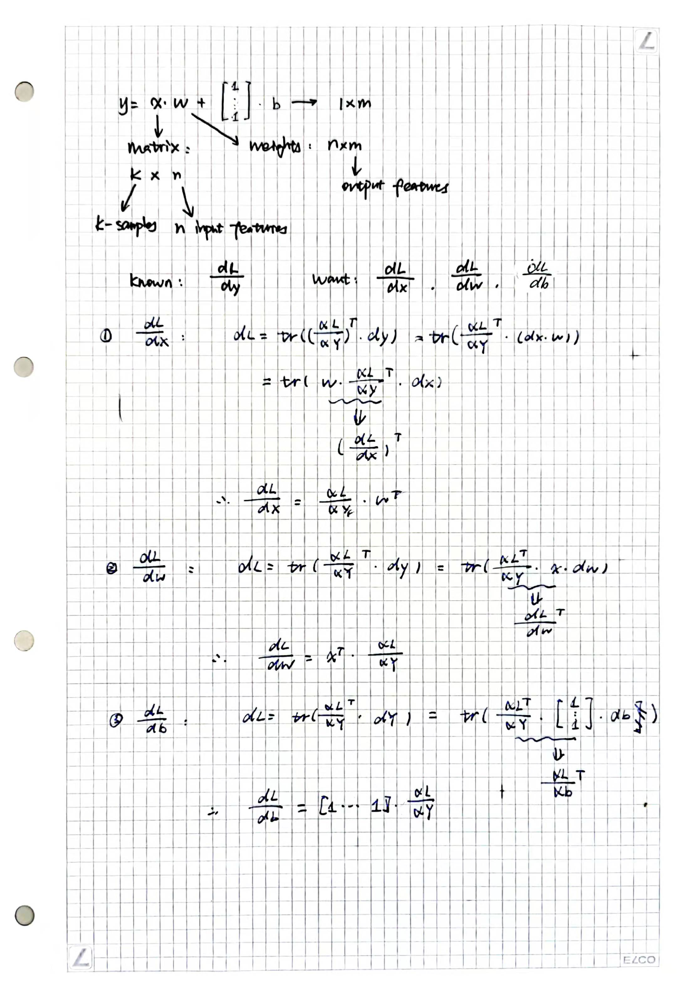

# Matrix Derivation

[toc]

> https://zhuanlan.zhihu.com/p/24709748
>
> https://zhuanlan.zhihu.com/p/24863977

 

## Scalar to Matrix Derivation

矩阵导数与微分的联系：
$$
d f=\sum_{i=1}^{m} \sum_{j=1}^{n} \frac{\partial f}{\partial X_{i j}} d X_{i j}=\operatorname{tr}\left(\frac{\partial f^{T}}{\partial X} d X\right)
$$
其中$tr$ 代表矩阵的迹，对于尺寸相同的矩阵$A$, $B$, 满足性质：
$$
\operatorname{tr}\left(A^{T} B\right)=\sum_{i, j} A_{i j} B_{i j}
$$
即 $tr(A^TB)$ 是矩阵 $A$, $B$ 的内积

### Matrix Differential Rules

1. 加减法: $d(X \pm Y)=d X \pm d Y$ ；矩阵乘法: $d(X Y)=(d X) Y+X d Y$ ；转置: $d\left(X^{T}\right)=(d X)^{T} ；$ 迹: $d \operatorname{tr}(X)=\operatorname{tr}(d X) 。$
2. 逆: $d X^{-1}=-X^{-1} d X X^{-1}$ 。此式可在 $X X^{-1}=I$ 两侧求微分来证明。
3. 行列式: $d|X|=\operatorname{tr}\left(X^{\#} d X\right)$ ，其中 $X^{\#}$ 表示X的伴随矩阵，在X可逆时又可以写作 $d|X|=|X| \operatorname{tr}\left(X^{-1} d X\right)$ 。此式可用Laplace展开来证明，详见张贤达《矩阵分析与应用》 第279页。
4. 逐元素乘法: $d(X \odot Y)=d X \odot Y+X \odot d Y ， \odot$ 表示尺寸相同的矩阵 $X, Y$ 逐元素相 乘。
5. 逐元素函数: $d \sigma(X)=\sigma^{\prime}(X) \odot d X ， \sigma(X)=\left[\sigma\left(X_{i j}\right)\right]$ 是逐元素标量函数运算， $\sigma^{\prime}(X)=\left[\sigma^{\prime}\left(X_{i j}\right)\right]$ 是逐元素求导数。例如 $X=\left[\begin{array}{ll}X_{11} & X_{12} \\ X_{21} & X_{22}\end{array}\right], d \sin (X)=\left[\begin{array}{ll}\cos X_{11} d X_{11} & \cos X_{12} d X_{12} \\ \cos X_{21} d X_{21} & \cos X_{22} d X_{22}\end{array}\right]=\cos (X) \odot d X$

### Trace Tricks

1. 标量套上迹: $a=\operatorname{tr}(a)$
2. 转置: $\operatorname{tr}\left(A^{T}\right)=\operatorname{tr}(A)$ 。
3. 线性: $\operatorname{tr}(A \pm B)=\operatorname{tr}(A) \pm \operatorname{tr}(B)$ 。
4. 矩阵乘法交换: $\operatorname{tr}(A B)=\operatorname{tr}(B A)$ ，其中 $A$ 与 $B^{T}$ 尺寸相同。两侧都等于 $\sum_{i, j} A_{i j} B_{j i}$ 。
5. 矩阵乘法/逐元素乘法交换: $\operatorname{tr}\left(A^{T}(B \odot C)\right)=\operatorname{tr}\left((A \odot B)^{T} C\right)$ ，其中 $A, B, C$ 尺寸相 同。两侧都等于 $\sum_{i, j} A_{i j} B_{i j} C_{i j}$ 。

### Standard Process

* 若标量函数 $f$ 是矩阵$X$经加减乘法、逆、行列式、逐元素函数等运算构成，则使用相应的运算法则对f求微分，再使用迹技巧给$df$套上迹并将其它项交换至$dX$左侧，对照导数与微 分的联系 $d f=\operatorname{tr}\left(\frac{\partial f^{T}}{\partial X} d X\right)$ ，即能得到导数。

* 特别地，若矩阵退化为向量，对照导数与微分的联系 $d f=\frac{\partial f^{T}}{\partial \boldsymbol{x}} d \boldsymbol{x}$ ， 即能得到导数。

### Composition

* 在未定义矩阵对矩阵的导数$\frac{\partial Y}{\partial X}$时，我们不能随意沿用标量的链式法则
* 在未定义矩阵对矩阵的导数时，我们应采取：
  *  先写出 $d f=\operatorname{tr}\left(\frac{\partial f^{T}}{\partial Y} d Y\right)$ ，
  * 再将 $\mathrm{dY}$ 用 $\mathrm{d} X$ 表示出来代入，
  * 并使用迹技巧将其他项交换至 $\mathrm{dX}$ 左侧，即可得到 $\frac{\partial f}{\partial X}$ 。

#### Example

For $Y=AXB$
$$
d f=\operatorname{tr}\left(\frac{\partial f^{T}}{\partial Y} d Y\right)=\operatorname{tr}\left(\frac{\partial f^{T}}{\partial Y} (d A) X B+A d X B+A X dB\right)=\operatorname{tr}\left(\frac{\partial f^{T}}{\partial Y} A d X B\right)=\operatorname{tr}\left(B \frac{\partial f^{T}}{\partial Y} A d X\right)=\operatorname{tr}\left(\left(A^{T} \frac{\partial f}{\partial Y} B^{T}\right)^{T} d X\right)
$$
So we will have:
$$
\frac{\partial f}{\partial X}=A^{T} \frac{\partial f}{\partial Y} B^{T}
$$

### Other Examples

这里，我们将使用一个简单的Neural Network中的例子进行讲解与计算

## Matrix to Matrix Derivation

未完待续

### Vector Tricks

### Some Properties of Kronecker

### Standard Process
